# NATIVE-FOREGROUND-ACTIVATE: one combined review generation

## Authority and exact boundary

The user moved complete D-0032 from `LEAN-WORKFLOW` into `NATIVE-FOREGROUND-ACTIVATE` on 2026-09-11 because three helper calls made every review round unnecessarily slow. Decision 0067 records the resulting design: one helper call, one immutable raw-plus-three-lens generation, and one task-scoped selected pointer. The user approved all amended story and task plans on 2026-09-12.

The current task branch contains merge `db03a5708ca292d0e7e918d385748eb5b60008e5`, whose second parent is validated `origin/main` commit `c9a705bc315d4677309815eb03b58e61e7957e50`. That inherited baseline supplies Decision 0066's `delta_id`, resumable `forge task close`, complete proof before stage mutation, marker-only sealing, task-plan rendering, native recorded-scope validation, board/CI readers, and the interim concurrent three-helper review. These are baseline behavior, not this task's contribution.

The previously captured combined-review audit predates that merge and is historical context only. Its candidate-directory, `review-run.json` pointer, and fixed-file fallback proposals are superseded. The approved story plan and its bound ownership graph are the design authority. The story-plan amendment adds only the two inherited-main regression files omitted from the earlier 72-path scope. The final task contract therefore has 75 paths and 58 declared tests. Main records the final decomposition, saves and grills this task plan, binds the user's approval, controls stage/delegation, and runs `forge task close` through PR and CI.

## Goal

Replace the interim three-helper review with the complete Decision 0067 protocol while reusing the inherited closeout and product-delta seams. Every complete review attempt calls the installed helper once, validates all three genuine lens assessments from the same raw result, writes one immutable generation, and atomically selects it last. Missing, stale, blocking, fixed-only, story-fallback, mixed, copied, tampered, or interrupted proof cannot certify the task.

Use ponytail's minimum-diff ladder for every edit. Preserve all completed First work. Derive changes from the current checkout; do not replay any historical patch or treat prior proof as current proof.

## Remaining delegate boundary

The recorded 75-path scope and 180-file/18,000-line review budget measure the complete accumulated First task, including already committed work. They do not authorize this delegate to revisit those bytes. This delegate may edit only these 16 existing paths plus the one new schema, with at most 2,500 added-plus-deleted lines:

- `docs/QUALITY.md`
- `factory/schemas/review-set.json`
- `factory/scripts/check_task_proof.py`
- `factory/scripts/factory_lib.py`
- `factory/scripts/forge.py`
- `factory/scripts/record_review_from_json.py`
- `factory/scripts/forge_cli/close.py`
- `factory/scripts/forge_cli/review.py`
- `factory/scripts/forge_cli/review_brief.py`
- `factory/scripts/forge_cli/stages.py`
- `factory/scripts/forge_cli/tasks.py`
- `factory/tests/test_gates.py`
- `factory/tests/test_proof_read_path.py`
- `factory/tests/test_review_lenses_in_parallel.py`
- `factory/tests/test_review_settled_contracts.py`
- `factory/tests/test_review_task_delta.py`
- `harness.yaml`

Every other path in the 75-path task envelope is preserve-byte-for-byte input. Stop and report a contract amendment if another path or more than 2,500 changed lines is mechanically required.

## Workflow

```mermaid
flowchart LR
    A[Approved task contract] --> B[Registered Sol/medium delegate]
    B --> C[One combined helper call]
    C --> D[Validate ordered passes, three sections, tags and verdicts]
    D --> E[Write immutable raw plus three-lens generation]
    E --> F[Read back and hash]
    F --> G[Atomically replace selected.json]
    G --> H[Shared task proof checks current delta_id]
    H --> I[forge task close]
    I --> J[Task PR and green CI]
```



Before implementation, Main records the amended 75-path/58-test decomposition and saves, grills, and approves this exact plan. One registered `gpt-5.6-sol`/medium worker then writes the tests first, demonstrates the new one-helper and strict-task-proof cases fail against the incumbent runtime, applies the smallest production change, and runs the nineteen-selector focused batch. The worker finishes with `./forge next` and the real harmless native PreToolUse denial probe. Main correlates that public terminal evidence, commits the product delta, records required proof, and runs the resumable `forge task close` path. A blocking review returns as one bounded Sol/medium fix batch; the next close attempt repeats only proof made stale by the new delta.

### Combined result grammar

With no `--lens`, the selected lens set is quality, performance, and security in that order. Every actual provider pass contains one non-empty assessment for each lens between exact full-line `BEGIN` and `END` markers. Quality retains one terse `VERDICT <contract-id>:` line for each current contract. An unchunked result is one top-level pass; a chunked result requires exact non-empty labels `chunk 1/N` through `chunk N/N` with no gaps or reordering.

Every merged finding title begins with exactly one token: `[quality] `, `[performance] `, or `[security] `. Projection removes that token only from its own lens record. The installed helper exposes one integer `code_location.line`, so both normalized start and end equal that value. Cross-lens duplicates use exactly this fingerprint after tag removal: NFC POSIX repository-relative `file_path`, that integer start/end pair, and the NFC whitespace-collapsed case-folded title. Category is not part of the fingerprint. Preserve every provider pass in order. Extract `VERDICT` lines only from the validated quality assessment block inside each actual pass `overall_explanation`; never scan performance/security blocks, finding bodies, or the synthesized top-level chunk summary for quality verdicts. Then reuse the existing per-lens score, recommendation, and worst quality-contract-verdict behavior. Preflight the required marker and verdict boilerplate against the helper schema's 3,000-character `overall_explanation` maximum, and reject any oversized output.

### Generation, binding, and publication

`factory/schemas/review-set.json` validates a generation document and a selected-pointer document. A generation has exactly these shared fields: `format: forge-review-generation/v1`, `generation_id`, `origin`, `generated_by`, `story`, `task_id`, `review_run_id`, `brief_sha256`, `inspected_commit`, `delta_id`, `helper`, `input`, `raw_result`, `lenses`, and `recorded_at`. `helper` is exactly `{path, version, sha256}`; `input` is exactly `{sha256, bytes}`; `lenses` is exactly `{quality, performance, security}` with each value satisfying the existing review payload contract. `raw_result` is exactly `{encoding: base64, sha256, bytes, data}` and stores RFC 4648 base64 of the exact bytes read once from the helper's `--json-output` file before UTF-8 JSON parsing. Rejection successors preserve that decoded byte sequence, its metadata, helper/input/shared bindings, and unaffected lenses.

Origins add one mutually exclusive field. `combined` forbids `rejection` and `upgrade`. `rejection` requires exactly `{source_generation_id, source_generation_sha256, root_generation_id, history}`; each history entry is exactly `{finding_fingerprint, reason, citation, actor}`, and a successor must equal its source history plus one entry. `upgrade` requires exactly `{inventory_digest, source_kind, legacy_artifacts, sealed_commit}` where `source_kind` is `active` or `sealed`, `legacy_artifacts` is the sorted exact `{aspect, path, sha256}` triple, active uses an empty `sealed_commit`, and sealed requires the exact marker commit. The selected pointer is exactly `{format: forge-review-selection/v1, story, task_id, generation_id, generation_sha256, delta_id, selected_at}`. `generation_sha256` always means SHA256 of the exact deterministic generation-file bytes; a rejection's `source_generation_sha256` means that same file-byte hash, removing any ambiguous “source hash.”

`python3 factory/scripts/record_review_from_json.py --set --task <id> --input <candidate.json>` is the complete-set interface and is mutually exclusive with diagnostic `--aspect`. The candidate supplies every generation field except `generation_id`; the recorder verifies the current task token/delta and origin-specific shape, derives the ID, publishes, reads back, then selects. Review, rejection, and upgrade call the same shared publication function rather than reimplementing validation.

Compute lowercase `generation_id` as SHA256 over canonical sorted compact UTF-8 JSON for every generation field except `generation_id`. Serialize the generation file deterministically as sorted indented UTF-8 JSON plus one LF; recompute the ID and exact file-byte SHA on every read. For each generation, selection, and same-directory temporary path, `lstat` every existing ancestor and require a real non-symlink directory. An existing leaf must be a regular file with `st_nlink == 1`; a new temp leaf is opened exclusive/no-follow and verified likewise. After complete write, flush, and readback, atomically hard-link the temp to the absent generation destination without overwrite, unlink the temp, and verify the final leaf is regular with one link. An existing byte-identical generation is idempotent success; the same ID with unequal exact file bytes is a collision and refuses.

Resolve the helper to one regular real path, capture its version, file identity, and SHA immediately before launch, then re-resolve and rehash that same identity after exit and before publication. Any before/after identity, version, or byte mismatch discards the attempt without pointer or stamp mutation. Do not add hostile-worker containment.

Hold the existing cross-platform protected task lock with kind `review-selection` across selected-pointer read, source validation, generation publication, final selected-source compare, pointer replacement, and stage stamping. A rejection therefore refuses if selection changed after its source read. Generate the selected-pointer temp completely in the same directory, flush and read it back, re-check the expected old selection under the lock, then atomically replace `reviews/selected.json` and read it back. Pointer replacement is the publication commit point: any failure before it preserves the previous pointer byte-for-byte; a later stage-stamp failure leaves the newly committed pointer selected, and retry validates and stamps that same current generation.

A complete blocking generation is selected and blocks clean proof. Only a selected clean generation bound to the current `delta_id` certifies proof. Pre-seal readers use the current task pointer. Normal sealed readers load the pointer from the immutable marker commit. Portable owns the sole later exception: an `origin=upgrade` pointer may be read only when its sealed-commit binding exactly equals that marker. Runtime readers never fall back to fixed quality/performance/security files or story-level proof for a task-owned artifact.

### Diagnostics, rejection, and closeout

`--lens <lens>` remains one non-authoritative diagnostic helper call. It cannot publish, stamp, revoke, or otherwise compete with the selected complete generation. Remove the inherited `--sequential` option and environment branch.

`--reject --lens <lens>` may start from the selected `origin=combined` generation or its selected `origin=rejection` descendant. It writes one immutable `origin=rejection` successor bound to the immediate source generation file SHA256 and root combined generation ID, plus the exact finding, reason, citation, and actor. It preserves the exact decoded `raw_result` bytes, ordered passes, shared bindings, rejection history, and unaffected lenses, then publishes the successor pointer last. Multiple false-positive rejections therefore form an immutable chain. Fixed-only, upgrade, unselected, or unrelated sources refuse.

`forge task close` runs the one-helper review for absent, fixed-only, story-level, malformed, blocking, or stale selected proof. It skips review only when the selected clean generation is bound to the same current `delta_id`. Refusal happens before stage, marker, Git, PR, or proof mutation.

## Implementation surface

Keep the implementation on the existing review and proof seams:

- `factory/scripts/forge_cli/review.py` composes one combined prompt, calls the helper once, validates and projects the result, publishes complete generations, keeps single-lens diagnostics non-authoritative, and applies citation-based rejection.
- `factory/scripts/forge_cli/review_brief.py` preserves the direct `review-brief --all` input/run-token behavior and complete approved task inputs.
- `factory/scripts/record_review_from_json.py` keeps `--aspect` for diagnostics and adds one complete-set recording path.
- `factory/scripts/factory_lib.py` owns schema-backed safe generation publication, atomic selection, pointer-aware reading, and reuse of the existing product delta identity by every proof consumer.
- `factory/schemas/review-set.json` is the only new schema.
- `stamp_is_fresh` becomes the selected-clean/current-`delta_id` predicate shared by `close.py`, stages, tasks, readiness, proof checks, frontier routing, CI, and the board task-progress path. `board.py` already reaches it through `task_proof_problems`; its separate story summary remains story-scoped display and cannot satisfy task proof, so it is preserved. `forge.py`, `close.py`, and `review.py` remove the public and internal sequential plumbing. `harness.yaml` and `docs/QUALITY.md` declare the generation schema/recorder while fixed files remain diagnostic and migration input only.
- Rewrite `factory/tests/test_review_lenses_in_parallel.py` in place to prove one helper, coherent three-lens publication, ledger integrity, and crash atomicity.
- Rewrite `factory/tests/test_proof_read_path.py` in place so an active task with missing task proof resolves to its missing task path and never accepts the story copy. Story runs without a task identity retain their story path.

No background reviewer, extra registry, candidate tree, product-tree digest, private prompt reconstruction, story-wide second review, hostile-worker containment, or new CI evidence parser is added.

## Required focused proof

Extend the existing selectors without removing their earlier assertions:

- `factory/tests/test_gates.py::test_review_consumers_include_complete_approved_inputs`
- `factory/tests/test_gates.py::test_review_brief_mints_run_id_and_lenses_echo_it`
- `factory/tests/test_gates.py::test_task_proof_consumers_share_complete_predicate` — additionally prove `forge task close` runs review for fixed-only/stale proof and skips only a selected clean generation on the current `delta_id`.
- `factory/tests/test_gates.py::test_pr_ready_refuses_incoherent_lens_set`
- `factory/tests/test_review_task_delta.py::test_combined_review_projects_tagged_lenses_and_preserves_ordered_pass_verdicts`
- `factory/tests/test_review_task_delta.py::test_combined_review_refuses_incomplete_noncontiguous_missing_copied_or_mixed_output`
- `factory/tests/test_gates.py::test_combined_review_publication_is_pointer_last_and_failure_atomic`
- `factory/tests/test_gates.py::test_single_lens_review_preserves_cli_without_publishing_an_incomplete_set` — additionally prove a blocking diagnostic cannot revoke or alter an earlier selected clean generation.
- `factory/tests/test_review_settled_contracts.py::test_reject_republishes_one_complete_pointer_selected_set` — additionally allow a selected rejection descendant, preserve its immutable history, and refuse upgrade, unselected, or unrelated sources.
- `factory/tests/test_review_lenses_in_parallel.py::test_default_review_uses_one_helper_and_publishes_one_generation`
- `factory/tests/test_proof_read_path.py::test_a_task_run_does_not_fall_back_to_the_story_copy`
- `factory/tests/test_gates.py::test_review_generation_id_recomputes_and_tamper_refuses`
- `factory/tests/test_gates.py::test_review_generation_retry_and_collision_are_safe`
- `factory/tests/test_review_settled_contracts.py::test_selected_upgrade_generation_requires_exact_sealed_binding`
- `factory/tests/test_review_settled_contracts.py::test_rejection_compare_and_swap_refuses_interleaved_selection`
- `factory/tests/test_proof_read_path.py::test_board_task_progress_uses_selected_generation_only`
- `factory/tests/test_gates.py::test_close_and_frontier_use_selected_current_delta`
- `factory/tests/test_review_task_delta.py::test_review_set_recorder_validates_origin_specific_shape_and_raw_bytes`
- `factory/tests/test_review_lenses_in_parallel.py::test_review_helper_identity_mismatch_refuses_publication`

Run them together with a fresh report:

```sh
UV_CACHE_DIR=/tmp/forge-lean-uv-cache UV_TOOL_DIR=/tmp/forge-lean-uv-tools uv run --python 3.11 --with pytest --with psutil python -m pytest factory/tests/test_gates.py factory/tests/test_review_task_delta.py factory/tests/test_review_settled_contracts.py factory/tests/test_review_lenses_in_parallel.py factory/tests/test_proof_read_path.py -k 'test_review_consumers_include_complete_approved_inputs or test_review_brief_mints_run_id_and_lenses_echo_it or test_task_proof_consumers_share_complete_predicate or test_pr_ready_refuses_incoherent_lens_set or test_combined_review_projects_tagged_lenses_and_preserves_ordered_pass_verdicts or test_combined_review_refuses_incomplete_noncontiguous_missing_copied_or_mixed_output or test_combined_review_publication_is_pointer_last_and_failure_atomic or test_single_lens_review_preserves_cli_without_publishing_an_incomplete_set or test_reject_republishes_one_complete_pointer_selected_set or test_default_review_uses_one_helper_and_publishes_one_generation or test_a_task_run_does_not_fall_back_to_the_story_copy or test_review_generation_id_recomputes_and_tamper_refuses or test_review_generation_retry_and_collision_are_safe or test_selected_upgrade_generation_requires_exact_sealed_binding or test_rejection_compare_and_swap_refuses_interleaved_selection or test_board_task_progress_uses_selected_generation_only or test_close_and_frontier_use_selected_current_delta or test_review_set_recorder_validates_origin_specific_shape_and_raw_bytes or test_review_helper_identity_mismatch_refuses_publication' --junitxml=/tmp/forge-native-c8-combined-review-amendment.xml
```

The new one-helper and task-proof refusal selectors must be RED against the incumbent merged runtime after the tests are written and before production edits. A selector that stays green means the diagnosis or test is wrong; correct the test rather than changing production blindly. After the focused batch passes, the worker runs the three recorded verify commands unchanged.

## Manual Verification

1. Run the focused command and confirm exactly nineteen selected tests pass with a fresh JUnit report.
2. Exercise one default review with a fake or controlled helper and confirm exactly one helper process, one immutable generation containing raw output plus three different lens records, and one pointer replacement after successful readback.
3. Make the helper crash, change its bytes between launch and publication, return a copied/missing assessment, tamper with a stored generation, retry identical/colliding bytes, or target a linked generation path; confirm the previous pointer is byte-identical and no clean stamp appears.
4. Give `forge task close` fixed-only or stale selected proof and confirm it runs or refuses review before mutation. Give it selected clean proof on the current `delta_id` and confirm it skips the helper.
5. Point an active task at missing task proof while a story copy exists; confirm the task path remains missing and the story copy cannot satisfy the task.
6. Race selection while rejecting and confirm compare-and-swap refuses without replacing the newer pointer. Reject one selected combined finding and confirm exact decoded raw bytes and unaffected lenses are unchanged in the new successor. Confirm the selected rejection descendant can produce another immutable successor, while upgrade, unselected, and unrelated sources refuse.
7. In the admitted worker, run `./forge next` and invoke the real native PreToolUse hook against the protected task plan with harmless absent patch context containing `THIS PATCH MUST NEVER EXECUTE`. Passing requires the actual correlated deny event, unchanged plan bytes, and `patch_executed=false`; context failure alone is insufficient.

The worker returns concise prose only. It writes no handoff or receipt, reads no raw session history, self-delegates, commits, records lifecycle/proof, invokes model review, publishes a PR, or changes CI. Main owns those steps through `forge task close`.

<!-- forge:contract -->
## Contract (recorded)

Rendered by the harness from the recorded decomposition; edit the decomposition, not this block. It is excluded from the plan's approval and grill digests, so a re-render never stales either.

**Objective.** Act as the registered gpt-5.6-sol/medium worker for approved NATIVE-FOREGROUND-ACTIVATE. Read the protected task plan and current tree, use ponytail, and edit only its named 17-path remaining-delegate subset within 2,500 lines; preserve every other accumulated First path byte-for-byte and never replay historical patches. Implement complete D-0032 with one helper call per complete review. Publish one content-addressed immutable raw-plus-three-lens generation, then the task selected.json pointer last. Derive generation_id from canonical sorted compact UTF-8 JSON excluding generation_id; recompute it on read, require real non-symlink directory ancestors and regular single-link leaves, accept byte-identical retries, and refuse unequal collisions. Validate exact ordered full-line lens sections, chunk order, one lens tag per finding, normalized path/line/title duplicate identity, existing scores/recommendations, and worst quality verdicts. Reuse product_excluded_prefixes/product_delta_digest so review and task close share one delta_id. Rejection extends the selected combined or rejection descendant, binds the immediate source generation file SHA256 and root combined generation ID, and preserves exact decoded raw-result bytes, history, and unaffected lenses. Diagnostics cannot publish, stamp, revoke, or compete with selected proof. Failed, stale, copied, mixed, fixed-only, story-fallback, or interrupted proof leaves the pointer unchanged. Rewrite the inherited parallel-review and story-fallback tests, add the one schema, run the focused batch, then run forge next and the harmless real protected-plan denial probe. Return concise prose; Main owns correlation, commit, proof, closeout, PR, and CI. Treat origin/main c9a705bc closeout/delta/proof/board/CI as inherited baseline.

**Acceptance criteria**

- NATIVE-FOREGROUND-ACTIVATE preserves the full target hook configuration and Claude parity: native hook JSON stays scoped, `.claude/settings.json` gains clear registration, `check_dual_runtime.py` verifies independent and both-adapter omissions, and official hook readiness remains trusted. As an explicitly additional user-requested overlay, First owns every current model-policy hunk without moving any of the original 40 prepared path/hunk allocations: its owning harness/launcher, active project profiles and guidance, all 15 committed team agent definitions, exact init/upgrade distribution proof, and same-plugin Luna/max doctor compatibility. Exploration uses Sol/low; planning, decomposition, architecture, plan validation and every grill use Sol/high; all implementation, technical test verification and autoreview fixes use Sol/medium, with formal Lite as the Luna/max exception; formal autoreview and functional checking use Sol/high; no new actor may run on Terra. Decision 0068 supersedes Decision 0062's model policy and amends only Decision 0031's model clause while preserving its Lite lifecycle. The original C8 Luna/max launch, receipt and transcript remain unchanged historical proof against the original approved task plan, not current selector authority. Review execution pins Codex to Sol/high and refuses an unreadable or known Terra-fallback helper before review-brief publication or process launch, with update-helper guidance and no doctor mutation.
- Process-bound admission remains truthful: foreground launch registers before stdin with terminal identity, zero-exit without completed turn is failed, and native write admission covers add/update/delete/move only after registration. Cancellation writes the existing durable revocation marker before cleanup signals; terminal success/failure plus dead process and released matching lock revoke completion; non-active stage incarnation revokes stage closure. Admission requires an exact starting/running row, live matching process ancestry, held matching lock, active matching stage and no explicit revocation; failed cleanup never invents success and no new completion tombstone is introduced.
- C9 review inputs are complete and task-specific: task, branch and combined review receive the full approved target task plan, approval/grill fields, digest identity, current delta identity and resolved automated report; missing, unapproved, stale, summarized, truncated or future-row-substituted inputs refuse. Each initial or post-fix default `./forge review <task-id>` creates one schema-exact content-addressed immutable `origin=combined` generation containing RFC4648 base64 of the exact pre-parse helper output bytes, composes one combined prompt and calls the installed helper exactly once. The recorder-enforced `factory/schemas/review-set.json` also validates citation-based `origin=rejection` and one-time `origin=upgrade`, the helper schema's 3,000-character `overall_explanation` maximum and required-boilerplate preflight, exact full-line quality/performance/security markers in order, exact chunk order, one exact `[quality] `, `[performance] `, or `[security] ` title tag per finding with end line equal to the helper's sole line, the normalized path/line/title duplicate fingerprint, existing score/recommendation and worst quality-verdict rules, quality verdicts only from each pass's validated quality block, before/after helper identity verification, a cross-platform review-selection lock with rejection compare-and-swap, and generation-first/pointer-last publication whose pointer replacement is the commit point. `generation_id` is the lowercase SHA256 of canonical sorted compact UTF-8 JSON for every generation field except `generation_id`; the generation file includes that ID, every read recomputes it, all existing ancestors are real non-symlink directories and existing/new leaves are regular single-link files, a byte-identical retry succeeds, and an unequal same-ID collision refuses. A blocking complete generation publishes and revokes clean status; only the selected clean current-delta generation certifies proof. A single-lens run remains diagnostic and cannot publish, stamp, revoke, or otherwise compete with the selected complete generation. A rejection may extend the selected combined generation or its selected rejection descendant, binds both its immediate source generation file SHA256 and root combined generation ID, preserves the exact decoded `raw_result` bytes and immutable rejection history, and refuses upgrade, unselected, fixed-only, or unrelated sources. First and Lean produce only recorder-backed exact-task AC6 proof and label preparation or diagnostics as non-proof.
- C10 proof uses one task-aware predicate for local worktree, committed CI, board/readiness, `forge task close` and pre-seal gating. Every pre-seal consumer resolves the one immutable generation named and hashed by the task-scoped `selected.json` pointer; that generation contains raw output and all three lens records and is bound to the same current `delta_id` produced by the inherited `product_delta_digest` seam. Normal sealed reads use the pointer from the marker commit; only Portable may later supply an `origin=upgrade` pointer whose sealed-commit binding exactly equals that immutable marker. The pointer publishes last, and any absent, fixed-only, incomplete, malformed, copied, mixed, stale, tampered or interrupted set refuses while leaving the prior complete pointer unchanged. `forge task close`, stage/frontier routing, CI and board task progress skip review only for the selected clean current-delta generation through one shared predicate; refusal mutates no marker, Git, PR, stage or proof state, and runtime readers never fall back to fixed quality/performance/security files or story-level proof for a task-owned artifact.
- Workspace-before-JIT honors incumbent0063 for the first bootstrap. Successor task start checks the approved story plan and decomposition, task/digest identity, refreshed trunk and dependency markers, then creates the task worktree before task-plan save/grill/approval. The explicit attach route accepts only a clean, registered, unowned same-common-directory worktree at that trunk commit with matching branch/story/task/decomposition/dependencies. Grounding, JIT approval, stage and registered admission still precede writes.
- Unsupported native operations refuse before side effects: native background/read-only background, general status, live/dead worker status, cancel/resume/jobs, explore, and native question delivery do not compose briefs, spend question eligibility, append ledgers, signal processes, or dispatch children until their successor owners ship. The only native status exception renders already-dead registered native grill rows through existing dead_launches, restricted to strict grill gate/task labels and starting/running rows proven dead; it does not call the general status handler. Preserve unchanged Claude dispatch.
- Own-task review preflight uses `proof_path(base, story, artifact, task_id=args.id)` for the active task, accepts only own-task proof, and refuses story or other-task proof without helper fallback.
- The real admitted native worker proves protected-state read by executing forge next against the correct story/task/stage, then exercises the actual native tool hook against the protected task plan with harmless absent patch context. Only an actual correlated PreToolUse deny event counts: the existing automated report receipt, protected registered terminal row and durable tool log must identify the same native launch/session/tool call and actual hook-denial response. The existing implemented plan-contract review verdict checks that correlation; unchanged bytes, context/patch failure or a synthetic payload never certify denial. The one shared review-set schema is introduced here; no second review registry or CI/C10 evidence parser is introduced.

**Write scope** (what `stage done` measures the diff against)

- .claude/CLAUDE.md
- .claude/settings.json
- .codex/agents/AGENTS.md
- .codex/agents/architect.toml
- .codex/agents/backend.toml
- .codex/agents/debugger.toml
- .codex/agents/docs-decomposer.toml
- .codex/agents/explorer.toml
- .codex/agents/frontend.toml
- .codex/agents/functional-checker.toml
- .codex/agents/griller.toml
- .codex/agents/lite.toml
- .codex/agents/performance.toml
- .codex/agents/planner-high.toml
- .codex/agents/planner.toml
- .codex/agents/refactorer.toml
- .codex/agents/security.toml
- .codex/agents/tester.toml
- .codex/config.toml
- .codex/explore.config.toml
- .codex/hooks.json
- AGENTS.md
- README.md
- WORKFLOW.md
- docs/FACTORY.md
- docs/QUALITY.md
- docs/ROLES.md
- docs/architecture/dual-coordinator-parity.md
- docs/decisions/0062-luna-max-exploration-and-implementation.md
- docs/decisions/0068-sol-specialized-workflow-models.md
- docs/degraded-mode.md
- docs/getting-started.md
- docs/product/BRIEF.md
- docs/specs/dual-coordinator-parity.md
- docs/specs/strict-role-split.md
- factory/prompts/griller.md
- factory/prompts/implementer.md
- factory/prompts/planner.md
- factory/prompts/reviewer.md
- factory/schemas/delegation.json
- factory/schemas/review-set.json
- factory/scripts/check_dual_runtime.py
- factory/scripts/check_encoding_hygiene.py
- factory/scripts/check_task_proof.py
- factory/scripts/factory_lib.py
- factory/scripts/forge.py
- factory/scripts/forge_cli/close.py
- factory/scripts/forge_cli/codex_runtime.py
- factory/scripts/forge_cli/delegate.py
- factory/scripts/forge_cli/doctor.py
- factory/scripts/forge_cli/phase.py
- factory/scripts/forge_cli/readiness.py
- factory/scripts/forge_cli/review.py
- factory/scripts/forge_cli/review_brief.py
- factory/scripts/forge_cli/stages.py
- factory/scripts/forge_cli/tasks.py
- factory/scripts/forge_cli/upgrade.py
- factory/scripts/forge_cli/worker_admission.py
- factory/scripts/pre_tool_use.py
- factory/scripts/record_review_from_json.py
- factory/scripts/session_start.py
- factory/scripts/stop_continue.py
- factory/skills/forge.md
- factory/tests/test_gate_table.py
- factory/tests/test_gates.py
- factory/tests/test_grill_release.py
- factory/tests/test_native_launch.py
- factory/tests/test_native_setup.py
- factory/tests/test_proof_read_path.py
- factory/tests/test_review_lenses_in_parallel.py
- factory/tests/test_review_settled_contracts.py
- factory/tests/test_review_task_delta.py
- factory/tests/test_worker_admission.py
- harness.yaml
- plans/exploration/coordinator-parity-preparation/lean-delivery-graph.json

**Scope amendments** (measured paths the scope did not name, recorded with `forge stage amend-scope`)

- factory/scripts/check_encoding_hygiene.py -- CI encoding hygiene requires relocating four existing unchanged callsite pins after native runtime and proof changes. This necessary technical correction is covered by the standing authorization and Decision 0064; exception meanings and policy stay unchanged.
- factory/tests/test_review_settled_contracts.py -- The required complete-review-input change exposed incomplete fixtures in these two existing review test files. They now provide real task contracts, approval records and automated reports; all existing review semantics remain covered. This is a necessary test-only technical correction under the user's standing authorization and Accepted 0064.
- factory/tests/test_review_task_delta.py -- The required complete-review-input change exposed incomplete fixtures in these two existing review test files. They now provide real task contracts, approval records and automated reports; all existing review semantics remain covered. This is a necessary test-only technical correction under the user's standing authorization and Accepted 0064.

**Required tests** (run by `stage done`)

- `test_review_consumers_include_complete_approved_inputs` -- `UV_CACHE_DIR=/tmp/forge-lean-uv-cache UV_TOOL_DIR=/tmp/forge-lean-uv-tools uv run --python 3.11 --with pytest --with psutil python -m pytest {path} -k {id} --junitxml={report}` (factory/tests/test_gates.py)
- `test_task_proof_consumers_share_complete_predicate` -- `UV_CACHE_DIR=/tmp/forge-lean-uv-cache UV_TOOL_DIR=/tmp/forge-lean-uv-tools uv run --python 3.11 --with pytest --with psutil python -m pytest {path} -k {id} --junitxml={report}` (factory/tests/test_gates.py)
- `test_task_seal_refuses_incomplete_proof_before_mutation` -- `UV_CACHE_DIR=/tmp/forge-lean-uv-cache UV_TOOL_DIR=/tmp/forge-lean-uv-tools uv run --python 3.11 --with pytest --with psutil python -m pytest {path} -k {id} --junitxml={report}` (factory/tests/test_gates.py)
- `test_task_start_creates_before_jit_with_approved_identity` -- `UV_CACHE_DIR=/tmp/forge-lean-uv-cache UV_TOOL_DIR=/tmp/forge-lean-uv-tools uv run --python 3.11 --with pytest --with psutil python -m pytest {path} -k {id} --junitxml={report}` (factory/tests/test_gates.py)
- `test_native_unshipped_operations_refuse_before_dispatch` -- `UV_CACHE_DIR=/tmp/forge-lean-uv-cache UV_TOOL_DIR=/tmp/forge-lean-uv-tools uv run --python 3.11 --with pytest --with psutil python -m pytest {path} -k {id} --junitxml={report}` (factory/tests/test_gates.py)
- `test_review_preflight_uses_active_task_proof` -- `UV_CACHE_DIR=/tmp/forge-lean-uv-cache UV_TOOL_DIR=/tmp/forge-lean-uv-tools uv run --python 3.11 --with pytest --with psutil python -m pytest {path} -k {id} --junitxml={report}` (factory/tests/test_gates.py)
- `test_review_preflight_refuses_other_task_or_story_proof` -- `UV_CACHE_DIR=/tmp/forge-lean-uv-cache UV_TOOL_DIR=/tmp/forge-lean-uv-tools uv run --python 3.11 --with pytest --with psutil python -m pytest {path} -k {id} --junitxml={report}` (factory/tests/test_gates.py)
- `test_foreground_cleanup_revokes_admission_before_signals` -- `UV_CACHE_DIR=/tmp/forge-lean-uv-cache UV_TOOL_DIR=/tmp/forge-lean-uv-tools uv run --python 3.11 --with pytest --with psutil python -m pytest {path} -k {id} --junitxml={report}` (factory/tests/test_worker_admission.py)
- `test_native_worker_reads_state_without_protected_write_authority` -- `UV_CACHE_DIR=/tmp/forge-lean-uv-cache UV_TOOL_DIR=/tmp/forge-lean-uv-tools uv run --python 3.11 --with pytest --with psutil python -m pytest {path} -k {id} --junitxml={report}` (factory/tests/test_worker_admission.py)
- `test_dual_runtime_checker_requires_each_session_start_source` -- `UV_CACHE_DIR=/tmp/forge-lean-uv-cache UV_TOOL_DIR=/tmp/forge-lean-uv-tools uv run --python 3.11 --with pytest --with psutil python -m pytest {path} -k {id} --junitxml={report}` (factory/tests/test_native_setup.py)
- `test_native_worker_patch_add_update_delete_and_move_is_admitted` -- `UV_CACHE_DIR=/tmp/forge-lean-uv-cache UV_TOOL_DIR=/tmp/forge-lean-uv-tools uv run --python 3.11 --with pytest --with psutil python -m pytest {path} -k {id} --junitxml={report}` (factory/tests/test_worker_admission.py)
- `test_any_protected_revocation_marker_denies_admission` -- `UV_CACHE_DIR=/tmp/forge-lean-uv-cache UV_TOOL_DIR=/tmp/forge-lean-uv-tools uv run --python 3.11 --with pytest --with psutil python -m pytest {path} -k {id} --junitxml={report}` (factory/tests/test_worker_admission.py)
- `test_native_launch_registers_before_stdin_and_records_terminal_identity` -- `UV_CACHE_DIR=/tmp/forge-lean-uv-cache UV_TOOL_DIR=/tmp/forge-lean-uv-tools uv run --python 3.11 --with pytest --with psutil python -m pytest {path} -k {id} --junitxml={report}` (factory/tests/test_native_launch.py)
- `test_native_zero_exit_without_completed_turn_is_failed` -- `UV_CACHE_DIR=/tmp/forge-lean-uv-cache UV_TOOL_DIR=/tmp/forge-lean-uv-tools uv run --python 3.11 --with pytest --with psutil python -m pytest {path} -k {id} --junitxml={report}` (factory/tests/test_native_launch.py)
- `test_codex_hook_readiness_requires_exact_enabled_trusted_source` -- `UV_CACHE_DIR=/tmp/forge-lean-uv-cache UV_TOOL_DIR=/tmp/forge-lean-uv-tools uv run --python 3.11 --with pytest --with psutil python -m pytest {path} -k {id} --junitxml={report}` (factory/tests/test_native_setup.py)
- `test_model_policy_selects_sol_work_and_luna_lite` -- `UV_CACHE_DIR=/tmp/forge-lean-uv-cache UV_TOOL_DIR=/tmp/forge-lean-uv-tools uv run --python 3.11 --with pytest --with psutil python -m pytest {path} -k {id} --junitxml={report}` (factory/tests/test_native_setup.py)
- `test_active_model_policy_has_no_forbidden_execution_surface` -- `UV_CACHE_DIR=/tmp/forge-lean-uv-cache UV_TOOL_DIR=/tmp/forge-lean-uv-tools uv run --python 3.11 --with pytest --with psutil python -m pytest {path} -k {id} --junitxml={report}` (factory/tests/test_gate_table.py)
- `test_project_agents_init_upgrade_and_preserve_client_additions` -- `UV_CACHE_DIR=/tmp/forge-lean-uv-cache UV_TOOL_DIR=/tmp/forge-lean-uv-tools uv run --python 3.11 --with pytest --with psutil python -m pytest {path} -k {id} --junitxml={report}` (factory/tests/test_gates.py)
- `test_doctor_repairs_only_exact_plugin_max_source` -- `UV_CACHE_DIR=/tmp/forge-lean-uv-cache UV_TOOL_DIR=/tmp/forge-lean-uv-tools uv run --python 3.11 --with pytest --with psutil python -m pytest {path} -k {id} --junitxml={report}` (factory/tests/test_native_setup.py)
- `test_review_codex_helper_policy_refuses_fallback_before_launch` -- `UV_CACHE_DIR=/tmp/forge-lean-uv-cache UV_TOOL_DIR=/tmp/forge-lean-uv-tools uv run --python 3.11 --with pytest --with psutil python -m pytest {path} -k {id} --junitxml={report}` (factory/tests/test_gates.py)
- `test_review_codex_engine_pins_sol_high` -- `UV_CACHE_DIR=/tmp/forge-lean-uv-cache UV_TOOL_DIR=/tmp/forge-lean-uv-tools uv run --python 3.11 --with pytest --with psutil python -m pytest {path} -k {id} --junitxml={report}` (factory/tests/test_gates.py)
- `test_planning_lock_forces_plan_mode` -- `UV_CACHE_DIR=/tmp/forge-lean-uv-cache UV_TOOL_DIR=/tmp/forge-lean-uv-tools uv run --python 3.11 --with pytest --with psutil python -m pytest {path} -k {id} --junitxml={report}` (factory/tests/test_gates.py)
- `test_codex_exec_ban_matches_invocations_not_prose` -- `UV_CACHE_DIR=/tmp/forge-lean-uv-cache UV_TOOL_DIR=/tmp/forge-lean-uv-tools uv run --python 3.11 --with pytest --with psutil python -m pytest {path} -k {id} --junitxml={report}` (factory/tests/test_gates.py)
- `test_review_product_dirty_preserves_porcelain_status_prefix` -- `UV_CACHE_DIR=/tmp/forge-lean-uv-cache UV_TOOL_DIR=/tmp/forge-lean-uv-tools uv run --python 3.11 --with pytest --with psutil python -m pytest {path} -k {id} --junitxml={report}` (factory/tests/test_gates.py)
- `test_session_start_routes_native_questions_to_main_chat` -- `UV_CACHE_DIR=/tmp/forge-lean-uv-cache UV_TOOL_DIR=/tmp/forge-lean-uv-tools uv run --python 3.11 --with pytest --with psutil python -m pytest {path} -k {id} --junitxml={report}` (factory/tests/test_gates.py)
- `test_review_all_bounds_sealed_task_inputs_after_successor_product` -- `UV_CACHE_DIR=/tmp/forge-lean-uv-cache UV_TOOL_DIR=/tmp/forge-lean-uv-tools uv run --python 3.11 --with pytest --with psutil python -m pytest {path} -k {id} --junitxml={report}` (factory/tests/test_gates.py)
- `test_task_proof_ci_uses_sealed_selected_t1_not_later_t2_singleton` -- `UV_CACHE_DIR=/tmp/forge-lean-uv-cache UV_TOOL_DIR=/tmp/forge-lean-uv-tools uv run --python 3.11 --with pytest --with psutil python -m pytest {path} -k {id} --junitxml={report}` (factory/tests/test_gates.py)
- `test_native_log_open_failure_releases_lock_without_lifecycle_rows` -- `UV_CACHE_DIR=/tmp/forge-lean-uv-cache UV_TOOL_DIR=/tmp/forge-lean-uv-tools uv run --python 3.11 --with pytest --with psutil python -m pytest {path} -k {id} --junitxml={report}` (factory/tests/test_native_launch.py)
- `test_known_native_launch_reads_delegation_ledger_once` -- `UV_CACHE_DIR=/tmp/forge-lean-uv-cache UV_TOOL_DIR=/tmp/forge-lean-uv-tools uv run --python 3.11 --with pytest --with psutil python -m pytest {path} -k {id} --junitxml={report}` (factory/tests/test_worker_admission.py)
- `test_current_claude_companion_token_resolves_protected_worker` -- `UV_CACHE_DIR=/tmp/forge-lean-uv-cache UV_TOOL_DIR=/tmp/forge-lean-uv-tools uv run --python 3.11 --with pytest --with psutil python -m pytest {path} -k {id} --junitxml={report}` (factory/tests/test_worker_admission.py)
- `test_active_task_frontier_routes_current_handoff_and_proof` -- `UV_CACHE_DIR=/tmp/forge-lean-uv-cache UV_TOOL_DIR=/tmp/forge-lean-uv-tools uv run --python 3.11 --with pytest --with psutil python -m pytest {path} -k {id} --junitxml={report}` (factory/tests/test_gates.py)
- `test_next_prose_reconciles_handoffs_without_blind_retry` -- `UV_CACHE_DIR=/tmp/forge-lean-uv-cache UV_TOOL_DIR=/tmp/forge-lean-uv-tools uv run --python 3.11 --with pytest --with psutil python -m pytest {path} -k {id} --junitxml={report}` (factory/tests/test_gates.py)
- `test_lean_stop_allows_authenticated_registered_worker_handoff` -- `UV_CACHE_DIR=/tmp/forge-lean-uv-cache UV_TOOL_DIR=/tmp/forge-lean-uv-tools uv run --python 3.11 --with pytest --with psutil python -m pytest {path} -k {id} --junitxml={report}` (factory/tests/test_worker_admission.py)
- `test_lean_stop_allows_authenticated_live_native_read_only_grill` -- `UV_CACHE_DIR=/tmp/forge-lean-uv-cache UV_TOOL_DIR=/tmp/forge-lean-uv-tools uv run --python 3.11 --with pytest --with psutil python -m pytest {path} -k {id} --junitxml={report}` (factory/tests/test_worker_admission.py)
- `test_lean_stop_does_not_exempt_untrusted_or_non_grill_launch` -- `UV_CACHE_DIR=/tmp/forge-lean-uv-cache UV_TOOL_DIR=/tmp/forge-lean-uv-tools uv run --python 3.11 --with pytest --with psutil python -m pytest {path} -k {id} --junitxml={report}` (factory/tests/test_worker_admission.py)
- `test_next_early_grill_guidance_uses_gate_floor_and_stops_native` -- `UV_CACHE_DIR=/tmp/forge-lean-uv-cache UV_TOOL_DIR=/tmp/forge-lean-uv-tools uv run --python 3.11 --with pytest --with psutil python -m pytest {path} -k {id} --junitxml={report}` (factory/tests/test_gates.py)
- `test_next_only_offers_signoff_grill_for_complete_inputs` -- `UV_CACHE_DIR=/tmp/forge-lean-uv-cache UV_TOOL_DIR=/tmp/forge-lean-uv-tools uv run --python 3.11 --with pytest --with psutil python -m pytest {path} -k {id} --junitxml={report}` (factory/tests/test_gates.py)
- `test_next_native_requirements_question_stops_at_unsupported_delivery` -- `UV_CACHE_DIR=/tmp/forge-lean-uv-cache UV_TOOL_DIR=/tmp/forge-lean-uv-tools uv run --python 3.11 --with pytest --with psutil python -m pytest {path} -k {id} --junitxml={report}` (factory/tests/test_gates.py)
- `test_task_pr_ready_retry_reuses_unchanged_committed_marker` -- `UV_CACHE_DIR=/tmp/forge-lean-uv-cache UV_TOOL_DIR=/tmp/forge-lean-uv-tools uv run --python 3.11 --with pytest --with psutil python -m pytest {path} -k {id} --junitxml={report}` (factory/tests/test_gates.py)
- `test_task_pr_ready_changed_evidence_reseals_instead_of_reusing_marker` -- `UV_CACHE_DIR=/tmp/forge-lean-uv-cache UV_TOOL_DIR=/tmp/forge-lean-uv-tools uv run --python 3.11 --with pytest --with psutil python -m pytest {path} -k {id} --junitxml={report}` (factory/tests/test_gates.py)
- `test_task_pr_ready_marker_commit_preserves_unrelated_index` -- `UV_CACHE_DIR=/tmp/forge-lean-uv-cache UV_TOOL_DIR=/tmp/forge-lean-uv-tools uv run --python 3.11 --with pytest --with psutil python -m pytest {path} -k {id} --junitxml={report}` (factory/tests/test_gates.py)
- `test_review_brief_mints_run_id_and_lenses_echo_it` -- `UV_CACHE_DIR=/tmp/forge-lean-uv-cache UV_TOOL_DIR=/tmp/forge-lean-uv-tools uv run --python 3.11 --with pytest --with psutil python -m pytest {path} -k {id} --junitxml={report}` (factory/tests/test_gates.py)
- `test_pr_ready_refuses_incoherent_lens_set` -- `UV_CACHE_DIR=/tmp/forge-lean-uv-cache UV_TOOL_DIR=/tmp/forge-lean-uv-tools uv run --python 3.11 --with pytest --with psutil python -m pytest {path} -k {id} --junitxml={report}` (factory/tests/test_gates.py)
- `test_combined_review_projects_tagged_lenses_and_preserves_ordered_pass_verdicts` -- `UV_CACHE_DIR=/tmp/forge-lean-uv-cache UV_TOOL_DIR=/tmp/forge-lean-uv-tools uv run --python 3.11 --with pytest --with psutil python -m pytest {path} -k {id} --junitxml={report}` (factory/tests/test_review_task_delta.py)
- `test_combined_review_refuses_incomplete_noncontiguous_missing_copied_or_mixed_output` -- `UV_CACHE_DIR=/tmp/forge-lean-uv-cache UV_TOOL_DIR=/tmp/forge-lean-uv-tools uv run --python 3.11 --with pytest --with psutil python -m pytest {path} -k {id} --junitxml={report}` (factory/tests/test_review_task_delta.py)
- `test_combined_review_publication_is_pointer_last_and_failure_atomic` -- `UV_CACHE_DIR=/tmp/forge-lean-uv-cache UV_TOOL_DIR=/tmp/forge-lean-uv-tools uv run --python 3.11 --with pytest --with psutil python -m pytest {path} -k {id} --junitxml={report}` (factory/tests/test_gates.py)
- `test_single_lens_review_preserves_cli_without_publishing_an_incomplete_set` -- `UV_CACHE_DIR=/tmp/forge-lean-uv-cache UV_TOOL_DIR=/tmp/forge-lean-uv-tools uv run --python 3.11 --with pytest --with psutil python -m pytest {path} -k {id} --junitxml={report}` (factory/tests/test_gates.py)
- `test_reject_republishes_one_complete_pointer_selected_set` -- `UV_CACHE_DIR=/tmp/forge-lean-uv-cache UV_TOOL_DIR=/tmp/forge-lean-uv-tools uv run --python 3.11 --with pytest --with psutil python -m pytest {path} -k {id} --junitxml={report}` (factory/tests/test_review_settled_contracts.py)
- `test_a_task_run_does_not_fall_back_to_the_story_copy` -- `UV_CACHE_DIR=/tmp/forge-lean-uv-cache UV_TOOL_DIR=/tmp/forge-lean-uv-tools uv run --python 3.11 --with pytest --with psutil python -m pytest {path} -k {id} --junitxml={report}` (factory/tests/test_proof_read_path.py)
- `test_default_review_uses_one_helper_and_publishes_one_generation` -- `UV_CACHE_DIR=/tmp/forge-lean-uv-cache UV_TOOL_DIR=/tmp/forge-lean-uv-tools uv run --python 3.11 --with pytest --with psutil python -m pytest {path} -k {id} --junitxml={report}` (factory/tests/test_review_lenses_in_parallel.py)
- `test_review_generation_id_recomputes_and_tamper_refuses` -- `UV_CACHE_DIR=/tmp/forge-lean-uv-cache UV_TOOL_DIR=/tmp/forge-lean-uv-tools uv run --python 3.11 --with pytest --with psutil python -m pytest {path} -k {id} --junitxml={report}` (factory/tests/test_gates.py)
- `test_review_generation_retry_and_collision_are_safe` -- `UV_CACHE_DIR=/tmp/forge-lean-uv-cache UV_TOOL_DIR=/tmp/forge-lean-uv-tools uv run --python 3.11 --with pytest --with psutil python -m pytest {path} -k {id} --junitxml={report}` (factory/tests/test_gates.py)
- `test_selected_upgrade_generation_requires_exact_sealed_binding` -- `UV_CACHE_DIR=/tmp/forge-lean-uv-cache UV_TOOL_DIR=/tmp/forge-lean-uv-tools uv run --python 3.11 --with pytest --with psutil python -m pytest {path} -k {id} --junitxml={report}` (factory/tests/test_review_settled_contracts.py)
- `test_rejection_compare_and_swap_refuses_interleaved_selection` -- `UV_CACHE_DIR=/tmp/forge-lean-uv-cache UV_TOOL_DIR=/tmp/forge-lean-uv-tools uv run --python 3.11 --with pytest --with psutil python -m pytest {path} -k {id} --junitxml={report}` (factory/tests/test_review_settled_contracts.py)
- `test_board_task_progress_uses_selected_generation_only` -- `UV_CACHE_DIR=/tmp/forge-lean-uv-cache UV_TOOL_DIR=/tmp/forge-lean-uv-tools uv run --python 3.11 --with pytest --with psutil python -m pytest {path} -k {id} --junitxml={report}` (factory/tests/test_proof_read_path.py)
- `test_close_and_frontier_use_selected_current_delta` -- `UV_CACHE_DIR=/tmp/forge-lean-uv-cache UV_TOOL_DIR=/tmp/forge-lean-uv-tools uv run --python 3.11 --with pytest --with psutil python -m pytest {path} -k {id} --junitxml={report}` (factory/tests/test_gates.py)
- `test_review_set_recorder_validates_origin_specific_shape_and_raw_bytes` -- `UV_CACHE_DIR=/tmp/forge-lean-uv-cache UV_TOOL_DIR=/tmp/forge-lean-uv-tools uv run --python 3.11 --with pytest --with psutil python -m pytest {path} -k {id} --junitxml={report}` (factory/tests/test_review_task_delta.py)
- `test_review_helper_identity_mismatch_refuses_publication` -- `UV_CACHE_DIR=/tmp/forge-lean-uv-cache UV_TOOL_DIR=/tmp/forge-lean-uv-tools uv run --python 3.11 --with pytest --with psutil python -m pytest {path} -k {id} --junitxml={report}` (factory/tests/test_review_lenses_in_parallel.py)

**Verify commands**

- `UV_CACHE_DIR=/tmp/forge-lean-uv-cache UV_TOOL_DIR=/tmp/forge-lean-uv-tools uv run --python 3.11 --with pytest --with psutil python factory/scripts/check_encoding_hygiene.py`
- `UV_CACHE_DIR=/tmp/forge-lean-uv-cache UV_TOOL_DIR=/tmp/forge-lean-uv-tools uv run --python 3.11 --with pytest --with psutil python -m pytest factory/tests/test_native_launch.py factory/tests/test_native_setup.py factory/tests/test_worker_admission.py -q`
- `UV_CACHE_DIR=/tmp/forge-lean-uv-cache UV_TOOL_DIR=/tmp/forge-lean-uv-tools uv run --python 3.11 --with pytest --with psutil python factory/scripts/verify.py`

**Review budget.** 180 files / 18000 lines -- Seal-time ceiling over the complete accumulated 75-path First task delta, including prior committed work and generated proof. It grants no edit authority. The next delegate is separately bound by the protected task plan to exactly 17 paths and 2,500 added-plus-deleted lines.
<!-- /forge:contract -->
