# NATIVE-FOREGROUND-ACTIVATE model-selection closeout

## Status

The active task remains unsealed and draft PR #221 remains open. Its implementation and prior formal-review fixes are committed through `8f85728a874ed620a53dfd45959af4cd8a07ebd1`; Decision 0074, the reconfirmed capability, architecture correction, requirements pass, approved story plan, and updated eight-task decomposition now supersede the prior closeout handover. The stage stays active. Do not run task start or stage start again.

This file is the sole current execution handover. Earlier task-plan bodies, receipts, partial verification runs, and review generations remain history and cannot authorize this continuation.

## Outcome and boundaries

Finish the user-requested main-model correction while retaining every Forge-managed model pin. The repository stops choosing the main coordinator model or reasoning, including Plan mode. The user and host may select any supported main model, including Terra. Forge-owned exploration, planning, grills, workers, formal review, Lite, functional checking, and named subagents keep their exact current pins, and no managed lane uses Terra.

The same bounded correction also closes the requirements finding that same-lens review records can share one rejection fingerprint. Preserve the installed helper's provider/top-level merge key and lossless raw/top-level findings. Lens projection and remediation use the existing normalized tag-free fingerprint; within one lens, the first provider record owns the projection, while the same fingerprint in another lens still refuses.

The complete post-`a83890049629626ef618e45bb249865b48bac1cb` product/test remediation may add plus delete at most 960 lines. The seal-time ceiling remains 180 files and 18,000 lines. The effective admission stays at the recorded 77-path envelope plus the existing `factory/tests/test_task_parallelism.py` scope amendment; this plan adds no launch-specific scope feature and opens no degraded window.

## Integration baseline

Before the correction worker, use one registered `gpt-5.6-sol`/medium worker to fetch exact validated `origin/main` commit `e17f44f850b7d1574c7438bf641c69c70e5dcd38`, verify that tip, and run `git merge --no-commit e17f44f850b7d1574c7438bf641c69c70e5dcd38`. The worker stops at the conflict without editing or committing. Main resolves the only prevalidated textual conflict, `plans/deferrals.md`, as an authorized orchestration-surface edit by preserving:

- upstream open D-0032 for an interrupted zero-verdict grill;
- Toolshed D-0033;
- completed combined-review D-0034, including its statement that historical pre-`e17f44f` FORGE-COORD-1 references to D-0032 mean D-0034.

Immediately after resolution and before staging, Main requires no output from `rg -n '^(<<<<<<< .*|=======|>>>>>>> .*)$' plans/deferrals.md` and requires `git diff --check` to pass. `factory/scripts/forge_cli/tasks.py` and `factory/tests/test_gates.py` must retain both upstream pending-reconcile behavior and the branch's task-proof/start behavior. Any different fetched tip or additional conflict stops for a new integration audit. Main stages the resolved file, audits and commits the merge, and records that commit as the post-merge/pre-delegation baseline. Imported main paths are inherited and are audited separately from the correction.

## Current-plan protected-write proof

After this exact task plan is saved, grilled, approved, and committed, launch one ordinary registered `gpt-5.6-sol`/medium worker with zero repository edits. It must hash the protected task plan, make one real harmless `apply_patch` attempt against absent context containing `THIS PATCH MUST NEVER EXECUTE`, observe the PreToolUse denial before execution, hash the file again, and write `/tmp/forge-native-c8-current-receipt.json` with launch, session, tool-call, hashes, plan path, and `patch_executed: false`.

Main correlates the receipt with the registered terminal row and durable hook event. A changed hash, executed patch, context failure, synthetic payload, missing terminal identity, or older task-plan receipt does not certify C8.

## Exact correction output

Launch one ordinary registered `gpt-5.6-sol`/medium correction worker and apply ponytail. Relative to the recorded post-merge/pre-delegation baseline, only these 14 paths may change:

- `.codex/config.toml`
- `AGENTS.md`
- `.claude/CLAUDE.md`
- `README.md`
- `docs/ROLES.md`
- `docs/FACTORY.md`
- `factory/prompts/implementer.md`
- `factory/skills/forge.md`
- `docs/specs/dual-coordinator-parity.md`
- `factory/scripts/forge_cli/review.py`
- `factory/tests/test_gate_table.py`
- `factory/tests/test_native_setup.py`
- `factory/tests/test_gates.py`
- `factory/tests/test_review_task_delta.py`

The worker must:

1. Remove only the top-level `.codex/config.toml` keys `model`, `model_reasoning_effort`, and `plan_mode_reasoning_effort`; retain `[agents]` defaults and all named agent profiles.
2. Align every named guidance surface with Decision 0074: the user/host chooses the main coordinator model and reasoning, while repository-managed lanes retain their explicit pins.
3. Keep the helper provider/top-level merge key `(NFC POSIX path, integer line, exact category, normalized tagged title)` unchanged. In `_project_combined_report`, retain every unique provider merge-key record in raw/top-level validation, then project only the first same-lens record for `(path, normalized line pair, normalized tag-free title)`. Check a prior fingerprint owner before skipping a duplicate so a different-lens duplicate still refuses. Do not change `factory_lib.py`, schemas, raw validation, or rejection validators.
4. Extend the existing focused selectors. The same-lens category-distinct case must preserve both raw/top-level findings and project the first only; the existing cross-lens refusal and rejection lineage must remain green. Init and upgrade must ship the config without the three top-level keys while all managed pins and client-added agents remain.

Immediately after the worker returns and before Main commits, Main runs a baseline-to-working-tree tracked diff plus an untracked-path listing, filters only harness-owned `.factory/**`, and requires the combined nonempty product/test/documentation set to be a subset of those 14 paths. Main also rejects more than 180 added-plus-deleted correction lines. After Main commits, `<baseline>..HEAD` with the same `.factory/**` exclusion must name the same correction set. Every other branch-owned product/test byte is preserved relative to the baseline.

```bash
git diff --name-only "$correction_baseline" -- . ':(exclude).factory/**'
git ls-files --others --exclude-standard | awk '$0 !~ /^\.factory\//'
```

## Workflow

```mermaid
flowchart LR
    A[Approved current task plan] --> B[Registered trunk integration]
    B --> C[Post-merge baseline]
    C --> D[Registered zero-edit C8 proof]
    D --> E[Registered 14-path correction]
    E --> F[Exact diff and focused checks]
    F --> G[Updated automated report]
    G --> H[One resumable task close]
    H --> I[Full verify, formal review, seal]
```



The integration and correction workers do not self-delegate, record Forge proof, commit, invoke review, open a PR, or change CI. Main owns Git commits, evidence recorders, the formal review loop, draft promotion, CI, and merge.

## Focused verification

Run the smallest relevant checks after the correction commit:

```bash
UV_CACHE_DIR=/tmp/forge-lean-uv-cache UV_TOOL_DIR=/tmp/forge-lean-uv-tools uv run --python 3.11 --with pytest --with psutil pytest -q \
  factory/tests/test_gate_table.py::test_active_model_policy_has_no_forbidden_execution_surface \
  factory/tests/test_native_setup.py::test_model_policy_selects_sol_work_and_luna_lite \
  factory/tests/test_gates.py::test_init_and_upgrade_ship_portable_hook_commands \
  factory/tests/test_gates.py::test_project_agents_init_upgrade_and_preserve_client_additions \
  factory/tests/test_review_task_delta.py::test_combined_review_projects_tagged_lenses_and_preserves_ordered_pass_verdicts \
  factory/tests/test_review_task_delta.py::test_combined_review_refuses_incomplete_noncontiguous_missing_copied_or_mixed_output \
  factory/tests/test_review_settled_contracts.py::test_reject_republishes_one_complete_pointer_selected_set
python3 factory/scripts/check_dual_runtime.py
git diff --check
```

Retain the current 62 declared selectors. The existing task close owns them, the complete deterministic verifier, one formal three-lens review, and sealing; do not duplicate those expensive phases first.

## Manual Verification

1. Inspect `.codex/config.toml`: the three main-session keys are absent, `[agents]` remains, and every named `.codex/agents/*.toml`, explore, worker, grill, review, Lite, and functional pin is unchanged.
2. Inspect all named guidance surfaces and confirm each distinguishes user-selected main coordination from Forge-managed lanes.
3. Inspect the category-distinct same-lens regression: both provider/top-level records survive, only the first projection survives, and the different-lens duplicate still refuses.
4. Compare the post-merge baseline against the working tree, untracked set, and correction commit; confirm the exact-output boundary and line budget.
5. Inspect the current automated report and confirm focused check results plus the current task-plan C8 launch/session/tool-call/hash correlation.
6. Resume `./forge task close NATIVE-FOREGROUND-ACTIVATE`; observe deterministic verification finish before the one formal review and seal.

A valid P0/P1 formal-review finding returns as one bounded Sol/medium correction under an amended task contract if it changes scope. Resolve or properly record P2/P3 under `docs/QUALITY.md`. When the task is sealed, promote draft PR #221, verify required CI green, merge under the standing program authorization, and run post-merge checks before starting `LEAN-WORKFLOW`.

<!-- forge:contract -->
## Contract (recorded)

Rendered by the harness from the recorded decomposition; edit the decomposition, not this block. It is excluded from the plan's approval and grill digests, so a re-render never stales either.

**Objective.** Resume the active task from the confirmed Decision 0074 contract. First integrate validated origin/main e17f44f850b7d1574c7438bf641c69c70e5dcd38 with a registered Sol/medium worker that fetches and runs git merge --no-commit, then stops. Main resolves only the known plans/deferrals.md conflict as an orchestration-surface edit, runs the anchored conflict-marker and diff checks before staging, and preserves upstream D-0032, Toolshed D-0033, and completed combined-review D-0034. Record that merge as the pre-delegation baseline. Then use one registered Sol/medium worker for the exact 14-path expected correction: remove only the three top-level main-session selector keys, align live guidance while preserving every Forge-managed pin, and deduplicate same-lens review projections by the existing tag-free remediation fingerprint without changing the helper provider/top-level merge key. After the correction worker returns and before Main commits, exclude only harness-owned .factory/** state and reject any other working-tree or untracked path outside those 14; verify the same filtered set after Main commits. Keep the effective 78-path admission, 180-file/18,000-line seal ceiling, and 960-line cumulative post-a838900 product/test ceiling. Produce a current-task-plan C8 denial receipt, run the focused model/distribution/projection proof, update automated evidence, and resume one task close.

**Acceptance criteria**

- NATIVE-FOREGROUND-ACTIVATE preserves the full target hook configuration and Claude parity: native hook JSON stays scoped, `.claude/settings.json` gains clear registration, `check_dual_runtime.py` verifies independent and both-adapter omissions, and official hook readiness remains trusted. As an explicitly additional user-requested overlay, First owns every current model-policy hunk without moving any original prepared path/hunk allocation: owning harness/launcher, active project profiles and guidance, all 15 committed team agent definitions, exact init/upgrade distribution proof, top-level main-selector omission, and same-plugin Luna/max doctor compatibility. The main coordinator model and reasoning are selected by the user and host, including Terra when the user chooses it. Exploration uses Sol/low; planning, decomposition, architecture, plan validation and grills use Sol/high; implementation, technical test verification and autoreview fixes use Sol/medium, with formal Lite as Luna/max; formal autoreview and functional checking use Sol/high; no Forge-managed delegated or subagent lane uses Terra. Decision 0074 supersedes Decision 0070 for current model policy, retains every Forge-managed pin and team definition, and preserves Decision 0031's Lite lifecycle. The original Luna/max C8 evidence remains unchanged history, not selector authority. Ordinary `forge delegate` derives Sol/medium from harness.yaml; any retained effort input accepts only exact `medium` and rejects low/high/xhigh before launch. Review execution pins Codex to Sol/high and refuses an unreadable or known Terra-fallback helper before brief publication or launch. Shell-wrapped raw Codex detection consumes supported option operands before command detection: Bash `-o/+o`, `-O/+O`, `--rcfile`, `--init-file`, including whitespace-separated, clustered, and attached forms, and zsh `-o/+o`, including whitespace-separated and attached forms. Operand values remain data even when they contain `c`, `codex`, or shell-looking text. It treats `c` only as a real short option, stops at `--` or the first script operand, and refuses nested raw launch before execution. Direct and supported wrapped raw launches normalize both slash styles before comparing the platform basenames codex, codex.exe, and codex.cmd; quoted absolute Windows paths and executable suffixes cannot bypass the protected launch path. Raw detection remains quote-aware for whitespace-bearing global option operands and environment-assignment values in direct, wrapped, pipeline, and substitution forms; already-parsed Codex argv is classified directly without re-stringifying it. Raw-Codex regex candidates are accepted only at active shell boundaries: quoted or escaped assignment/query/pipeline data, single-quoted substitution text, and inert nested-shell data cannot deny, while active separators, later real launches, backticks, and command substitution inside double quotes still deny at both top-level and nested-shell checks. An active $() or backtick body uses fresh inner command context and restores its outer quote only at a real unquoted/unescaped close, so a later launch inside the body denies even under outer double quotes while nested, quoted, and escaped delimiters stay data.
- Process-bound admission remains truthful: foreground launch registers before stdin with terminal identity and writes exact UTF-8 prompt bytes independent of the host locale, zero-exit without completed turn is failed, and native write admission covers add/update/delete/move only after registration. Cancellation writes the existing durable revocation marker before cleanup signals; terminal success/failure plus dead process and released matching lock revoke completion; non-active stage incarnation revokes stage closure. Admission requires an exact starting/running row, live matching process ancestry, held matching lock, active matching stage and no explicit revocation; failed cleanup never invents success and no new completion tombstone is introduced. Worker admission and stage coverage use one immutable-baseline-aware scope rule: a Git tree or explicit trailing slash is a directory, while a blob, symlink, or absent path is exact. Exact equality remains allowed; descendants require directory classification, and the mutable working tree cannot widen authority. Native Codex receives binary stdin bytes equal to the exact multiline prompt encoded as UTF-8, with no platform newline translation. An ordinary terminal row certifies completion only when argv exactly matches the command derived from its own recorded and baseline-classified scope; scope-less legacy argv is never current selector authority. Structured patch normalization preserves an exact lexical symlink leaf so its authorized delete or move can proceed, while any symlinked or escaping ancestor still refuses.
- C9 review inputs are complete and task-specific: task, branch and combined review receive the full approved task plan, approval/grill fields, digest, current delta and resolved automated report; missing, stale, summarized, truncated or substituted inputs refuse. Each default `forge review` calls the installed helper once and creates one schema-exact immutable generation with RFC4648 base64 of exact pre-parse output and three genuine lens records. Combined/rejection retain real helper/input/raw/run/brief provenance; upgrade losslessly copies sealed legacy lenses with inventory/source hashes and marker identity and fabricates none. Public `--set` derives or compares the installed helper path/version/hash, exact `_combined_prompt(task)` bytes/hash/count, current run/brief, task token and current delta before accepting raw output; it rederives lenses and refuses caller mismatch. Provider passes are authoritative. Forge reconstructs and validates the top-level list in pass order with the helper's unchanged `(NFC POSIX path, integer line, exact category, normalized tagged title)` merge key and chunk prefix/2,000-character bound; raw and top-level findings remain lossless and mixed source attribution refuses. Lens projection and remediation use the separate `(NFC POSIX path, integer line as normalized start/end, normalized tag-free title)` fingerprint. Same-lens duplicates keep only the first projected provider record, preserving its category and metadata; the same fingerprint under different lenses refuses. Assessment prose carries no parsed fingerprint grammar, and rejection identity remains SHA256 of canonical path/line/title JSON. Require exact ordered full-line lens markers, chunk order, one lens tag, the 3,000-character explanation bound, quality verdicts only inside quality blocks, and existing score/recommendation/worst-verdict rules. Verify helper identity before/after launch. Under cross-platform review-selection exclusion, revalidate current HEAD/delta immediately before pointer replacement; stale publication refuses. Generation identity is canonical content SHA256; reads recompute it; ancestors are real directories and leaves regular single-link files; identical retry succeeds and unequal collision refuses. A blocking generation selects and revokes clean status; only selected clean/current proof certifies. Rejection may extend selected combined or rejection proof, bind the immediate source SHA/ID and combined root, preserve raw bytes/prior history/unaffected lenses, and append one unique cited finding plus deterministic lesson path/hash. Record or idempotently reuse the lesson before pointer publication; lesson failure preserves selection, later pointer failure may leave a valid reusable lesson, and divergent lesson collision refuses. Upgrade, fixed-only, unselected, copied, stale, incomplete-source, unrelated-citation, no-match, ambiguous and already-rejected findings refuse. Existing regressions prove each refusal preserves selection and prove two sequential successful rejections preserve exact fingerprints, raw bytes, lesson lineage, and clean-checkout sealing. Diagnostics never publish or stamp. First and Lean produce only recorder-backed task proof. Lens-title validation normalizes the tag-free title before checking for another lens tag, so a second quality, performance, or security tag separated by any whitespace refuses before projection and duplicate identity. Combined/rejection generation validation always checks decoded raw helper shape even for zero bytes with canonical empty base64/SHA. One-pass and pass wrappers alone carry provider_report; a chunked top-level provider_report is unexpected and refuses before projection or publication. Every decoded non-object helper result, including null, number, list, and string, reaches one controlled invalid-wrapper refusal before membership tests and can never publish. provider_report authority is allowed only when the caller requires it for one-pass or pass wrappers, never through a global allowance.
- C10 uses one task-aware proof predicate for local worktree, CI, board/readiness, `forge task close` and sealing. Pre-seal consumers resolve the immutable generation named and hashed by task `selected.json`, with raw output, three lenses and current `product_delta_digest` identity. Pointer replacement publishes last; absent, fixed-only, incomplete, malformed, copied, mixed, stale, tampered or interrupted proof preserves the prior pointer. Active publication rechecks HEAD/delta while holding review-selection exclusion. Task seal holds that same exclusion from selected-proof validation through marker commit, revalidates the pointer, traverses and validates the complete combined-to-selected rejection ancestry, and stages the pointer, every generation in that lineage, each referenced lesson at its exact path/hash, and `all.md`. A real separate-process regression pauses sealing after marker preparation while the lock remains held, starts publication in a second process, and proves pointer replacement waits until the marker commit finishes; sealed readers load that lineage and its lessons from the marker commit. Only Portable may later publish an upgrade pointer. Sealed readers follow the task's current pointer for an upgrade only when its validated `sealed_commit` exactly equals the inspected task marker; ordinary combined or rejection ancestry remains loaded from that marker commit. Close skips helper only for selected clean/current proof; a post-pointer stamp retry validates and stamps that same generation without another helper. Stage/frontier, CI and board share the predicate; refusal mutates no marker, Git, PR, stage or proof state, and no runtime reader falls back to fixed or story proof. Every verify/tests reader uses one central proof-specific typed-read rule in factory_lib.py: valid non-object JSON is malformed proof, and the existing forge next/phase, board, phase-transition, story-closeout, task-close, frontier and seal consumers reach their inspection, repair or refusal outcomes without calling .get on that value or raising; every out-of-batch consumer module remains byte-identical and only factory_lib.py plus existing in-batch tests may change for this fix. Decision 0066 legacy conversion runs only after selected proof passes; invalid/stale proof leaves caller, authoritative stage and snapshot bytes unchanged. Task-owned proof presence is independent of successful object parsing: a syntactically valid non-object verify.json or tests.json forces modern fail-closed validation and can never enable legacy fallback. With an existing marker and unchanged product delta, an ordinary pr-ready retry runs the sealed predicate and refuses every post-marker proof rewrite before marker, stage, selection, Git, push, or PR mutation; clean unchanged proof reuses the marker, while a genuinely moved product follows the normal reopen, fresh-proof, review, close, and reseal flow. A sealed task with missing task-owned proof never downgrades to fixed story/root verify, tests, or lens files. The sole fixed-proof migration remains a schema-valid selected origin=upgrade generation whose sealed_commit exactly binds the inspected marker.
- Workspace-before-JIT honors incumbent 0063. Successor task start checks approved plan/decomposition, task/digest, refreshed trunk and dependency markers, then creates the worktree before JIT save/grill/approval. Attach accepts only a clean, registered, unowned same-common-directory worktree at that trunk commit with matching identity/dependencies. Grounding, JIT approval, stage and registered admission precede writes. After materialization, hydration preflights every destination before payload mutation and preserves Decision 0028's legal in-target file symlink. On refusal it attempts exact worktree removal, deletes the branch only after confirmed removal, and otherwise reports the surviving worktree/registration/branch without inventing cleanup success or mutating external payload state. The shipped-dependency predicate reads one exact fetched origin/trunk snapshot, validates marker identity and ancestry with the fetched SHA, and for an ordinary marker validates the shared exact task proof before any successor branch or worktree allocation. A reconciled marker skips proof only after its identity and ancestry validate; malformed, wrong-task, or proofless markers remain unshipped across task start, board, frontier, and closeout. Existing startup proof covers invalid JSON, non-object, empty-object, wrong-task, invalid-commit, and proofless ordinary dependency markers; each remains unshipped and allocates no task branch or worktree before the validated reconciled positive control.
- Unsupported native operations refuse before side effects: native background/read-only background, general status, live/dead worker status, cancel/resume/jobs, explore, and native question delivery do not compose briefs, spend question eligibility, append ledgers, signal processes, or dispatch children until their successor owners ship. The only native status exception renders already-dead registered native grill rows through existing dead_launches, restricted to strict grill gate/task labels and starting/running rows proven dead; it does not call the general status handler. Preserve unchanged Claude dispatch.
- Own-task review preflight uses `proof_path(base, story, artifact, task_id=args.id)` for the active task, accepts only own-task proof, and refuses story or other-task proof without helper fallback.
- The admitted native worker reads and hashes the exact protected task plan, then exercises the actual native hook against that plan with harmless absent patch context. Only a correlated PreToolUse deny event counts: automated report receipt, registered terminal row and durable tool log identify the same launch/session/tool call and actual denial; unchanged bytes, context failure or synthetic payload never certify it. Main runs current `forge next`, process-heavy/full verification and correlation outside the managed companion. The implemented plan-contract review checks that evidence. The one shared review-set schema is introduced here; no second registry or CI/C10 parser is added.

**Write scope** (what `stage done` measures the diff against)

- .claude/CLAUDE.md
- .claude/settings.json
- .codex/agents/AGENTS.md
- .codex/agents/architect.toml
- .codex/agents/backend.toml
- .codex/agents/debugger.toml
- .codex/agents/docs-decomposer.toml
- .codex/agents/explorer.toml
- .codex/agents/frontend.toml
- .codex/agents/functional-checker.toml
- .codex/agents/griller.toml
- .codex/agents/lite.toml
- .codex/agents/performance.toml
- .codex/agents/planner-high.toml
- .codex/agents/planner.toml
- .codex/agents/refactorer.toml
- .codex/agents/security.toml
- .codex/agents/tester.toml
- .codex/config.toml
- .codex/explore.config.toml
- .codex/hooks.json
- AGENTS.md
- README.md
- WORKFLOW.md
- docs/FACTORY.md
- docs/QUALITY.md
- docs/ROLES.md
- docs/architecture/dual-coordinator-parity.md
- docs/decisions/0062-luna-max-exploration-and-implementation.md
- docs/decisions/0070-sol-specialized-workflow-models.md
- docs/degraded-mode.md
- docs/getting-started.md
- docs/product/BRIEF.md
- docs/specs/dual-coordinator-parity.md
- docs/specs/strict-role-split.md
- factory/prompts/griller.md
- factory/prompts/implementer.md
- factory/prompts/planner.md
- factory/prompts/reviewer.md
- factory/schemas/delegation.json
- factory/schemas/review-set.json
- factory/scripts/check_dual_runtime.py
- factory/scripts/check_encoding_hygiene.py
- factory/scripts/check_task_proof.py
- factory/scripts/factory_lib.py
- factory/scripts/forge.py
- factory/scripts/forge_cli/close.py
- factory/scripts/forge_cli/codex_runtime.py
- factory/scripts/forge_cli/delegate.py
- factory/scripts/forge_cli/doctor.py
- factory/scripts/forge_cli/phase.py
- factory/scripts/forge_cli/readiness.py
- factory/scripts/forge_cli/review.py
- factory/scripts/forge_cli/review_brief.py
- factory/scripts/forge_cli/stages.py
- factory/scripts/forge_cli/tasks.py
- factory/scripts/forge_cli/upgrade.py
- factory/scripts/forge_cli/worker_admission.py
- factory/scripts/pre_tool_use.py
- factory/scripts/record_review_from_json.py
- factory/scripts/session_start.py
- factory/scripts/stop_continue.py
- factory/skills/forge.md
- factory/tests/test_gate_table.py
- factory/tests/test_gates.py
- factory/tests/test_close_binds_to_the_diff.py
- factory/tests/test_grill_release.py
- factory/tests/test_native_launch.py
- factory/tests/test_native_setup.py
- factory/tests/test_proof_read_path.py
- factory/tests/test_review_lenses_in_parallel.py
- factory/tests/test_review_settled_contracts.py
- factory/tests/test_review_task_delta.py
- factory/tests/test_stop_less_often.py
- factory/tests/test_worker_admission.py
- harness.yaml
- plans/exploration/coordinator-parity-preparation/lean-delivery-graph.json

**Scope amendments** (measured paths the scope did not name, recorded with `forge stage amend-scope`)

- factory/tests/test_task_parallelism.py -- The authoritative full verifier exposed this existing task-parallelism regression fixture as part of the approved immutable-baseline scope-classification change; its six slash expectations must track the directory-marked scope representation.

**Required tests** (run by `stage done`)

- `test_review_consumers_include_complete_approved_inputs` -- `UV_CACHE_DIR=/tmp/forge-lean-uv-cache UV_TOOL_DIR=/tmp/forge-lean-uv-tools uv run --python 3.11 --with pytest --with psutil python -m pytest {path} -k {id} --junitxml={report}` (factory/tests/test_gates.py)
- `test_task_proof_consumers_share_complete_predicate` -- `UV_CACHE_DIR=/tmp/forge-lean-uv-cache UV_TOOL_DIR=/tmp/forge-lean-uv-tools uv run --python 3.11 --with pytest --with psutil python -m pytest {path} -k {id} --junitxml={report}` (factory/tests/test_gates.py)
- `test_task_seal_refuses_incomplete_proof_before_mutation` -- `UV_CACHE_DIR=/tmp/forge-lean-uv-cache UV_TOOL_DIR=/tmp/forge-lean-uv-tools uv run --python 3.11 --with pytest --with psutil python -m pytest {path} -k {id} --junitxml={report}` (factory/tests/test_gates.py)
- `test_task_start_creates_before_jit_with_approved_identity` -- `UV_CACHE_DIR=/tmp/forge-lean-uv-cache UV_TOOL_DIR=/tmp/forge-lean-uv-tools uv run --python 3.11 --with pytest --with psutil python -m pytest {path} -k {id} --junitxml={report}` (factory/tests/test_gates.py)
- `test_native_unshipped_operations_refuse_before_dispatch` -- `UV_CACHE_DIR=/tmp/forge-lean-uv-cache UV_TOOL_DIR=/tmp/forge-lean-uv-tools uv run --python 3.11 --with pytest --with psutil python -m pytest {path} -k {id} --junitxml={report}` (factory/tests/test_gates.py)
- `test_review_preflight_uses_active_task_proof` -- `UV_CACHE_DIR=/tmp/forge-lean-uv-cache UV_TOOL_DIR=/tmp/forge-lean-uv-tools uv run --python 3.11 --with pytest --with psutil python -m pytest {path} -k {id} --junitxml={report}` (factory/tests/test_gates.py)
- `test_review_preflight_refuses_other_task_or_story_proof` -- `UV_CACHE_DIR=/tmp/forge-lean-uv-cache UV_TOOL_DIR=/tmp/forge-lean-uv-tools uv run --python 3.11 --with pytest --with psutil python -m pytest {path} -k {id} --junitxml={report}` (factory/tests/test_gates.py)
- `test_foreground_cleanup_revokes_admission_before_signals` -- `UV_CACHE_DIR=/tmp/forge-lean-uv-cache UV_TOOL_DIR=/tmp/forge-lean-uv-tools uv run --python 3.11 --with pytest --with psutil python -m pytest {path} -k {id} --junitxml={report}` (factory/tests/test_worker_admission.py)
- `test_native_worker_reads_state_without_protected_write_authority` -- `UV_CACHE_DIR=/tmp/forge-lean-uv-cache UV_TOOL_DIR=/tmp/forge-lean-uv-tools uv run --python 3.11 --with pytest --with psutil python -m pytest {path} -k {id} --junitxml={report}` (factory/tests/test_worker_admission.py)
- `test_dual_runtime_checker_requires_each_session_start_source` -- `UV_CACHE_DIR=/tmp/forge-lean-uv-cache UV_TOOL_DIR=/tmp/forge-lean-uv-tools uv run --python 3.11 --with pytest --with psutil python -m pytest {path} -k {id} --junitxml={report}` (factory/tests/test_native_setup.py)
- `test_native_worker_patch_add_update_delete_and_move_is_admitted` -- `UV_CACHE_DIR=/tmp/forge-lean-uv-cache UV_TOOL_DIR=/tmp/forge-lean-uv-tools uv run --python 3.11 --with pytest --with psutil python -m pytest {path} -k {id} --junitxml={report}` (factory/tests/test_worker_admission.py)
- `test_any_protected_revocation_marker_denies_admission` -- `UV_CACHE_DIR=/tmp/forge-lean-uv-cache UV_TOOL_DIR=/tmp/forge-lean-uv-tools uv run --python 3.11 --with pytest --with psutil python -m pytest {path} -k {id} --junitxml={report}` (factory/tests/test_worker_admission.py)
- `test_native_launch_registers_before_stdin_and_records_terminal_identity` -- `UV_CACHE_DIR=/tmp/forge-lean-uv-cache UV_TOOL_DIR=/tmp/forge-lean-uv-tools uv run --python 3.11 --with pytest --with psutil python -m pytest {path} -k {id} --junitxml={report}` (factory/tests/test_native_launch.py)
- `test_native_zero_exit_without_completed_turn_is_failed` -- `UV_CACHE_DIR=/tmp/forge-lean-uv-cache UV_TOOL_DIR=/tmp/forge-lean-uv-tools uv run --python 3.11 --with pytest --with psutil python -m pytest {path} -k {id} --junitxml={report}` (factory/tests/test_native_launch.py)
- `test_codex_hook_readiness_requires_exact_enabled_trusted_source` -- `UV_CACHE_DIR=/tmp/forge-lean-uv-cache UV_TOOL_DIR=/tmp/forge-lean-uv-tools uv run --python 3.11 --with pytest --with psutil python -m pytest {path} -k {id} --junitxml={report}` (factory/tests/test_native_setup.py)
- `test_model_policy_selects_sol_work_and_luna_lite` -- `UV_CACHE_DIR=/tmp/forge-lean-uv-cache UV_TOOL_DIR=/tmp/forge-lean-uv-tools uv run --python 3.11 --with pytest --with psutil python -m pytest {path} -k {id} --junitxml={report}` (factory/tests/test_native_setup.py)
- `test_active_model_policy_has_no_forbidden_execution_surface` -- `UV_CACHE_DIR=/tmp/forge-lean-uv-cache UV_TOOL_DIR=/tmp/forge-lean-uv-tools uv run --python 3.11 --with pytest --with psutil python -m pytest {path} -k {id} --junitxml={report}` (factory/tests/test_gate_table.py)
- `test_project_agents_init_upgrade_and_preserve_client_additions` -- `UV_CACHE_DIR=/tmp/forge-lean-uv-cache UV_TOOL_DIR=/tmp/forge-lean-uv-tools uv run --python 3.11 --with pytest --with psutil python -m pytest {path} -k {id} --junitxml={report}` (factory/tests/test_gates.py)
- `test_doctor_repairs_only_exact_plugin_max_source` -- `UV_CACHE_DIR=/tmp/forge-lean-uv-cache UV_TOOL_DIR=/tmp/forge-lean-uv-tools uv run --python 3.11 --with pytest --with psutil python -m pytest {path} -k {id} --junitxml={report}` (factory/tests/test_native_setup.py)
- `test_review_codex_helper_policy_refuses_fallback_before_launch` -- `UV_CACHE_DIR=/tmp/forge-lean-uv-cache UV_TOOL_DIR=/tmp/forge-lean-uv-tools uv run --python 3.11 --with pytest --with psutil python -m pytest {path} -k {id} --junitxml={report}` (factory/tests/test_gates.py)
- `test_review_codex_engine_pins_sol_high` -- `UV_CACHE_DIR=/tmp/forge-lean-uv-cache UV_TOOL_DIR=/tmp/forge-lean-uv-tools uv run --python 3.11 --with pytest --with psutil python -m pytest {path} -k {id} --junitxml={report}` (factory/tests/test_gates.py)
- `test_planning_lock_forces_plan_mode` -- `UV_CACHE_DIR=/tmp/forge-lean-uv-cache UV_TOOL_DIR=/tmp/forge-lean-uv-tools uv run --python 3.11 --with pytest --with psutil python -m pytest {path} -k {id} --junitxml={report}` (factory/tests/test_gates.py)
- `test_codex_exec_ban_matches_invocations_not_prose` -- `UV_CACHE_DIR=/tmp/forge-lean-uv-cache UV_TOOL_DIR=/tmp/forge-lean-uv-tools uv run --python 3.11 --with pytest --with psutil python -m pytest {path} -k {id} --junitxml={report}` (factory/tests/test_gates.py)
- `test_review_product_dirty_preserves_porcelain_status_prefix` -- `UV_CACHE_DIR=/tmp/forge-lean-uv-cache UV_TOOL_DIR=/tmp/forge-lean-uv-tools uv run --python 3.11 --with pytest --with psutil python -m pytest {path} -k {id} --junitxml={report}` (factory/tests/test_gates.py)
- `test_session_start_routes_native_questions_to_main_chat` -- `UV_CACHE_DIR=/tmp/forge-lean-uv-cache UV_TOOL_DIR=/tmp/forge-lean-uv-tools uv run --python 3.11 --with pytest --with psutil python -m pytest {path} -k {id} --junitxml={report}` (factory/tests/test_gates.py)
- `test_review_all_bounds_sealed_task_inputs_after_successor_product` -- `UV_CACHE_DIR=/tmp/forge-lean-uv-cache UV_TOOL_DIR=/tmp/forge-lean-uv-tools uv run --python 3.11 --with pytest --with psutil python -m pytest {path} -k {id} --junitxml={report}` (factory/tests/test_gates.py)
- `test_task_proof_ci_uses_sealed_selected_t1_not_later_t2_singleton` -- `UV_CACHE_DIR=/tmp/forge-lean-uv-cache UV_TOOL_DIR=/tmp/forge-lean-uv-tools uv run --python 3.11 --with pytest --with psutil python -m pytest {path} -k {id} --junitxml={report}` (factory/tests/test_gates.py)
- `test_native_log_open_failure_releases_lock_without_lifecycle_rows` -- `UV_CACHE_DIR=/tmp/forge-lean-uv-cache UV_TOOL_DIR=/tmp/forge-lean-uv-tools uv run --python 3.11 --with pytest --with psutil python -m pytest {path} -k {id} --junitxml={report}` (factory/tests/test_native_launch.py)
- `test_known_native_launch_reads_delegation_ledger_once` -- `UV_CACHE_DIR=/tmp/forge-lean-uv-cache UV_TOOL_DIR=/tmp/forge-lean-uv-tools uv run --python 3.11 --with pytest --with psutil python -m pytest {path} -k {id} --junitxml={report}` (factory/tests/test_worker_admission.py)
- `test_current_claude_companion_token_resolves_protected_worker` -- `UV_CACHE_DIR=/tmp/forge-lean-uv-cache UV_TOOL_DIR=/tmp/forge-lean-uv-tools uv run --python 3.11 --with pytest --with psutil python -m pytest {path} -k {id} --junitxml={report}` (factory/tests/test_worker_admission.py)
- `test_active_task_frontier_routes_current_handoff_and_proof` -- `UV_CACHE_DIR=/tmp/forge-lean-uv-cache UV_TOOL_DIR=/tmp/forge-lean-uv-tools uv run --python 3.11 --with pytest --with psutil python -m pytest {path} -k {id} --junitxml={report}` (factory/tests/test_gates.py)
- `test_next_prose_reconciles_handoffs_without_blind_retry` -- `UV_CACHE_DIR=/tmp/forge-lean-uv-cache UV_TOOL_DIR=/tmp/forge-lean-uv-tools uv run --python 3.11 --with pytest --with psutil python -m pytest {path} -k {id} --junitxml={report}` (factory/tests/test_gates.py)
- `test_lean_stop_allows_authenticated_registered_worker_handoff` -- `UV_CACHE_DIR=/tmp/forge-lean-uv-cache UV_TOOL_DIR=/tmp/forge-lean-uv-tools uv run --python 3.11 --with pytest --with psutil python -m pytest {path} -k {id} --junitxml={report}` (factory/tests/test_worker_admission.py)
- `test_lean_stop_allows_authenticated_live_native_read_only_grill` -- `UV_CACHE_DIR=/tmp/forge-lean-uv-cache UV_TOOL_DIR=/tmp/forge-lean-uv-tools uv run --python 3.11 --with pytest --with psutil python -m pytest {path} -k {id} --junitxml={report}` (factory/tests/test_worker_admission.py)
- `test_lean_stop_does_not_exempt_untrusted_or_non_grill_launch` -- `UV_CACHE_DIR=/tmp/forge-lean-uv-cache UV_TOOL_DIR=/tmp/forge-lean-uv-tools uv run --python 3.11 --with pytest --with psutil python -m pytest {path} -k {id} --junitxml={report}` (factory/tests/test_worker_admission.py)
- `test_next_early_grill_guidance_uses_gate_floor_and_stops_native` -- `UV_CACHE_DIR=/tmp/forge-lean-uv-cache UV_TOOL_DIR=/tmp/forge-lean-uv-tools uv run --python 3.11 --with pytest --with psutil python -m pytest {path} -k {id} --junitxml={report}` (factory/tests/test_gates.py)
- `test_next_only_offers_signoff_grill_for_complete_inputs` -- `UV_CACHE_DIR=/tmp/forge-lean-uv-cache UV_TOOL_DIR=/tmp/forge-lean-uv-tools uv run --python 3.11 --with pytest --with psutil python -m pytest {path} -k {id} --junitxml={report}` (factory/tests/test_gates.py)
- `test_next_native_requirements_question_stops_at_unsupported_delivery` -- `UV_CACHE_DIR=/tmp/forge-lean-uv-cache UV_TOOL_DIR=/tmp/forge-lean-uv-tools uv run --python 3.11 --with pytest --with psutil python -m pytest {path} -k {id} --junitxml={report}` (factory/tests/test_gates.py)
- `test_task_pr_ready_retry_reuses_unchanged_committed_marker` -- `UV_CACHE_DIR=/tmp/forge-lean-uv-cache UV_TOOL_DIR=/tmp/forge-lean-uv-tools uv run --python 3.11 --with pytest --with psutil python -m pytest {path} -k {id} --junitxml={report}` (factory/tests/test_gates.py)
- `test_task_pr_ready_refuses_changed_evidence_after_marker` -- `UV_CACHE_DIR=/tmp/forge-lean-uv-cache UV_TOOL_DIR=/tmp/forge-lean-uv-tools uv run --python 3.11 --with pytest --with psutil python -m pytest {path} -k {id} --junitxml={report}` (factory/tests/test_gates.py)
- `test_task_pr_ready_marker_commit_preserves_unrelated_index` -- `UV_CACHE_DIR=/tmp/forge-lean-uv-cache UV_TOOL_DIR=/tmp/forge-lean-uv-tools uv run --python 3.11 --with pytest --with psutil python -m pytest {path} -k {id} --junitxml={report}` (factory/tests/test_gates.py)
- `test_review_brief_mints_run_id_and_lenses_echo_it` -- `UV_CACHE_DIR=/tmp/forge-lean-uv-cache UV_TOOL_DIR=/tmp/forge-lean-uv-tools uv run --python 3.11 --with pytest --with psutil python -m pytest {path} -k {id} --junitxml={report}` (factory/tests/test_gates.py)
- `test_pr_ready_refuses_incoherent_lens_set` -- `UV_CACHE_DIR=/tmp/forge-lean-uv-cache UV_TOOL_DIR=/tmp/forge-lean-uv-tools uv run --python 3.11 --with pytest --with psutil python -m pytest {path} -k {id} --junitxml={report}` (factory/tests/test_gates.py)
- `test_combined_review_projects_tagged_lenses_and_preserves_ordered_pass_verdicts` -- `UV_CACHE_DIR=/tmp/forge-lean-uv-cache UV_TOOL_DIR=/tmp/forge-lean-uv-tools uv run --python 3.11 --with pytest --with psutil python -m pytest {path} -k {id} --junitxml={report}` (factory/tests/test_review_task_delta.py)
- `test_combined_review_refuses_incomplete_noncontiguous_missing_copied_or_mixed_output` -- `UV_CACHE_DIR=/tmp/forge-lean-uv-cache UV_TOOL_DIR=/tmp/forge-lean-uv-tools uv run --python 3.11 --with pytest --with psutil python -m pytest {path} -k {id} --junitxml={report}` (factory/tests/test_review_task_delta.py)
- `test_combined_review_publication_is_pointer_last_and_failure_atomic` -- `UV_CACHE_DIR=/tmp/forge-lean-uv-cache UV_TOOL_DIR=/tmp/forge-lean-uv-tools uv run --python 3.11 --with pytest --with psutil python -m pytest {path} -k {id} --junitxml={report}` (factory/tests/test_gates.py)
- `test_single_lens_review_preserves_cli_without_publishing_an_incomplete_set` -- `UV_CACHE_DIR=/tmp/forge-lean-uv-cache UV_TOOL_DIR=/tmp/forge-lean-uv-tools uv run --python 3.11 --with pytest --with psutil python -m pytest {path} -k {id} --junitxml={report}` (factory/tests/test_gates.py)
- `test_reject_republishes_one_complete_pointer_selected_set` -- `UV_CACHE_DIR=/tmp/forge-lean-uv-cache UV_TOOL_DIR=/tmp/forge-lean-uv-tools uv run --python 3.11 --with pytest --with psutil python -m pytest {path} -k {id} --junitxml={report}` (factory/tests/test_review_settled_contracts.py)
- `test_a_task_run_does_not_fall_back_to_the_story_copy` -- `UV_CACHE_DIR=/tmp/forge-lean-uv-cache UV_TOOL_DIR=/tmp/forge-lean-uv-tools uv run --python 3.11 --with pytest --with psutil python -m pytest {path} -k {id} --junitxml={report}` (factory/tests/test_proof_read_path.py)
- `test_default_review_uses_one_helper_and_publishes_one_generation` -- `UV_CACHE_DIR=/tmp/forge-lean-uv-cache UV_TOOL_DIR=/tmp/forge-lean-uv-tools uv run --python 3.11 --with pytest --with psutil python -m pytest {path} -k {id} --junitxml={report}` (factory/tests/test_review_lenses_in_parallel.py)
- `test_review_generation_id_recomputes_and_tamper_refuses` -- `UV_CACHE_DIR=/tmp/forge-lean-uv-cache UV_TOOL_DIR=/tmp/forge-lean-uv-tools uv run --python 3.11 --with pytest --with psutil python -m pytest {path} -k {id} --junitxml={report}` (factory/tests/test_gates.py)
- `test_review_generation_retry_and_collision_are_safe` -- `UV_CACHE_DIR=/tmp/forge-lean-uv-cache UV_TOOL_DIR=/tmp/forge-lean-uv-tools uv run --python 3.11 --with pytest --with psutil python -m pytest {path} -k {id} --junitxml={report}` (factory/tests/test_gates.py)
- `test_selected_upgrade_generation_requires_exact_sealed_binding` -- `UV_CACHE_DIR=/tmp/forge-lean-uv-cache UV_TOOL_DIR=/tmp/forge-lean-uv-tools uv run --python 3.11 --with pytest --with psutil python -m pytest {path} -k {id} --junitxml={report}` (factory/tests/test_review_settled_contracts.py)
- `test_rejection_compare_and_swap_refuses_interleaved_selection` -- `UV_CACHE_DIR=/tmp/forge-lean-uv-cache UV_TOOL_DIR=/tmp/forge-lean-uv-tools uv run --python 3.11 --with pytest --with psutil python -m pytest {path} -k {id} --junitxml={report}` (factory/tests/test_review_settled_contracts.py)
- `test_board_task_progress_uses_selected_generation_only` -- `UV_CACHE_DIR=/tmp/forge-lean-uv-cache UV_TOOL_DIR=/tmp/forge-lean-uv-tools uv run --python 3.11 --with pytest --with psutil python -m pytest {path} -k {id} --junitxml={report}` (factory/tests/test_proof_read_path.py)
- `test_close_and_frontier_use_selected_current_delta` -- `UV_CACHE_DIR=/tmp/forge-lean-uv-cache UV_TOOL_DIR=/tmp/forge-lean-uv-tools uv run --python 3.11 --with pytest --with psutil python -m pytest {path} -k {id} --junitxml={report}` (factory/tests/test_gates.py)
- `test_review_set_recorder_validates_origin_specific_shape_and_raw_bytes` -- `UV_CACHE_DIR=/tmp/forge-lean-uv-cache UV_TOOL_DIR=/tmp/forge-lean-uv-tools uv run --python 3.11 --with pytest --with psutil python -m pytest {path} -k {id} --junitxml={report}` (factory/tests/test_review_task_delta.py)
- `test_review_helper_identity_mismatch_refuses_publication` -- `UV_CACHE_DIR=/tmp/forge-lean-uv-cache UV_TOOL_DIR=/tmp/forge-lean-uv-tools uv run --python 3.11 --with pytest --with psutil python -m pytest {path} -k {id} --junitxml={report}` (factory/tests/test_review_lenses_in_parallel.py)
- `test_the_stamp_survives_everything_that_is_not_the_diff` -- `UV_CACHE_DIR=/tmp/forge-lean-uv-cache UV_TOOL_DIR=/tmp/forge-lean-uv-tools uv run --python 3.11 --with pytest --with psutil python -m pytest {path} -k {id} --junitxml={report}` (factory/tests/test_close_binds_to_the_diff.py)
- `test_closed_in_scope_degraded_window_is_the_stages_write_launch` -- `UV_CACHE_DIR=/tmp/forge-lean-uv-cache UV_TOOL_DIR=/tmp/forge-lean-uv-tools uv run --python 3.11 --with pytest --with psutil python -m pytest {path} -k {id} --junitxml={report}` (factory/tests/test_seal_measures.py)
- `test_quality_review_requires_contract_verdicts` -- `UV_CACHE_DIR=/tmp/forge-lean-uv-cache UV_TOOL_DIR=/tmp/forge-lean-uv-tools uv run --python 3.11 --with pytest --with psutil python -m pytest {path} -k {id} --junitxml={report}` (factory/tests/test_gates.py)
- `test_the_effort_escalation_harness_yaml_documents_is_reachable` -- `UV_CACHE_DIR=/tmp/forge-lean-uv-cache UV_TOOL_DIR=/tmp/forge-lean-uv-tools uv run --python 3.11 --with pytest --with psutil python -m pytest {path} -k {id} --junitxml={report}` (factory/tests/test_stop_less_often.py)

**Verify commands**

- `UV_CACHE_DIR=/tmp/forge-lean-uv-cache UV_TOOL_DIR=/tmp/forge-lean-uv-tools uv run --python 3.11 --with pytest --with psutil python factory/scripts/check_encoding_hygiene.py`
- `UV_CACHE_DIR=/tmp/forge-lean-uv-cache UV_TOOL_DIR=/tmp/forge-lean-uv-tools uv run --python 3.11 --with pytest --with psutil python -m pytest factory/tests/test_native_launch.py factory/tests/test_native_setup.py factory/tests/test_worker_admission.py -q`
- `UV_CACHE_DIR=/tmp/forge-lean-uv-cache UV_TOOL_DIR=/tmp/forge-lean-uv-tools uv run --python 3.11 --with pytest --with psutil python factory/scripts/verify.py`

**Review budget.** 180 files / 18000 lines -- Seal-time ceiling remains 180 files/18,000 lines. The post-merge correction is an exact 14-path expected-output subset of the incumbent effective 78-path admission and may add or delete at most 180 lines; the complete post-a838900 product/test remediation stays within 960 changed lines. After the worker returns and before Main commits, compare the recorded post-merge/pre-delegation baseline with the tracked working tree and untracked paths, exclude only harness-owned .factory/** state, and reject every other path outside the 14; verify the same set after Main commits.
<!-- /forge:contract -->
