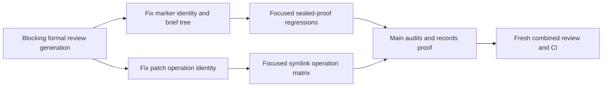

# NATIVE-FOREGROUND-ACTIVATE nineteenth formal review fixes

## Status

Draft PR #221 is open at `499c358`. Its current Linux and Windows CI is green. Formal combined review generation `6575c26f` is preserved as blocking history with two quality P1 findings and one security P1 finding. Independent focused reproductions confirmed all three defects.

## Objective

Fix the three confirmed review defects without changing architecture or the task graph: fail closed when a working-tree task marker differs from its committed HEAD identity, read a sealed task's authoritative review brief from the marker-publication commit, and preserve structured patch operation identity so Add, standalone Update, and Move destination cannot follow a symlink leaf while Delete and Move source keep their authorized lexical-leaf behavior.

## Scope and decisions

Only these product paths may change:

- `factory/scripts/factory_lib.py`
- `factory/scripts/pre_tool_use.py`
- `factory/tests/test_gates.py`
- `factory/tests/test_worker_admission.py`

Use the existing C2 worker-admission and C4 sealed-proof abstractions. Do not add a marker format, review registry, proof fallback, path abstraction, dependency, skip, or platform exception. Follow `constitution/09-agent-conduct.md` sections 2 through 4 and the Ponytail ladder.

The exact repairs are:

1. Local task-proof validation compares the working marker with the marker committed at HEAD before treating a task as unsealed. A changed, deleted, malformed, or non-object working marker refuses when HEAD contains a marker. A task with no committed marker keeps its existing pre-seal behavior, and explicit `preseal=True` remains available for the supported fresh-proof flow.
2. A sealed ordinary task reads `.factory/review-briefs/all.md` from the commit that first published its marker. It must not prefer an inherited brief at the product/seal commit. Existing selected-upgrade and historical proof behavior remains intact.
3. `apply_patch_paths()` preserves Add, standalone Update, Delete, Move source, and Move destination roles through normalization. Add, standalone Update, and Move destination targeting a symlink lexical leaf refuse because Codex writes through those paths. Delete and Move source retain the existing lexical-leaf behavior. Symlinked or escaping ancestors still refuse.

## Workflow



## Verification

The implementation worker runs:

```bash
UV_CACHE_DIR=/tmp/forge-review-p1-uv-cache UV_TOOL_DIR=/tmp/forge-review-p1-uv-tool \
  uv run --python 3.11 --with pytest --with psutil pytest -q \
  factory/tests/test_gates.py::test_task_proof_refuses_working_tree_marker_different_from_head \
  factory/tests/test_gates.py::test_task_proof_allows_mixed_product_and_metadata_commits \
  factory/tests/test_gates.py::test_task_pr_ready_retry_reuses_unchanged_committed_marker \
  factory/tests/test_worker_admission.py::test_worker_add_or_update_symlink_leaf_is_denied \
  factory/tests/test_worker_admission.py::test_worker_symlink_entry_is_denied
git diff --check
```

Main audits the exact four-path diff and records focused proof. Final task close uses the existing cumulative selectors with a focused `FACTORY_TEST_CMD`; current-head Linux and Windows CI own the broad cross-platform run before merge.

## Manual Verification

1. Read `_committed_task_marker()` and confirm a committed marker cannot be hidden by changing or deleting its working copy, while a genuinely unsealed task still works.
2. Read the sealed proof call and confirm marker publication is the sole ordinary sealed source for `all.md`.
3. Read the structured patch parser and confirm a Move reclassifies its source and destination separately without resolving either lexical leaf.
4. Run the focused tests and confirm changed/deleted/non-object marker cases refuse, the publication-brief case passes, Add/standalone-Update/Move-destination symlink leaves refuse, and Delete/Move-source controls pass.
5. Inspect the worker diff and confirm only the four authorized files changed, with no skip or fallback.

<!-- forge:contract -->
## Contract (recorded)

Rendered by the harness from the recorded decomposition; edit the decomposition, not this block. It is excluded from the plan's approval and grill digests, so a re-render never stales either.

**Objective.** Resolve formal combined review generation 6575c26f without changing architecture or the task graph. In factory_lib.py, fail closed when the local task marker differs from the marker committed at HEAD and read an ordinary sealed review brief from the marker-publication commit. In pre_tool_use.py, preserve Add/Update/Delete/Move identity through structured patch normalization so Add, standalone Update, and Move-destination symlink leaves refuse while authorized Delete and Move-source lexical leaves remain allowed and escaping ancestors still refuse. Change only factory/scripts/factory_lib.py, factory/scripts/pre_tool_use.py, factory/tests/test_gates.py, and factory/tests/test_worker_admission.py; Main owns recorders, Git, close, review, seal, PR, and CI.

**Acceptance criteria**

- NATIVE-FOREGROUND-ACTIVATE preserves the full target hook configuration and Claude parity: native hook JSON stays scoped, `.claude/settings.json` gains clear registration, `check_dual_runtime.py` verifies independent and both-adapter omissions, and official hook readiness remains trusted. As an explicitly additional user-requested overlay, First owns every current model-policy hunk without moving any original prepared path/hunk allocation: owning harness/launcher, active project profiles and guidance, all 15 committed team agent definitions, exact init/upgrade distribution proof, top-level main-selector omission, and same-plugin Luna/max doctor compatibility. The main coordinator model and reasoning are selected by the user and host, including Terra when the user chooses it. Exploration uses Sol/low; planning, decomposition, architecture, plan validation and grills use Sol/high; implementation, technical test verification and autoreview fixes use Sol/medium, with formal Lite as Luna/max; formal autoreview and functional checking use Sol/high; no Forge-managed delegated or subagent lane uses Terra. Decision 0074 supersedes Decision 0070 for current model policy, retains every Forge-managed pin and team definition, and preserves Decision 0031's Lite lifecycle. The original Luna/max C8 evidence remains unchanged history, not selector authority. Ordinary `forge delegate` derives Sol/medium from harness.yaml; any retained effort input accepts only exact `medium` and rejects low/high/xhigh before launch. Review execution pins Codex to Sol/high and refuses an unreadable or known Terra-fallback helper before brief publication or launch. Shell-wrapped raw Codex detection consumes supported option operands before command detection: Bash `-o/+o`, `-O/+O`, `--rcfile`, `--init-file`, including whitespace-separated, clustered, and attached forms, and zsh `-o/+o`, including whitespace-separated and attached forms. Operand values remain data even when they contain `c`, `codex`, or shell-looking text. It treats `c` only as a real short option, stops at `--` or the first script operand, and refuses nested raw launch before execution. Direct and supported wrapped raw launches normalize both slash styles before comparing the platform basenames codex, codex.exe, and codex.cmd; quoted absolute Windows paths and executable suffixes cannot bypass the protected launch path. Raw detection remains quote-aware for whitespace-bearing global option operands and environment-assignment values in direct, wrapped, pipeline, and substitution forms; already-parsed Codex argv is classified directly without re-stringifying it. Raw-Codex regex candidates are accepted only at active shell boundaries: quoted or escaped assignment/query/pipeline data, single-quoted substitution text, and inert nested-shell data cannot deny, while active separators, later real launches, backticks, and command substitution inside double quotes still deny at both top-level and nested-shell checks. An active $() or backtick body uses fresh inner command context and restores its outer quote only at a real unquoted/unescaped close, so a later launch inside the body denies even under outer double quotes while nested, quoted, and escaped delimiters stay data.
- Process-bound admission remains truthful: foreground launch registers before stdin with terminal identity and writes exact UTF-8 prompt bytes independent of the host locale, zero-exit without completed turn is failed, and native write admission covers add/update/delete/move only after registration. Cancellation writes the existing durable revocation marker before cleanup signals; terminal success/failure plus dead process and released matching lock revoke completion; non-active stage incarnation revokes stage closure. Admission requires an exact starting/running row, live matching process ancestry, held matching lock, active matching stage and no explicit revocation; failed cleanup never invents success and no new completion tombstone is introduced. Worker admission and stage coverage use one immutable-baseline-aware scope rule: a Git tree or explicit trailing slash is a directory, while a blob, symlink, or absent path is exact. Exact equality remains allowed; descendants require directory classification, and the mutable working tree cannot widen authority. Native Codex receives binary stdin bytes equal to the exact multiline prompt encoded as UTF-8, with no platform newline translation. An ordinary terminal row certifies completion only when argv exactly matches the command derived from its own recorded and baseline-classified scope; scope-less legacy argv is never current selector authority. Structured patch normalization preserves an exact lexical symlink leaf so its authorized delete or move can proceed, while any symlinked or escaping ancestor still refuses.
- C9 review inputs are complete and task-specific: task, branch and combined review receive the full approved task plan, approval/grill fields, digest, current delta and resolved automated report; missing, stale, summarized, truncated or substituted inputs refuse. Each default `forge review` calls the installed helper once and creates one schema-exact immutable generation with RFC4648 base64 of exact pre-parse output and three genuine lens records. Combined/rejection retain real helper/input/raw/run/brief provenance; upgrade losslessly copies sealed legacy lenses with inventory/source hashes and marker identity and fabricates none. Public `--set` derives or compares the installed helper path/version/hash, exact `_combined_prompt(task)` bytes/hash/count, current run/brief, task token and current delta before accepting raw output; it rederives lenses and refuses caller mismatch. Provider passes are authoritative. Forge reconstructs and validates the top-level list in pass order with the helper's unchanged `(NFC POSIX path, integer line, exact category, normalized tagged title)` merge key and chunk prefix/2,000-character bound; raw and top-level findings remain lossless and mixed source attribution refuses. Lens projection and remediation use the separate `(NFC POSIX path, integer line as normalized start/end, normalized tag-free title)` fingerprint. Same-lens duplicates keep only the first projected provider record, preserving its category and metadata; the same fingerprint under different lenses refuses. Assessment prose carries no parsed fingerprint grammar, and rejection identity remains SHA256 of canonical path/line/title JSON. Require exact ordered full-line lens markers, chunk order, one lens tag, the 3,000-character explanation bound, quality verdicts only inside quality blocks, and existing score/recommendation/worst-verdict rules. Verify helper identity before/after launch. Under cross-platform review-selection exclusion, revalidate current HEAD/delta immediately before pointer replacement; stale publication refuses. Generation identity is canonical content SHA256; reads recompute it; ancestors are real directories and leaves regular single-link files; identical retry succeeds and unequal collision refuses. A blocking generation selects and revokes clean status; only selected clean/current proof certifies. Rejection may extend selected combined or rejection proof, bind the immediate source SHA/ID and combined root, preserve raw bytes/prior history/unaffected lenses, and append one unique cited finding plus deterministic lesson path/hash. Record or idempotently reuse the lesson before pointer publication; lesson failure preserves selection, later pointer failure may leave a valid reusable lesson, and divergent lesson collision refuses. Upgrade, fixed-only, unselected, copied, stale, incomplete-source, unrelated-citation, no-match, ambiguous and already-rejected findings refuse. Existing regressions prove each refusal preserves selection and prove two sequential successful rejections preserve exact fingerprints, raw bytes, lesson lineage, and clean-checkout sealing. Diagnostics never publish or stamp. First and Lean produce only recorder-backed task proof. Lens-title validation normalizes the tag-free title before checking for another lens tag, so a second quality, performance, or security tag separated by any whitespace refuses before projection and duplicate identity. Combined/rejection generation validation always checks decoded raw helper shape even for zero bytes with canonical empty base64/SHA. One-pass and pass wrappers alone carry provider_report; a chunked top-level provider_report is unexpected and refuses before projection or publication. Every decoded non-object helper result, including null, number, list, and string, reaches one controlled invalid-wrapper refusal before membership tests and can never publish. provider_report authority is allowed only when the caller requires it for one-pass or pass wrappers, never through a global allowance.
- C10 uses one task-aware proof predicate for local worktree, CI, board/readiness, `forge task close` and sealing. Pre-seal consumers resolve the immutable generation named and hashed by task `selected.json`, with raw output, three lenses and current `product_delta_digest` identity. Pointer replacement publishes last; absent, fixed-only, incomplete, malformed, copied, mixed, stale, tampered or interrupted proof preserves the prior pointer. Active publication rechecks HEAD/delta while holding review-selection exclusion. Task seal holds that same exclusion from selected-proof validation through marker commit, revalidates the pointer, traverses and validates the complete combined-to-selected rejection ancestry, and stages the pointer, every generation in that lineage, each referenced lesson at its exact path/hash, and `all.md`. A real separate-process regression pauses sealing after marker preparation while the lock remains held, starts publication in a second process, and proves pointer replacement waits until the marker commit finishes; sealed readers load that lineage and its lessons from the marker commit. Only Portable may later publish an upgrade pointer. Sealed readers follow the task's current pointer for an upgrade only when its validated `sealed_commit` exactly equals the inspected task marker; ordinary combined or rejection ancestry remains loaded from that marker commit. Close skips helper only for selected clean/current proof; a post-pointer stamp retry validates and stamps that same generation without another helper. Stage/frontier, CI and board share the predicate; refusal mutates no marker, Git, PR, stage or proof state, and no runtime reader falls back to fixed or story proof. Every verify/tests reader uses one central proof-specific typed-read rule in factory_lib.py: valid non-object JSON is malformed proof, and the existing forge next/phase, board, phase-transition, story-closeout, task-close, frontier and seal consumers reach their inspection, repair or refusal outcomes without calling .get on that value or raising; every out-of-batch consumer module remains byte-identical and only factory_lib.py plus existing in-batch tests may change for this fix. Decision 0066 legacy conversion runs only after selected proof passes; invalid/stale proof leaves caller, authoritative stage and snapshot bytes unchanged. Task-owned proof presence is independent of successful object parsing: a syntactically valid non-object verify.json or tests.json forces modern fail-closed validation and can never enable legacy fallback. With an existing marker and unchanged product delta, an ordinary pr-ready retry runs the sealed predicate and refuses every post-marker proof rewrite before marker, stage, selection, Git, push, or PR mutation; clean unchanged proof reuses the marker, while a genuinely moved product follows the normal reopen, fresh-proof, review, close, and reseal flow. A sealed task with missing task-owned proof never downgrades to fixed story/root verify, tests, or lens files. The sole fixed-proof migration remains a schema-valid selected origin=upgrade generation whose sealed_commit exactly binds the inspected marker.
- Workspace-before-JIT honors incumbent 0063. Successor task start checks approved plan/decomposition, task/digest, refreshed trunk and dependency markers, then creates the worktree before JIT save/grill/approval. Attach accepts only a clean, registered, unowned same-common-directory worktree at that trunk commit with matching identity/dependencies. Grounding, JIT approval, stage and registered admission precede writes. After materialization, hydration preflights every destination before payload mutation and preserves Decision 0028's legal in-target file symlink. On refusal it attempts exact worktree removal, deletes the branch only after confirmed removal, and otherwise reports the surviving worktree/registration/branch without inventing cleanup success or mutating external payload state. The shipped-dependency predicate reads one exact fetched origin/trunk snapshot, validates marker identity and ancestry with the fetched SHA, and for an ordinary marker validates the shared exact task proof before any successor branch or worktree allocation. A reconciled marker skips proof only after its identity and ancestry validate; malformed, wrong-task, or proofless markers remain unshipped across task start, board, frontier, and closeout. Existing startup proof covers invalid JSON, non-object, empty-object, wrong-task, invalid-commit, and proofless ordinary dependency markers; each remains unshipped and allocates no task branch or worktree before the validated reconciled positive control.
- Unsupported native operations refuse before side effects: native background/read-only background, general status, live/dead worker status, cancel/resume/jobs, explore, and native question delivery do not compose briefs, spend question eligibility, append ledgers, signal processes, or dispatch children until their successor owners ship. The only native status exception renders already-dead registered native grill rows through existing dead_launches, restricted to strict grill gate/task labels and starting/running rows proven dead; it does not call the general status handler. Preserve unchanged Claude dispatch.
- Own-task review preflight uses `proof_path(base, story, artifact, task_id=args.id)` for the active task, accepts only own-task proof, and refuses story or other-task proof without helper fallback.
- The admitted native worker reads and hashes the exact protected task plan, then exercises the actual native hook against that plan with harmless absent patch context. Only a correlated PreToolUse deny event counts: automated report receipt, registered terminal row and durable tool log identify the same launch/session/tool call and actual denial; unchanged bytes, context failure or synthetic payload never certify it. Main runs current `forge next`, process-heavy/full verification and correlation outside the managed companion. The implemented plan-contract review checks that evidence. The one shared review-set schema is introduced here; no second registry or CI/C10 parser is added.
- Closeout proof matches the hardened marker contract without weakening production validation. The board memo regression counts the current rev-parse probe, proves memo reuse, and invalidates against a schema-valid reconciled marker. The story-closeout regression commits the existing scoped decomposition with T1 proof before marker publication, immediately asserts T1 is valid on trunk, and keeps normal sealed markers unreconciled. AGENTS.md remains semantically complete at no more than 110 lines, and the repository scaffold checker passes.
- Review regression tests are hermetic on clean Ubuntu. The review-set recorder test supplies one test-owned safe helper to both in-process identity derivation and the subprocess recorder; the active-task proof preflight test replaces only helper discovery with a test-owned safe helper; and the rejection-lineage fixture commits existing lifecycle state before its intentional divergent merge and requires src/work.py to be the exact unmerged path before resolution. The three focused nodes pass with no personal AUTOREVIEW installation, without skips or production-code changes.

**Write scope** (what `stage done` measures the diff against)

- .claude/CLAUDE.md
- .claude/settings.json
- .codex/agents/AGENTS.md
- .codex/agents/architect.toml
- .codex/agents/backend.toml
- .codex/agents/debugger.toml
- .codex/agents/docs-decomposer.toml
- .codex/agents/explorer.toml
- .codex/agents/frontend.toml
- .codex/agents/functional-checker.toml
- .codex/agents/griller.toml
- .codex/agents/lite.toml
- .codex/agents/performance.toml
- .codex/agents/planner-high.toml
- .codex/agents/planner.toml
- .codex/agents/refactorer.toml
- .codex/agents/security.toml
- .codex/agents/tester.toml
- .codex/config.toml
- .codex/explore.config.toml
- .codex/hooks.json
- AGENTS.md
- README.md
- WORKFLOW.md
- docs/FACTORY.md
- docs/QUALITY.md
- docs/ROLES.md
- docs/architecture/dual-coordinator-parity.md
- docs/decisions/0062-luna-max-exploration-and-implementation.md
- docs/decisions/0070-sol-specialized-workflow-models.md
- docs/degraded-mode.md
- docs/getting-started.md
- docs/product/BRIEF.md
- docs/specs/dual-coordinator-parity.md
- docs/specs/strict-role-split.md
- factory/prompts/griller.md
- factory/prompts/implementer.md
- factory/prompts/planner.md
- factory/prompts/reviewer.md
- factory/schemas/delegation.json
- factory/schemas/review-set.json
- factory/scripts/check_dual_runtime.py
- factory/scripts/check_encoding_hygiene.py
- factory/scripts/check_task_proof.py
- factory/scripts/factory_lib.py
- factory/scripts/forge.py
- factory/scripts/forge_cli/close.py
- factory/scripts/forge_cli/codex_runtime.py
- factory/scripts/forge_cli/delegate.py
- factory/scripts/forge_cli/doctor.py
- factory/scripts/forge_cli/phase.py
- factory/scripts/forge_cli/readiness.py
- factory/scripts/forge_cli/review.py
- factory/scripts/forge_cli/review_brief.py
- factory/scripts/forge_cli/stages.py
- factory/scripts/forge_cli/tasks.py
- factory/scripts/forge_cli/upgrade.py
- factory/scripts/forge_cli/worker_admission.py
- factory/scripts/pre_tool_use.py
- factory/scripts/record_review_from_json.py
- factory/scripts/session_start.py
- factory/scripts/stop_continue.py
- factory/skills/forge.md
- factory/tests/test_gate_table.py
- factory/tests/test_board_load_time.py
- factory/tests/test_gates.py
- factory/tests/test_close_binds_to_the_diff.py
- factory/tests/test_grill_release.py
- factory/tests/test_native_launch.py
- factory/tests/test_native_setup.py
- factory/tests/test_proof_read_path.py
- factory/tests/test_review_lenses_in_parallel.py
- factory/tests/test_review_settled_contracts.py
- factory/tests/test_review_task_delta.py
- factory/tests/test_stop_less_often.py
- factory/tests/test_worker_admission.py
- harness.yaml
- plans/exploration/coordinator-parity-preparation/lean-delivery-graph.json

**Scope amendments** (measured paths the scope did not name, recorded with `forge stage amend-scope`)

- factory/tests/test_task_parallelism.py -- The authoritative full verifier exposed this existing task-parallelism regression fixture as part of the approved immutable-baseline scope-classification change; its six slash expectations must track the directory-marked scope representation.

**Required tests** (run by `stage done`)

- `test_task_proof_refuses_committed_non_object_marker` -- `UV_CACHE_DIR=/tmp/forge-review-p1-uv-cache UV_TOOL_DIR=/tmp/forge-review-p1-uv-tool uv run --python 3.11 --with pytest --with psutil python -m pytest {path} -k {id} --junitxml={report}` (factory/tests/test_gates.py)

**Verify commands**

- `git diff --check`

**Review budget.** 180 files / 18000 lines -- Original estimate remains 24 files/4,000 changed lines and the cumulative task remains inside the approved 180-file/18,000-line seal ceiling. The post-499c358 formal-review continuation may change only factory/scripts/factory_lib.py, factory/scripts/pre_tool_use.py, factory/tests/test_gates.py, and factory/tests/test_worker_admission.py with at most 160 added-plus-deleted lines. Exclude only recorder-owned .factory/** state; no architecture, dependency, schema, skip, or unrelated production path may change.
<!-- /forge:contract -->
