# NATIVE-FOREGROUND-ACTIVATE: one combined review generation

## Authority and exact boundary

The user moved complete D-0032 from `LEAN-WORKFLOW` into `NATIVE-FOREGROUND-ACTIVATE` on 2026-09-11 because three helper calls made every review round unnecessarily slow. Decision 0069 records the resulting design: one helper call, one immutable raw-plus-three-lens generation, and one task-scoped selected pointer. The user approved all amended story and task plans on 2026-09-12.

The current task branch contains integration merge `30b19c729b5874eaa855ac6d25200c87e44942c6`, whose second parent is validated `origin/main` commit `43f6bedeb01c50c9d7af52829ac73f540ae5d25f`. That tip retains the earlier validated `c9a705bc315d4677309815eb03b58e61e7957e50` closeout baseline and adds accepted Decision 0067 round ownership plus Decision 0068 worker-network behavior. The branch-owned decisions are mechanically renumbered to 0069 through 0072 without changing their semantics. The inherited baseline supplies Decision 0066's `delta_id`, resumable `forge task close`, complete proof before stage mutation, marker-only sealing, task-plan rendering, native recorded-scope validation, board/CI readers, and the interim concurrent three-helper review. These are baseline behavior, not this task's contribution.

Product commit `c5382eeef716b6a9bdff8ba867a2b681c4416a13` and proof commit `340000f86c2a42376273e5d4b12993001e332834` established the pre-integration green state. Their proof is historical after the trunk merge. Integration merge `30b19c729b5874eaa855ac6d25200c87e44942c6` is the comparison baseline for the remaining review fixes.

The previously captured combined-review audit predates that merge and is historical context only. Its candidate-directory, `review-run.json` pointer, and fixed-file fallback proposals are superseded. The approved story plan and its bound ownership graph are the design authority. The story-plan amendment adds the two inherited-main regression files omitted from the earlier 72-path scope. Post-implementation full verification then proved that one legacy closeout fixture module also needs migration to selected-generation authority. The final task cold read proved the old effort-escalation regression must change with Decision 0070's non-bypassable pin. The final task contract therefore has a 77-path recorded envelope and 62 declared tests; the existing protected scope amendment adds `factory/tests/test_task_parallelism.py`, making the incumbent mechanical authority 78 effective paths. Main records the final decomposition, saves and grills this task plan, binds the user's approval, controls stage/delegation, and runs `forge task close` through PR and CI.

## Goal

Replace the interim three-helper review with the complete Decision 0069 protocol while reusing the inherited closeout and product-delta seams. Every complete review attempt calls the installed helper once, validates all three genuine lens assessments from the same raw result, writes one immutable generation, and atomically selects it last. Missing, stale, blocking, fixed-only, story-fallback, mixed, copied, tampered, or interrupted proof cannot certify the task.

Use ponytail's minimum-diff ladder for every edit. Preserve all completed First work. Derive changes from the current checkout; do not replay any historical patch or treat prior proof as current proof.

## Remaining delegate expectation

The incumbent delegate, stage, and admission gates mechanically authorize the 77-path recorded task scope plus the existing protected `factory/tests/test_task_parallelism.py` amendment, for 78 effective paths, and the 180-file/18,000-line task budget. They have no launch-specific subset or smaller line-budget field. This recovery therefore uses one ordinary registered delegate under that honest existing authority; it does not claim that the narrower remediation list is a mechanical write lock.

The approved implementation intent expects changes only in these 22 existing paths plus the one new schema, with no more than 3,200 added-plus-deleted lines:

- `WORKFLOW.md`
- `docs/QUALITY.md`
- `factory/schemas/review-set.json`
- `factory/scripts/check_task_proof.py`
- `factory/scripts/factory_lib.py`
- `factory/scripts/forge.py`
- `factory/scripts/record_review_from_json.py`
- `factory/scripts/forge_cli/close.py`
- `factory/scripts/forge_cli/review.py`
- `factory/scripts/forge_cli/review_brief.py`
- `factory/scripts/forge_cli/stages.py`
- `factory/scripts/forge_cli/tasks.py`
- `factory/scripts/forge_cli/worker_admission.py`
- `factory/scripts/pre_tool_use.py`
- `factory/tests/test_gates.py`
- `factory/tests/test_close_binds_to_the_diff.py`
- `factory/tests/test_proof_read_path.py`
- `factory/tests/test_review_lenses_in_parallel.py`
- `factory/tests/test_review_settled_contracts.py`
- `factory/tests/test_review_task_delta.py`
- `factory/tests/test_stop_less_often.py`
- `factory/tests/test_worker_admission.py`
- `harness.yaml`

Every other path in the effective 78-path authority is preserve-byte-for-byte input. For the complete recovery, Main retains the approved 23-path/3,200-line expectation. Immediately before the third formal-review delegate, Main records the exact current HEAD. It compares only that delegate's delta against the recorded pre-delegation HEAD and accepts only the named eight existing paths; another path or more than 600 added-plus-deleted lines is a contract contradiction requiring amendment. The later `LEAN-WORKFLOW` task owns strict launch-specific `--scope` enforcement; First does not add a second partial implementation now.

## Final review amendment

The formal combined review at commit `33ac37daf39e88b9652f41b9738ef007daa45b2b` exposed five valid defects and one incorrect symlink-test diagnosis. Independent read-only validation confirmed the five fixes below and rejected the symlink diagnosis because the existing regression already reaches the topology refusal before ordinary scope admission.

Apply these fixes as one bounded review-remediation batch:

1. Accept ordinary assessment narrative before, between, or after the three uniquely marked lens blocks while retaining exact marker uniqueness, non-empty bodies, and quality/performance/security order.
2. Render the current immutable `delta_id` inside the complete approved task inputs received by the provider, and reuse that exact value for the token and review-run identity.
3. Preflight every hydration destination immediately after materializing a new task worktree and before grill deletion or payload writes. If validation fails, remove the exact newly allocated worktree and branch before returning the refusal.
4. Detect raw Codex execution inside shell short-option clusters containing `c`, including `bash -lc` and `sh -ec`, while continuing to allow display-only prose.
5. Update `WORKFLOW.md` to describe one combined helper invocation and remove the deleted `--sequential` workflow.

No new product path, task, dependency, acceptance criterion, schema, or line-budget increase is authorized by this amendment.

## Second formal review amendment

The first amendment was implemented and verified at `bcc3d89999c4220b98dc776a40c00961f21f94e6`. The next combined review preserved the previous selected pointer because publication correctly refused before replacement: the installed helper adds `chunk N/M` narrative to top-level merged finding bodies while preserving the original provider findings in `pass_reports`, and Forge incorrectly required those bodies to be identical.

Apply the five residual fixes below as one bounded review-remediation batch:

1. Match synthesized merged findings to preserved provider-pass findings by ordered lens plus normalized fingerprint, then project each lens from the provider-pass record. Refuse missing, changed, reordered, extra, ambiguously normalized, no-match, upgrade, unselected, copied, or unrelated identities and sources; later duplicates of the exact helper merge key remain raw-only as specified below.
2. Parse supported operand-taking shell options before command-mode detection: Bash `-o/+o`, `-O/+O`, `--rcfile`, and `--init-file`, including clustered or attached forms; zsh `-o/+o`, including attached forms. Treat `c` only as a real short option and stop at `--` or the first script operand.
3. Make worker admission and stage coverage use one immutable-baseline-aware scope rule: a Git tree or explicit trailing slash is a directory; a blob, symlink, or absent path is exact. Equality is allowed for every entry, descendants only for directories, and mutable-tree replacement cannot widen authority.
4. Treat syntactically valid non-object verify/tests JSON as malformed proof and route to inspection or repair without raising.
5. Validate selected proof before applying Decision 0066's legacy stage-stamp conversion. Invalid or stale selected proof leaves the caller's stamp plus authoritative and snapshot stage bytes unchanged; conversion occurs only after the shared selected-generation/current-`delta_id` predicate passes.

The existing hydration-destination preflight remains the already implemented fifth fix from the first amendment and retains Decision 0028's legal in-target file-symlink behavior. Cleanup attempts exact worktree removal first and deletes the task branch only after removal succeeds; a cleanup failure reports the surviving worktree/branch state and never claims rollback. The final cold read expands the recorded task scope to 77 paths and 62 required selectors by adding `factory/tests/test_stop_less_often.py` and its existing effort-policy selector. The existing protected `factory/tests/test_task_parallelism.py` amendment makes the incumbent authority 78 effective paths. The 180-file/18,000-line seal budget, 3,200-line complete-recovery expectation, task graph, schema set, and eight acceptance criteria remain unchanged.

The review's Codex-only setup/doctor concern is real but not owned here. Story-plan AC8, the parity ownership table, and `PORTABLE-DELIVERY-MIGRATION` assign setup/doctor coordinator selection to Portable; First owns only same-plugin Luna/max compatibility. Preserve `doctor.py` and setup bytes in this task and carry that concern to Portable.

## Third formal review amendment after main integration

The formal combined review of the pre-integration green product exposed six valid blockers. Main integrated validated `origin/main` first, preserved those findings as diagnostic history, and independently proved a focused fix shape. That proof is design evidence only: the ordinary registered delegate must derive its implementation from this amended protected plan and the current checkout.

Formal review covers the complete accumulated First-task delta and must apply `constitution/README.md`, `constitution/05-logging-and-observability.md`, `constitution/06-logger-and-log-transports.md`, `constitution/07-exception-handling.md`, and `constitution/09-agent-conduct.md`, including structured logging, redaction, terminal failure propagation, and exception behavior.

Apply these six fixes as one bounded review-remediation batch:

1. Sealed task readers must follow the task's current selected pointer after Portable publishes an upgrade generation, but accept that upgrade only when its schema-valid `sealed_commit` exactly equals the task marker being inspected. A stale, copied, mismatched, malformed, fixed-only, or unselected upgrade never satisfies sealed proof, and ordinary combined or rejection lineage continues to load from the marker commit.
2. Every proof reader that inspects `verify.json` or `tests.json` must use one central proof-specific typed-read rule in `factory/scripts/factory_lib.py`. That rule treats any valid JSON value that is not an object as malformed proof, so the existing `forge next`/phase, board, phase-transition, story-closeout, task-close, frontier, and seal paths route to their existing inspection, repair, or refusal result without calling `.get` on the value or raising. Keep every out-of-batch consumer module byte-identical; only `factory_lib.py` and the existing in-batch tests may change for this fix.
3. Native foreground launch must encode the exact prompt as UTF-8 before writing stdin, independent of the host locale. Extend the existing native-launch registration selector with a non-ASCII prompt under an ASCII locale; do not add a selector.
4. Raw-Codex shell guarding must consume whitespace-separated operands for every supported operand-taking option before looking for command mode. Option values that contain `c`, `codex`, or shell-looking text are data, not options or scripts. Preserve attached/clustered behavior, `--`, and first-script-operand stopping. Extend the existing raw-Codex guard selector in `factory/tests/test_gates.py`; do not create a separate test module.
5. Rejection tests must cover no-match, ambiguous, unrelated-citation, stale, incomplete-source, upgrade, unselected, copied, and already-rejected refusals while proving selection immutability. They must also prove two sequential successful rejections preserve exact fingerprints, raw bytes, lesson lineage, and clean-checkout seal validation.
6. Prove the seal/publication exclusion with real separate processes: pause task sealing after marker preparation while it still holds the shared review-selection lock, start publication in another process, and show publication cannot replace the pointer until the marker commit finishes. Thread-only or mocked-lock coverage is insufficient.

This batch may modify only `factory/scripts/factory_lib.py`, `factory/scripts/forge_cli/delegate.py`, `factory/scripts/pre_tool_use.py`, `factory/tests/test_gates.py`, `factory/tests/test_native_launch.py`, `factory/tests/test_proof_read_path.py`, `factory/tests/test_review_settled_contracts.py`, and `factory/tests/test_task_parallelism.py`. Reuse the existing 62 declared selectors: add no test file, selector, dependency, schema, task, acceptance criterion, or scope entry. Keep the 77-path recorded envelope plus the existing protected scope amendment (78 effective paths), 23-path complete-recovery expectation, and 180-file/18,000-line seal budget unchanged.

## Fourth formal review fix loop

The third remediation was committed at `bf7a00eb4403d9baa0a8e3b61482033213fbcaa4` and passed the eight focused selectors, the 23 review/proof selectors, all 62 declared selectors, the 72-case native suite, encoding hygiene, and the full 1,051-pass verifier. The first complete post-remediation three-lens review then found five valid defects and one hook-matcher diagnosis that the current prevalidation appears already to handle. Treat the matcher item as a required regression first: change `doctor.py` only if that regression is RED.

Resolve the review findings in one bounded fix batch:

1. Detect any commit that changes sealed verify, tests, review, and related proof after the task marker. Do not use only the first add commit. A post-seal rewrite must fail even when the proof file existed before sealing; marker-commit reads remain acceptable.
2. A native launch row without its own recorded `write_scope` has no write authority. Stage completion must refuse that row rather than substitute the task's current mutable scope.
3. The helper schema requires `source_attribution` on every finding and uses `null` for plain-source findings. Projection accepts only that null representation and refuses non-null or mixed attribution.
4. Extend an existing doctor hook-health selector with an invalid configured matcher. The check must return unhealthy readiness plus repair guidance without raising. The existing compile prevalidation is expected to satisfy this; edit `factory/scripts/forge_cli/doctor.py` only if the regression proves otherwise.
5. The admitted fix worker must hash the exact approved task plan and make one real `apply_patch` attempt against it with harmless absent context containing `THIS PATCH MUST NEVER EXECUTE`. Its result must identify the same launch, session, and tool call as the durable PreToolUse deny event, show unchanged before/after plan hashes, and report `patch_executed=false`. Main verifies the correlated terminal row and durable log and records those concrete identities and hashes in the automated test report.
6. Replace the fixed-delay seal/publication assertion with a child-to-parent handshake at the publisher's actual review-selection lock acquisition seam. Wait for that signal before asserting that pointer replacement is blocked until the marker commit completes.

This fourth batch may modify only `factory/scripts/factory_lib.py`, `factory/scripts/forge_cli/stages.py`, `factory/scripts/forge_cli/review.py`, `factory/scripts/forge_cli/doctor.py`, `factory/tests/test_worker_admission.py`, and `factory/tests/test_gates.py`, with no more than 500 added-plus-deleted lines from Main's exact new pre-delegation HEAD. Extend existing selectors only. Add no file, selector, dependency, schema, task, acceptance criterion, or scope entry. The existing 77-path recorded envelope plus protected scope amendment, 62 declared selectors, 23-path complete-recovery expectation, and 180-file/18,000-line seal budget remain unchanged.

## Fifth fix-loop amendment after parent verification

The fourth batch was committed at `9a299f1ab151be5fe7a6fb7ae0eab3f3b447ded1`. Its five focused regressions passed, but Main's exact native launch/setup/admission verify command then exposed two stale successful-launch fixtures in `factory/tests/test_native_launch.py`. The stricter runtime correctly refuses their native terminal rows because those rows omit the immutable `write_scope` they claim to certify.

Update only those existing fixtures: record the task's exact `write_scope` on each successful native lifecycle row and build its recorded argv from that same scope. Do not restore a missing-scope fallback or weaken the production check. Modify only `factory/tests/test_native_launch.py`, within 40 added-plus-deleted lines from Main's exact new pre-delegation HEAD. Add no file, selector, dependency, schema, task, acceptance criterion, or scope entry. Main reruns the exact native suite, all 62 declared selectors, the full verifier, proof recording, and formal review.

## Sixth fix-loop amendment after full verification

The fifth batch was committed at `593f4f8d47d56b1691630fb76f6d97fbedcadc01`. The exact native suite passed 72 tests and all 62 declared selectors passed as an 82-test union. The full verifier then passed 1,050 tests, skipped three, and failed only `factory/tests/test_gates.py::test_task_proof_allows_mixed_product_and_metadata_commits`.

The failing selector correctly exposes a shared-predicate regression in the fourth batch. `_modern_task_proof_problems` scans the entire task `reviews/` directory for post-marker changes, so it treats a deliberately mismatched, later unselected immutable generation as authoritative proof even after the valid marker-bound upgrade pointer is restored. Decision 0069 and the approved C4 contract make `selected.json` the authority: unselected immutable generations are inert, while the selected generation, every selected rejection ancestor and lesson, `verify.json`, and `tests.json` remain strict proof inputs.

Implement the smallest shared fix in `factory/scripts/factory_lib.py`: let `read_selected_review_generation` optionally collect every exact review path it consumes, including `selected.json`, the selected generation, rejection source generations, and lesson paths. Make the post-marker history check inspect only `verify.json`, `tests.json`, and that collected authoritative review lineage. Keep the existing exception limited to the exact valid marker-bound upgrade generation and its selected pointer. Do not blanket-allow generations, weaken sealed binding, or change `factory/scripts/check_task_proof.py`.

Keep the existing failing flow in `factory/tests/test_gates.py`: mismatched selected upgrade refuses, restoring the valid pointer makes the unrelated immutable generation inert, and a later non-identity marker metadata rewrite still resolves the original marker publication commit. Extend an existing selector, without adding a new one, to rewrite and restore an authoritative selected generation after the marker and assert the exact review path remains a proof-history failure. Modify only `factory/scripts/factory_lib.py` and `factory/tests/test_gates.py`, within 120 added-plus-deleted lines from Main's exact new pre-delegation HEAD. Add no file, selector, dependency, schema, task, acceptance criterion, or scope entry. Main reruns the failing selector, the exact native suite, all 62 declared selectors, the full verifier, proof recording, and formal review.

## Seventh formal review follow-up loop

The sixth remediation was committed at `9472dc8bde21b7cc910be564ee4ebd264b7fae46`. Its selected-lineage regression passed, the exact native suite passed 72 tests, all 62 declared selectors passed as an 82-test union, encoding hygiene passed, and the full verifier passed 1,051 tests with three platform skips. Combined review generation `c4abe47b8d5d7a388502a292ff9e8d6610aabe3f40e7ffa0328b1ba5e97217f8` then recorded six non-blocking P2 findings. All six are valid, cheap, and inside the incumbent task boundary, so the repository's clean-review rule requires one more fix commit and review.

Resolve the six findings as one minimum-diff batch:

1. Update `AGENTS.md` Hard Gates to name `reviews/selected.json` plus its immutable selected-generation lineage as certifying task review proof. Fixed quality/performance/security files remain diagnostic and migration input only.
2. Make native write admission require the launch record's own valid non-empty `write_scope`. Bind that exact field across starting/running lifecycle rows, require it to equal the task scope authenticated by `task_sha256`, classify the recorded scope at the immutable stage baseline, and validate native argv against that recorded classified scope. A missing, malformed, changed, or mismatched recorded scope refuses.
3. Make combined finding projection distinguish a missing `source_attribution` key from the required explicit `null`; plain-source output without the key refuses. Update valid helper-shaped fixtures, including the shared rejection fixture in `factory/tests/test_review_settled_contracts.py`, to include the explicit null and extend the existing malformed-output selector with key deletion.
4. Restrict raw `codex exec` detection to actual executable positions reached through the already-supported literal wrappers and shell command operands. Preserve denial for the existing direct, `command`, `env`, `nohup`, `nice`, `xargs`, and shell-wrapper cases, including wrapper options and their operands: at minimum `env -i`, `command --`, `nohup --`, `nice -n 5`, `xargs -n 1`, and `xargs -I ITEM` before `codex exec`. Allow argument data after an unrelated executable such as `python audit.py codex exec` and `tool --label codex exec`. Unknown option shapes for a known executable wrapper that still contain a literal launch must fail closed. Query-only `command -v`/`command -V` and wrapper `--help`/`--version` modes must remain allowed, while `env -S 'codex exec ...'` and `env --split-string='codex exec ...'` are command payloads and must be parsed and denied. Do not turn this into a general shell parser or weaken substitution/pipeline denial.
5. Strengthen the existing malformed hook-matcher regression to assert `ready is False` as well as the repair text. Production doctor code remains byte-identical unless this assertion is RED.
6. Keep the existing successful and missing-scope stage-completion proof, and extend the live native admission selector so missing, changed-between-rows, malformed, or task-mismatched recorded scope cannot reach `native_argv_valid` or receive a grant.

This batch may modify only `AGENTS.md`, `factory/scripts/forge_cli/worker_admission.py`, `factory/scripts/forge_cli/review.py`, `factory/scripts/pre_tool_use.py`, `factory/tests/test_worker_admission.py`, `factory/tests/test_review_task_delta.py`, `factory/tests/test_review_settled_contracts.py`, `factory/tests/test_native_setup.py`, and `factory/tests/test_gates.py`, with no more than 260 added-plus-deleted lines from Main's exact new pre-delegation HEAD. Extend existing selectors only. Add no file, selector, dependency, schema, task, acceptance criterion, or scope entry. Main runs the affected selectors, exact native suite, all 62 declared selectors, encoding hygiene, the full verifier, proof recording, and one fresh complete three-lens review.

## Eighth formal review follow-up loop

The seventh remediation was committed at `67118caca866f2733c82028324df1131f15c86a6`. Its direct hook matrix passed 18 cases, the five affected selectors passed, the exact native suite passed 72 tests, all 62 declared selectors passed as an 82-test union, encoding hygiene passed, and the full verifier passed 1,051 tests with three platform skips. Combined review generation `7f454350aa0085f2a70fd3c4030ef32b544b06312f1a633a96466b1f79021174` then recorded one blocking P1 and three non-blocking P2 findings. All four are valid, bounded contract gaps, so the clean-review rule requires one final minimum-diff batch.

Resolve the four findings as one batch:

1. Remove the scope-less legacy argv alternative from ordinary terminal native validation. A row without `resume_session` certifies completion only when its argv exactly equals the command derived from its own recorded and baseline-classified scope; old scope-less terminal rows cannot act as current selector authority.
2. Treat supported Windows launcher basenames `codex.exe` and `codex.cmd` as Codex executables everywhere the raw-launch guard recognizes direct or wrapped `codex exec`. Preserve the existing exact wrapper/query/data distinctions.
3. Preserve the lexical identity of an exact in-scope symlink leaf in structured patch validation while still refusing any ancestor symlink or resolution escape. This allows authorized delete or move operations on the symlink entry itself without granting access through it.
4. Launch native Codex with a binary stdin pipe and write `text.encode("utf-8")` so platform newline translation cannot change the prompt bytes. Extend the existing native launch selector with a multiline non-ASCII prompt and assert the child-captured raw bytes exactly match that UTF-8 sequence.

This batch may modify only `factory/scripts/forge_cli/codex_runtime.py`, `factory/scripts/forge_cli/delegate.py`, `factory/scripts/pre_tool_use.py`, `factory/tests/test_native_launch.py`, `factory/tests/test_worker_admission.py`, and `factory/tests/test_gates.py`, with no more than 180 added-plus-deleted lines from Main's exact new pre-delegation HEAD. Extend existing selectors only. Add no file, selector, dependency, schema, task, acceptance criterion, scope entry, wrapper abstraction, or compatibility fallback. Preserve every prior First-task behavior and proof. Main runs the affected selectors, exact native suite, all 62 declared selectors, encoding hygiene, the full verifier, proof recording, and one fresh complete three-lens review.

## Workflow

```mermaid
flowchart LR
    A[Approved task contract] --> B[Registered Sol/medium delegate]
    B --> C[One combined helper call]
    C --> D[Validate ordered passes, three sections, tags and verdicts]
    D --> E[Write immutable raw plus three-lens generation]
    E --> F[Read back and hash]
    F --> G[Atomically replace selected.json]
    G --> H[Shared task proof checks current delta_id]
    H --> I[forge task close]
    I --> J[Task PR and green CI]
```



Before the eighth fix batch, Main records the amended 77-path/62-test decomposition and existing protected scope amendment, saves, grills, and approves this exact plan while preserving the already-active stage incarnation. Main refreshes the protected incomplete-stage note through the owning recorder and records the exact current pre-delegation HEAD, then launches one ordinary registered `gpt-5.6-sol`/medium worker under the effective 78-path authority. That worker owns only the six named existing paths and resolves the four selected findings without adding a selector, abstraction, or compatibility fallback. Main validates the six-path/180-line boundary, reruns the affected selectors, the exact native suite, all 62 selectors, encoding hygiene, and the full verifier in the permissive parent environment, refreshes current proof, and reruns the complete three-lens review. Any valid P0-P2 finding returns as another bounded Sol/medium fix batch; clean proof continues through resumable `forge task close`, PR, and CI. No degraded window is opened unless a real ordinary-delegation outage is observed and recorded.

### Combined result grammar

With no `--lens`, the selected lens set is quality, performance, and security in that order. Every actual provider pass contains one non-empty assessment between the exact full-line `BEGIN FORGE ASSESSMENT <lens>` and `END FORGE ASSESSMENT <lens>` markers for each lowercase lens, in that order. Quality retains one terse `VERDICT <contract-id>:` line for each current contract. An unchunked result is one top-level pass; a chunked result requires exact non-empty labels `chunk 1/N` through `chunk N/N` with no gaps or reordering.

Every merged finding title begins with exactly one token: `[quality] `, `[performance] `, or `[security] `. Projection removes that token only from its own lens record. The installed helper exposes one integer `code_location.line`, so both normalized start and end equal that value. Cross-lens duplicates use exactly this fingerprint after tag removal: NFC POSIX repository-relative `file_path`, that integer start/end pair, and the NFC whitespace-collapsed case-folded title. Category is not part of the fingerprint. Every materially affected lens names the shared fingerprint and its blocking state in its assessment; an affected blocking lens cannot report clean, exactly one projected record owns the fingerprint, and projection under multiple lenses refuses. Preserve every provider pass in order. For chunked ordinary branch reviews, reconstruct the helper top-level findings in pass order by retaining the first occurrence of its exact merge key `(NFC repository-relative POSIX file_path, integer line, exact category, NFC whitespace-collapsed case-folded tagged title)`, prefix only that first provider body with the exact chunk label and helper 2,000-character bound, and require the entire synthesized list to match. Later duplicate keys remain only in raw provider reports. Require the schema's `source_attribution: null` representation for plain-source projection and refuse any non-null or mixed attribution. Project each lens from the retained first provider finding; the separate cross-lens rejection fingerprint remains path/line/title after tag removal. Extend the existing projection selector with a real helper-shaped duplicate across two chunks. Extract `VERDICT` lines only from the validated quality assessment block inside each actual pass `overall_explanation`; never scan performance/security blocks, finding bodies, or the synthesized top-level chunk summary for quality verdicts. Then reuse the existing per-lens score, recommendation, and worst quality-contract-verdict behavior. Preflight the required marker and verdict boilerplate against the helper schema's 3,000-character `overall_explanation` maximum, and reject any oversized output.

### Generation, binding, and publication

`factory/schemas/review-set.json` validates a generation document and a selected-pointer document with exact per-origin fields. Every generation has `format: forge-review-generation/v1`, `generation_id`, `origin`, `generated_by`, `story`, `task_id`, `inspected_commit`, `delta_id`, `lenses`, and `recorded_at`. A `combined` generation requires `generated_by: autoreview` plus real `review_run_id`, `brief_sha256`, `helper`, `input`, and `raw_result`. `helper` is exactly `{path, version, sha256}`. `input` is `{sha256, bytes}` for the exact UTF-8 `_combined_prompt(task)` bytes written once to `.factory/review-briefs/<task>.combined.md` and passed as `--prompt-file`; helper identity, dataset hash, inspected commit, delta and token bind the remaining Forge-controlled inputs. `raw_result` is exactly `{encoding: base64, sha256, bytes, data}` for the helper `--json-output` bytes read once before parsing. Every projected finding retains explicit normalized `file_path`, integer `line`, and normalized tag-free `title` beside its category/area/summary. Its rejection fingerprint is the lowercase SHA256 of canonical sorted compact UTF-8 JSON for exactly those three identity fields. A `rejection` generation preserves the root combined generation's real helper fields and decoded raw bytes, and adds exactly `{source_generation_id, source_generation_sha256, root_generation_id, history}`. Its non-empty history contains ordered `{finding_fingerprint, reason, citation, actor, lesson_path, lesson_sha256}` entries; each successor appends exactly one entry to its selected combined-or-rejection source.

An `upgrade` generation requires `generated_by: upgrade`, the three losslessly copied schema-valid legacy lens payloads, and exactly `{inventory_digest, source_kind: sealed, legacy_artifacts, sealed_commit}`. Each sorted legacy artifact entry is `{aspect, path, sha256}`; `sealed_commit` is the immutable task marker. Upgrade forbids helper, input, raw-result, review-run, and brief fields because legacy fixed records never contained that provenance. Active fixed proof receives a fresh combined review instead of migration. The selected pointer remains exactly `{format: forge-review-selection/v1, story, task_id, generation_id, generation_sha256, delta_id, selected_at}`. `generation_sha256` always hashes exact deterministic generation-file bytes; a rejection source hash has the same meaning.

`python3 factory/scripts/record_review_from_json.py --set --task <id> --input <candidate.json>` records only `origin=combined` and is mutually exclusive with diagnostic `--aspect`. The recorder resolves the documented active-task default, derives the exact current `_combined_prompt(task)` bytes/hash/count, current review-run/brief identity, installed helper real path/version/hash, current task token and current `delta_id`, then requires the candidate to match those authoritative values. It decodes the candidate's raw helper report, rederives all three lens records and their explicit finding identities from authoritative task state, and refuses any caller-supplied provenance or lens mismatch before it derives the ID, publishes, reads back, and selects. Citation rejection uses `forge review --reject`; the future Portable whole-inventory upgrade uses the same internal schema-backed publication function only after its preflight.

Compute lowercase `generation_id` as SHA256 over canonical sorted compact UTF-8 JSON for every generation field except `generation_id`. Serialize the generation file deterministically as sorted indented UTF-8 JSON plus one LF; recompute the ID and exact file-byte SHA on every read. For each generation, selection, and same-directory temporary path, `lstat` every existing ancestor and require a real non-symlink directory. An existing leaf must be a regular file with `st_nlink == 1`; a new temp leaf is opened exclusive/no-follow and verified likewise. After complete write, flush, and readback, atomically hard-link the temp to the absent generation destination without overwrite, unlink the temp, and verify the final leaf is regular with one link. An existing byte-identical generation is idempotent success; the same ID with unequal exact file bytes is a collision and refuses.

Resolve the helper to one regular real path, capture its version, file identity, and SHA immediately before launch, then re-resolve and rehash that same identity after exit and before publication. Any before/after identity, version, or byte mismatch discards the attempt without pointer or stamp mutation. A failed, missing, malformed, interrupted, stale, or helper-identity-mismatched pre-publication attempt retains only ordinary run diagnostics and publishes no generation or selected pointer. Do not add hostile-worker containment.

Hold the existing cross-platform protected task lock with kind `review-selection` across selected-pointer read, source validation, current `HEAD`/`delta_id` recomputation, generation publication, final selected-source compare, pointer replacement, and stage stamping. A combined or rejection generation whose recorded delta no longer equals the lock-protected current delta refuses before pointer mutation. A rejection therefore also refuses if selection changed after its source read. Generate the selected-pointer temp completely in the same directory, flush and read it back, re-check the expected old selection under the lock, then atomically replace `reviews/selected.json` and read it back. Pointer replacement is the publication commit point: any failure before it preserves the previous pointer byte-for-byte; a later stage-stamp failure leaves the newly committed pointer selected, and retry validates and stamps that same current generation without another helper call.

A complete blocking generation is selected and blocks clean proof. Only a selected clean generation bound to the current `delta_id` certifies proof. Pre-seal readers use the current task pointer. Task sealing holds the same `review-selection` lock from selected-proof validation through the marker commit, revalidates the pointer under that lock, walks and validates the complete immutable rejection ancestry to its combined root, and stages the pointer, selected generation, every ancestor generation, each exact lesson path/hash referenced by that lineage, and `all.md`. A real separate-process regression pauses sealing after marker preparation while the lock remains held, starts publication in a second process, and proves pointer replacement waits until the marker commit finishes. Normal sealed readers load that complete lineage and its lessons from the immutable marker commit. Portable owns the sole later exception: an `origin=upgrade` pointer may be read only when its sealed-commit binding exactly equals that marker. Runtime readers never fall back to fixed quality/performance/security files or story-level proof for a task-owned artifact.

### Diagnostics, rejection, and closeout

`--lens <lens>` remains one non-authoritative diagnostic helper call. It cannot publish, stamp, revoke, or otherwise compete with the selected complete generation. Remove the inherited `--sequential` option and environment branch, and extend an existing CLI selector to prove that the deleted option is rejected. Ordinary `forge delegate` obtains Sol/medium from `harness.yaml`; any retained `--effort` parser input may accept only the exact pinned `medium` no-op and must reject low/high/xhigh before launch so it cannot bypass accepted Decision 0070. Prove the parser and recorded launch retain the pin.

`--reject --lens <lens>` starts only from the selected `origin=combined` or `origin=rejection` generation. Its immutable successor binds the immediate source file SHA256 and ID, retains the original combined root ID, copies the source history, and appends exactly one new entry for the uniquely matched blocking finding, reason, citation, actor, and prevention lesson identity. It preserves the exact decoded `raw_result` bytes, ordered passes, shared bindings, prior rejected findings, and unaffected lenses. Before pointer replacement and while holding review-selection exclusion, record or idempotently reuse the deterministic citation-backed lesson and bind its regular relative path and exact SHA256 into the new history entry. Lesson failure leaves selection unchanged. A later publication failure may leave that valid settled lesson; retry must reuse byte-identical lesson content, while a divergent same-identity collision refuses. Then publish the successor pointer last. Upgrade, fixed-only, unselected, unrelated, no-match, ambiguous, or already-rejected finding sources refuse.

`forge task close` runs the one-helper review for absent, fixed-only, story-level, malformed, blocking, or stale selected proof. It skips the helper when the selected clean generation is bound to the same current `delta_id`; if pointer publication already succeeded but stage stamping did not, it validates and stamps that exact selected generation under review-selection exclusion. Refusal happens before stage, marker, Git, PR, or proof mutation.

## Implementation surface

Keep the implementation on the existing review and proof seams:

- `factory/scripts/forge_cli/review.py` composes one combined prompt, writes `_combined_prompt(task)` once as exact UTF-8 `.factory/review-briefs/<task>.combined.md` bytes, hashes and counts those same bytes in `generation.input`, and passes that relative file to the helper. The separately bound helper identity, dataset hash, inspected commit, `delta_id`, and review token cover the remaining Forge-controlled inputs; helper-owned framing is not claimed. It validates and projects the result, publishes complete generations, keeps single-lens diagnostics non-authoritative, and applies citation-based rejection.
- `factory/scripts/forge_cli/review_brief.py` preserves the direct `review-brief --all` input/run-token behavior and complete approved task inputs.
- `factory/scripts/record_review_from_json.py` keeps `--aspect` for diagnostics and records only a combined set whose lenses it rederives exactly from the stored raw helper output and authoritative task state.
- `factory/scripts/factory_lib.py` owns origin-specific schema validation, safe generation publication, atomic selection, pointer-aware reading, and reuse of the existing product delta identity by every proof consumer. Portable upgrade losslessly copies validated sealed lens payloads and records source hashes instead of inventing provider bytes.
- `factory/schemas/review-set.json` is the only new schema and uses the origin-specific field sets above.
- `stamp_is_fresh` becomes the selected-clean/current-`delta_id` predicate shared by `close.py`, stages, tasks, readiness, proof checks, frontier routing, CI, and the board task-progress path. `board.py` already reaches it through `task_proof_problems`; its separate story summary remains story-scoped display and cannot satisfy task proof, so it is preserved. `forge.py`, `close.py`, and `review.py` remove the public and internal sequential plumbing. `harness.yaml` and `docs/QUALITY.md` declare the generation schema/recorder while fixed files remain diagnostic and migration input only.
- Rewrite `factory/tests/test_review_lenses_in_parallel.py` in place to prove one helper, coherent three-lens publication, ledger integrity, and crash atomicity.
- Rewrite `factory/tests/test_proof_read_path.py` in place so an active task with missing task proof resolves to its missing task path and never accepts the story copy. Story runs without a task identity retain their story path. Migrate the shared closeout fixtures in `factory/tests/test_gates.py` and the direct legacy cases in `factory/tests/test_close_binds_to_the_diff.py` to publish a selected clean current-delta generation; `factory/tests/test_seal_measures.py` remains validation-only because it imports that shared helper.

No background reviewer, extra registry, candidate tree, product-tree digest, private prompt reconstruction, story-wide second review, hostile-worker containment, or new CI evidence parser is added.

## Required focused proof

Extend the existing selectors without removing their earlier assertions:

- `factory/tests/test_gates.py::test_review_consumers_include_complete_approved_inputs`
- `factory/tests/test_gates.py::test_review_brief_mints_run_id_and_lenses_echo_it`
- `factory/tests/test_gates.py::test_task_proof_consumers_share_complete_predicate` — additionally invoke `forge task close`, prove fixed-only/stale proof runs review, selected clean/current proof skips it, and a post-pointer stamp retry stamps the same selected generation with the helper forbidden.
- `factory/tests/test_gates.py::test_pr_ready_refuses_incoherent_lens_set`
- `factory/tests/test_review_task_delta.py::test_combined_review_projects_tagged_lenses_and_preserves_ordered_pass_verdicts`
- `factory/tests/test_review_task_delta.py::test_combined_review_refuses_incomplete_noncontiguous_missing_copied_or_mixed_output`
- `factory/tests/test_gates.py::test_combined_review_publication_is_pointer_last_and_failure_atomic` — additionally mutate the product after recorder validation but before lock acquisition and prove lock-protected current-delta recomputation refuses without pointer mutation.
- `factory/tests/test_gates.py::test_single_lens_review_preserves_cli_without_publishing_an_incomplete_set` — additionally prove a blocking diagnostic cannot revoke or alter an earlier selected clean generation.
- `factory/tests/test_review_settled_contracts.py::test_reject_republishes_one_complete_pointer_selected_set` — require a selected combined-or-rejection source, preserve explicit path/line/title identity, append two independently cited rejection/lesson history entries, preserve the combined root and exact raw bytes, seal the whole lineage, refuse invalid sources/findings, and prove lesson-first failure/retry semantics.
- `factory/tests/test_review_lenses_in_parallel.py::test_default_review_uses_one_helper_and_publishes_one_generation`
- `factory/tests/test_proof_read_path.py::test_a_task_run_does_not_fall_back_to_the_story_copy`
- `factory/tests/test_gates.py::test_review_generation_id_recomputes_and_tamper_refuses`
- `factory/tests/test_gates.py::test_review_generation_retry_and_collision_are_safe` — include symlink ancestor/leaf and final multi-link refusal.
- `factory/tests/test_review_settled_contracts.py::test_selected_upgrade_generation_requires_exact_sealed_binding`
- `factory/tests/test_review_settled_contracts.py::test_rejection_compare_and_swap_refuses_interleaved_selection` — retain selection CAS and add seal-versus-selection exclusion proof.
- `factory/tests/test_proof_read_path.py::test_board_task_progress_uses_selected_generation_only` — together with `test_close_and_frontier_use_selected_current_delta`, prove the central typed-read rule covers board aggregation, `forge next`/phase, phase transition, story closeout, task close/frontier, and sealing for non-object verify/tests values without exceptions.
- `factory/tests/test_gates.py::test_close_and_frontier_use_selected_current_delta` — include the remaining non-object verify/tests consumers through the same central typed-read rule, plus proof-before-legacy-stamp conversion with caller/authoritative/snapshot bytes unchanged on refusal.
- `factory/tests/test_review_task_delta.py::test_review_set_recorder_validates_origin_specific_shape_and_raw_bytes`
- `factory/tests/test_review_lenses_in_parallel.py::test_review_helper_identity_mismatch_refuses_publication` — also refuse mismatched caller-supplied helper, current combined-prompt, brief, and review-run provenance.
- `factory/tests/test_close_binds_to_the_diff.py::test_the_stamp_survives_everything_that_is_not_the_diff`
- `factory/tests/test_seal_measures.py::test_closed_in_scope_degraded_window_is_the_stages_write_launch`
- `factory/tests/test_gates.py::test_quality_review_requires_contract_verdicts` — also prove the review parser rejects deleted `--sequential`, delegate low/high/xhigh overrides refuse before launch, and ordinary or explicit-medium launch remains harness-pinned Sol/medium.
- `factory/tests/test_stop_less_often.py::test_the_effort_escalation_harness_yaml_documents_is_reachable` — rewrite the stale escalation expectation to prove Decision 0070's exact Sol/medium pin and refusal of every differing override.

The earlier amendment carryover `test_task_start_creates_before_jit_with_approved_identity` remains required. The final recovery amendment extends and runs the following eight already recorded selectors:

- `factory/tests/test_gates.py::test_task_start_creates_before_jit_with_approved_identity` — earlier-amendment carryover; exclude it from the eight-selector final-recovery command.
- `factory/tests/test_gates.py::test_codex_exec_ban_matches_invocations_not_prose`
- `factory/tests/test_worker_admission.py::test_native_worker_patch_add_update_delete_and_move_is_admitted`
- `factory/tests/test_gates.py::test_active_task_frontier_routes_current_handoff_and_proof`
- `factory/tests/test_close_binds_to_the_diff.py::test_the_stamp_survives_everything_that_is_not_the_diff`
- `factory/tests/test_review_task_delta.py::test_combined_review_projects_tagged_lenses_and_preserves_ordered_pass_verdicts`
- `factory/tests/test_review_task_delta.py::test_combined_review_refuses_incomplete_noncontiguous_missing_copied_or_mixed_output`
- `factory/tests/test_review_settled_contracts.py::test_reject_republishes_one_complete_pointer_selected_set`
- `factory/tests/test_stop_less_often.py::test_the_effort_escalation_harness_yaml_documents_is_reachable`

Run the eight final-recovery selectors explicitly before the 23-selector batch:

```sh
UV_CACHE_DIR=/tmp/forge-lean-uv-cache UV_TOOL_DIR=/tmp/forge-lean-uv-tools uv run --python 3.11 --with pytest --with psutil python -m pytest factory/tests/test_gates.py factory/tests/test_worker_admission.py factory/tests/test_close_binds_to_the_diff.py factory/tests/test_review_task_delta.py factory/tests/test_review_settled_contracts.py factory/tests/test_stop_less_often.py -k 'test_codex_exec_ban_matches_invocations_not_prose or test_native_worker_patch_add_update_delete_and_move_is_admitted or test_active_task_frontier_routes_current_handoff_and_proof or test_the_stamp_survives_everything_that_is_not_the_diff or test_combined_review_projects_tagged_lenses_and_preserves_ordered_pass_verdicts or test_combined_review_refuses_incomplete_noncontiguous_missing_copied_or_mixed_output or test_reject_republishes_one_complete_pointer_selected_set or test_the_effort_escalation_harness_yaml_documents_is_reachable' --junitxml=/tmp/forge-native-final-recovery-eight.xml
```

Run them together with a fresh report:

```sh
UV_CACHE_DIR=/tmp/forge-lean-uv-cache UV_TOOL_DIR=/tmp/forge-lean-uv-tools uv run --python 3.11 --with pytest --with psutil python -m pytest factory/tests/test_gates.py factory/tests/test_close_binds_to_the_diff.py factory/tests/test_seal_measures.py factory/tests/test_review_task_delta.py factory/tests/test_review_settled_contracts.py factory/tests/test_review_lenses_in_parallel.py factory/tests/test_proof_read_path.py factory/tests/test_stop_less_often.py -k 'test_review_consumers_include_complete_approved_inputs or test_review_brief_mints_run_id_and_lenses_echo_it or test_task_proof_consumers_share_complete_predicate or test_pr_ready_refuses_incoherent_lens_set or test_combined_review_projects_tagged_lenses_and_preserves_ordered_pass_verdicts or test_combined_review_refuses_incomplete_noncontiguous_missing_copied_or_mixed_output or test_combined_review_publication_is_pointer_last_and_failure_atomic or test_single_lens_review_preserves_cli_without_publishing_an_incomplete_set or test_reject_republishes_one_complete_pointer_selected_set or test_default_review_uses_one_helper_and_publishes_one_generation or test_a_task_run_does_not_fall_back_to_the_story_copy or test_review_generation_id_recomputes_and_tamper_refuses or test_review_generation_retry_and_collision_are_safe or test_selected_upgrade_generation_requires_exact_sealed_binding or test_rejection_compare_and_swap_refuses_interleaved_selection or test_board_task_progress_uses_selected_generation_only or test_close_and_frontier_use_selected_current_delta or test_review_set_recorder_validates_origin_specific_shape_and_raw_bytes or test_review_helper_identity_mismatch_refuses_publication or test_the_stamp_survives_everything_that_is_not_the_diff or test_closed_in_scope_degraded_window_is_the_stages_write_launch or test_quality_review_requires_contract_verdicts or test_the_effort_escalation_harness_yaml_documents_is_reachable' --junitxml=/tmp/forge-native-c8-combined-review-amendment.xml
```

The new integrity, canonical-marker, active-task-default, and selected-generation fixture assertions must be RED against the current runtime before production edits. A selector that stays green means the diagnosis or test is wrong; correct the test rather than changing production blindly. The worker runs the focused non-process selectors its managed environment supports. Main runs the exact three recorded verify commands unchanged, including the process-heavy native suite and full verifier, in the permissive parent environment and records any managed-worker skip honestly rather than treating it as a product failure.

## Manual Verification

1. Run the explicit eight-selector final-recovery command, then the focused command and confirm exactly twenty-three selected tests pass with fresh JUnit reports. Keep the earlier-amendment task-start carryover in the 62-selector run.
2. Exercise one default review with a fake or controlled helper and confirm exactly one helper process, one immutable generation containing raw output plus three different lens records, and one pointer replacement after successful readback.
3. Make the helper crash, change its bytes between launch and publication, change the task delta between recorder validation and publication locking, return a copied/missing assessment, tamper with a stored generation, retry identical/colliding bytes, or target linked ancestors/leaves and multi-link final files; confirm the previous pointer is byte-identical and no clean stamp appears.
4. Give `forge task close` fixed-only or stale selected proof and confirm it runs or refuses review before mutation. Give it selected clean proof on the current `delta_id` and confirm it skips the helper. Simulate pointer success followed by stamp failure, then confirm retry stamps the byte-identical existing selection without launching a helper.
5. Point an active task at missing task proof while a story copy exists; confirm the task path remains missing and the story copy cannot satisfy the task.
6. Race selection while rejecting and confirm compare-and-swap refuses without replacing the newer pointer. Reject two different findings in sequence and confirm the second successor extends the first, preserves exact decoded raw bytes, prior history and unaffected lenses, and seals with its entire combined-to-rejection lineage. Force lesson recording to fail and confirm selection stays byte-identical; force later pointer failure and confirm retry reuses the exact durable lesson. Confirm no-match, ambiguous, upgrade, unselected, copied, unrelated, and already-rejected findings cannot produce a successor.
7. Exercise scope entries for a baseline blob, tree, symlink, absent exact path, and explicit absent directory; replace the exact blob with a mutable directory and confirm descendants remain denied. Feed valid non-object verify/tests proof through the one central typed-read rule and confirm `forge next`/phase, board, phase transition, story closeout, task close/frontier, and sealing all reach their existing inspection, repair, or refusal outcomes without an exception. Feed invalid or stale selected proof to the frontier/stamp paths and confirm refusal without mutation of caller, authoritative stage, or snapshot bytes; then prove a still-fresh Decision 0066 legacy stamp converts only after selected proof validates. In the sealed-upgrade fixture, prove a mismatched selected upgrade refuses, restoring the valid pointer makes that unrelated immutable generation inert, and a later non-identity marker metadata rewrite stays clean while still resolving the original marker publication commit. Separately rewrite and restore an authoritative selected generation after the marker and prove its exact path remains a proof-history failure. Exercise an in-target file symlink to preserve Decision 0028, and force worktree-removal failure to confirm the branch and registration remain with an explicit residual-state refusal.
8. In the admitted worker, read and hash the exact protected task plan, then make one real `apply_patch` attempt against it with harmless absent context containing `THIS PATCH MUST NEVER EXECUTE`. Passing requires a PreToolUse deny event whose launch, session, and tool-call identities match the worker and durable tool log, unchanged before/after plan hashes, and `patch_executed=false`; context failure or a synthetic hook payload is insufficient. Main verifies and records those concrete identities and hashes, then runs `./forge next` outside the managed companion after the worker exits.

The worker returns concise prose only. It writes no handoff or receipt, reads no raw session history, self-delegates, commits, records lifecycle/proof, invokes model review, publishes a PR, or changes CI. Main owns those steps through `forge task close`.

<!-- forge:contract -->
## Contract (recorded)

Rendered by the harness from the recorded decomposition; edit the decomposition, not this block. It is excluded from the plan's approval and grill digests, so a re-render never stales either.

**Objective.** Act as the registered gpt-5.6-sol/medium eighth review-follow-up worker for NATIVE-FOREGROUND-ACTIVATE under the incumbent 78-effective-path and 18,000-line authority. Use ponytail. From 67118ca, change only factory/scripts/forge_cli/codex_runtime.py, factory/scripts/forge_cli/delegate.py, factory/scripts/pre_tool_use.py, factory/tests/test_native_launch.py, factory/tests/test_worker_admission.py, and factory/tests/test_gates.py, within 180 added-plus-deleted lines from Main's exact new pre-delegation HEAD. Resolve the four selected findings: reject scope-less legacy argv as ordinary terminal selector authority; recognize direct and wrapped codex.exe/codex.cmd raw launches; preserve an exact in-scope symlink leaf's lexical identity while refusing ancestor escapes; and write exact multiline non-ASCII UTF-8 bytes through binary native stdin. Extend existing selectors only. Do not add a file, selector, dependency, schema, task, criterion, scope entry, wrapper abstraction, or compatibility fallback. Preserve all prior First-task behavior and proof. Main owns exact affected selectors, the native suite, all 62 selectors, encoding, full verifier, evidence, review, closeout, PR, and CI.

**Acceptance criteria**

- NATIVE-FOREGROUND-ACTIVATE preserves the full target hook configuration and Claude parity: native hook JSON stays scoped, `.claude/settings.json` gains clear registration, `check_dual_runtime.py` verifies independent and both-adapter omissions, and official hook readiness remains trusted. As an explicitly additional user-requested overlay, First owns every current model-policy hunk without moving any original prepared path/hunk allocation: owning harness/launcher, active project profiles and guidance, all 15 committed team agent definitions, exact init/upgrade distribution proof, and same-plugin Luna/max doctor compatibility. Exploration uses Sol/low; planning, decomposition, architecture, plan validation and grills use Sol/high; implementation, technical test verification and autoreview fixes use Sol/medium, with formal Lite as Luna/max; formal autoreview and functional checking use Sol/high; no new actor uses Terra. Decision 0070 supersedes Decision 0062's model policy and amends only Decision 0031's model clause while preserving Lite lifecycle. The original Luna/max C8 evidence remains unchanged history, not selector authority. Ordinary `forge delegate` derives Sol/medium from harness.yaml; any retained effort input accepts only exact `medium` and rejects low/high/xhigh before launch. Review execution pins Codex to Sol/high and refuses an unreadable or known Terra-fallback helper before brief publication or launch. Shell-wrapped raw Codex detection consumes supported option operands before command detection: Bash `-o/+o`, `-O/+O`, `--rcfile`, `--init-file`, including whitespace-separated, clustered, and attached forms, and zsh `-o/+o`, including whitespace-separated and attached forms. Operand values remain data even when they contain `c`, `codex`, or shell-looking text. It treats `c` only as a real short option, stops at `--` or the first script operand, and refuses nested raw launch before execution. Direct and supported wrapped raw launches normalize the platform basenames codex, codex.exe, and codex.cmd before applying the same exec guard; Windows suffixes cannot bypass the protected launch path.
- Process-bound admission remains truthful: foreground launch registers before stdin with terminal identity and writes exact UTF-8 prompt bytes independent of the host locale, zero-exit without completed turn is failed, and native write admission covers add/update/delete/move only after registration. Cancellation writes the existing durable revocation marker before cleanup signals; terminal success/failure plus dead process and released matching lock revoke completion; non-active stage incarnation revokes stage closure. Admission requires an exact starting/running row, live matching process ancestry, held matching lock, active matching stage and no explicit revocation; failed cleanup never invents success and no new completion tombstone is introduced. Worker admission and stage coverage use one immutable-baseline-aware scope rule: a Git tree or explicit trailing slash is a directory, while a blob, symlink, or absent path is exact. Exact equality remains allowed; descendants require directory classification, and the mutable working tree cannot widen authority. Native Codex receives binary stdin bytes equal to the exact multiline prompt encoded as UTF-8, with no platform newline translation. An ordinary terminal row certifies completion only when argv exactly matches the command derived from its own recorded and baseline-classified scope; scope-less legacy argv is never current selector authority. Structured patch normalization preserves an exact lexical symlink leaf so its authorized delete or move can proceed, while any symlinked or escaping ancestor still refuses.
- C9 review inputs are complete and task-specific: task, branch and combined review receive the full approved task plan, approval/grill fields, digest, current delta and resolved automated report; missing, stale, summarized, truncated or substituted inputs refuse. Each default `forge review` calls the installed helper once and creates one schema-exact immutable generation with RFC4648 base64 of exact pre-parse output and three genuine lens records. Combined/rejection retain real helper/input/raw/run/brief provenance; upgrade losslessly copies sealed legacy lenses with inventory/source hashes and marker identity and fabricates none. Public `--set` derives or compares the installed helper path/version/hash, exact `_combined_prompt(task)` bytes/hash/count, current run/brief, task token and current delta before accepting raw output; it rederives lenses and refuses caller mismatch. Provider passes are authoritative. Forge reconstructs the top-level list in pass order from the first exact `(NFC POSIX path, integer line, category, normalized tagged title)` merge key with the helper chunk prefix/2,000-character bound; later duplicates remain raw-only and mixed source attribution refuses. Each projected finding retains normalized `file_path`, integer `line`, normalized tag-free `title`, category, area and summary; rejection identity is SHA256 of canonical path/line/title JSON. Cross-lens duplicate detection uses that normalized path/start/end/tag-free-title fingerprint; every materially affected lens names the shared fingerprint and blocking state, an affected blocking lens cannot report clean, and projecting one fingerprint under multiple lenses refuses. Require exact ordered full-line lens markers, chunk order, one lens tag, the 3,000-character explanation bound, quality verdicts only inside quality blocks, and existing score/recommendation/worst-verdict rules. Verify helper identity before/after launch. Under cross-platform review-selection exclusion, revalidate current HEAD/delta immediately before pointer replacement; stale publication refuses. Generation identity is canonical content SHA256; reads recompute it; ancestors are real directories and leaves regular single-link files; identical retry succeeds and unequal collision refuses. A blocking generation selects and revokes clean status; only selected clean/current proof certifies. Rejection may extend selected combined or rejection proof, bind the immediate source SHA/ID and combined root, preserve raw bytes/prior history/unaffected lenses, and append one unique cited finding plus deterministic lesson path/hash. Record or idempotently reuse the lesson before pointer publication; lesson failure preserves selection, later pointer failure may leave a valid reusable lesson, and divergent lesson collision refuses. Upgrade, fixed-only, unselected, copied, stale, incomplete-source, unrelated-citation, no-match, ambiguous and already-rejected findings refuse. Existing regressions prove each refusal preserves selection and prove two sequential successful rejections preserve exact fingerprints, raw bytes, lesson lineage, and clean-checkout sealing. Diagnostics never publish or stamp. First and Lean produce only recorder-backed task proof.
- C10 uses one task-aware proof predicate for local worktree, CI, board/readiness, `forge task close` and sealing. Pre-seal consumers resolve the immutable generation named and hashed by task `selected.json`, with raw output, three lenses and current `product_delta_digest` identity. Pointer replacement publishes last; absent, fixed-only, incomplete, malformed, copied, mixed, stale, tampered or interrupted proof preserves the prior pointer. Active publication rechecks HEAD/delta while holding review-selection exclusion. Task seal holds that same exclusion from selected-proof validation through marker commit, revalidates the pointer, traverses and validates the complete combined-to-selected rejection ancestry, and stages the pointer, every generation in that lineage, each referenced lesson at its exact path/hash, and `all.md`. A real separate-process regression pauses sealing after marker preparation while the lock remains held, starts publication in a second process, and proves pointer replacement waits until the marker commit finishes; sealed readers load that lineage and its lessons from the marker commit. Only Portable may later publish an upgrade pointer. Sealed readers follow the task's current pointer for an upgrade only when its validated `sealed_commit` exactly equals the inspected task marker; ordinary combined or rejection ancestry remains loaded from that marker commit. Close skips helper only for selected clean/current proof; a post-pointer stamp retry validates and stamps that same generation without another helper. Stage/frontier, CI and board share the predicate; refusal mutates no marker, Git, PR, stage or proof state, and no runtime reader falls back to fixed or story proof. Every verify/tests reader uses one central proof-specific typed-read rule in factory_lib.py: valid non-object JSON is malformed proof, and the existing forge next/phase, board, phase-transition, story-closeout, task-close, frontier and seal consumers reach their inspection, repair or refusal outcomes without calling .get on that value or raising; every out-of-batch consumer module remains byte-identical and only factory_lib.py plus existing in-batch tests may change for this fix. Decision 0066 legacy conversion runs only after selected proof passes; invalid/stale proof leaves caller, authoritative stage and snapshot bytes unchanged.
- Workspace-before-JIT honors incumbent 0063. Successor task start checks approved plan/decomposition, task/digest, refreshed trunk and dependency markers, then creates the worktree before JIT save/grill/approval. Attach accepts only a clean, registered, unowned same-common-directory worktree at that trunk commit with matching identity/dependencies. Grounding, JIT approval, stage and registered admission precede writes. After materialization, hydration preflights every destination before payload mutation and preserves Decision 0028's legal in-target file symlink. On refusal it attempts exact worktree removal, deletes the branch only after confirmed removal, and otherwise reports the surviving worktree/registration/branch without inventing cleanup success or mutating external payload state.
- Unsupported native operations refuse before side effects: native background/read-only background, general status, live/dead worker status, cancel/resume/jobs, explore, and native question delivery do not compose briefs, spend question eligibility, append ledgers, signal processes, or dispatch children until their successor owners ship. The only native status exception renders already-dead registered native grill rows through existing dead_launches, restricted to strict grill gate/task labels and starting/running rows proven dead; it does not call the general status handler. Preserve unchanged Claude dispatch.
- Own-task review preflight uses `proof_path(base, story, artifact, task_id=args.id)` for the active task, accepts only own-task proof, and refuses story or other-task proof without helper fallback.
- The admitted native worker reads and hashes the exact protected task plan, then exercises the actual native hook against that plan with harmless absent patch context. Only a correlated PreToolUse deny event counts: automated report receipt, registered terminal row and durable tool log identify the same launch/session/tool call and actual denial; unchanged bytes, context failure or synthetic payload never certify it. Main runs current `forge next`, process-heavy/full verification and correlation outside the managed companion. The implemented plan-contract review checks that evidence. The one shared review-set schema is introduced here; no second registry or CI/C10 parser is added.

**Write scope** (what `stage done` measures the diff against)

- .claude/CLAUDE.md
- .claude/settings.json
- .codex/agents/AGENTS.md
- .codex/agents/architect.toml
- .codex/agents/backend.toml
- .codex/agents/debugger.toml
- .codex/agents/docs-decomposer.toml
- .codex/agents/explorer.toml
- .codex/agents/frontend.toml
- .codex/agents/functional-checker.toml
- .codex/agents/griller.toml
- .codex/agents/lite.toml
- .codex/agents/performance.toml
- .codex/agents/planner-high.toml
- .codex/agents/planner.toml
- .codex/agents/refactorer.toml
- .codex/agents/security.toml
- .codex/agents/tester.toml
- .codex/config.toml
- .codex/explore.config.toml
- .codex/hooks.json
- AGENTS.md
- README.md
- WORKFLOW.md
- docs/FACTORY.md
- docs/QUALITY.md
- docs/ROLES.md
- docs/architecture/dual-coordinator-parity.md
- docs/decisions/0062-luna-max-exploration-and-implementation.md
- docs/decisions/0070-sol-specialized-workflow-models.md
- docs/degraded-mode.md
- docs/getting-started.md
- docs/product/BRIEF.md
- docs/specs/dual-coordinator-parity.md
- docs/specs/strict-role-split.md
- factory/prompts/griller.md
- factory/prompts/implementer.md
- factory/prompts/planner.md
- factory/prompts/reviewer.md
- factory/schemas/delegation.json
- factory/schemas/review-set.json
- factory/scripts/check_dual_runtime.py
- factory/scripts/check_encoding_hygiene.py
- factory/scripts/check_task_proof.py
- factory/scripts/factory_lib.py
- factory/scripts/forge.py
- factory/scripts/forge_cli/close.py
- factory/scripts/forge_cli/codex_runtime.py
- factory/scripts/forge_cli/delegate.py
- factory/scripts/forge_cli/doctor.py
- factory/scripts/forge_cli/phase.py
- factory/scripts/forge_cli/readiness.py
- factory/scripts/forge_cli/review.py
- factory/scripts/forge_cli/review_brief.py
- factory/scripts/forge_cli/stages.py
- factory/scripts/forge_cli/tasks.py
- factory/scripts/forge_cli/upgrade.py
- factory/scripts/forge_cli/worker_admission.py
- factory/scripts/pre_tool_use.py
- factory/scripts/record_review_from_json.py
- factory/scripts/session_start.py
- factory/scripts/stop_continue.py
- factory/skills/forge.md
- factory/tests/test_gate_table.py
- factory/tests/test_gates.py
- factory/tests/test_close_binds_to_the_diff.py
- factory/tests/test_grill_release.py
- factory/tests/test_native_launch.py
- factory/tests/test_native_setup.py
- factory/tests/test_proof_read_path.py
- factory/tests/test_review_lenses_in_parallel.py
- factory/tests/test_review_settled_contracts.py
- factory/tests/test_review_task_delta.py
- factory/tests/test_stop_less_often.py
- factory/tests/test_worker_admission.py
- harness.yaml
- plans/exploration/coordinator-parity-preparation/lean-delivery-graph.json

**Scope amendments** (measured paths the scope did not name, recorded with `forge stage amend-scope`)

- factory/tests/test_task_parallelism.py -- The authoritative full verifier exposed this existing task-parallelism regression fixture as part of the approved immutable-baseline scope-classification change; its six slash expectations must track the directory-marked scope representation.

**Required tests** (run by `stage done`)

- `test_review_consumers_include_complete_approved_inputs` -- `UV_CACHE_DIR=/tmp/forge-lean-uv-cache UV_TOOL_DIR=/tmp/forge-lean-uv-tools uv run --python 3.11 --with pytest --with psutil python -m pytest {path} -k {id} --junitxml={report}` (factory/tests/test_gates.py)
- `test_task_proof_consumers_share_complete_predicate` -- `UV_CACHE_DIR=/tmp/forge-lean-uv-cache UV_TOOL_DIR=/tmp/forge-lean-uv-tools uv run --python 3.11 --with pytest --with psutil python -m pytest {path} -k {id} --junitxml={report}` (factory/tests/test_gates.py)
- `test_task_seal_refuses_incomplete_proof_before_mutation` -- `UV_CACHE_DIR=/tmp/forge-lean-uv-cache UV_TOOL_DIR=/tmp/forge-lean-uv-tools uv run --python 3.11 --with pytest --with psutil python -m pytest {path} -k {id} --junitxml={report}` (factory/tests/test_gates.py)
- `test_task_start_creates_before_jit_with_approved_identity` -- `UV_CACHE_DIR=/tmp/forge-lean-uv-cache UV_TOOL_DIR=/tmp/forge-lean-uv-tools uv run --python 3.11 --with pytest --with psutil python -m pytest {path} -k {id} --junitxml={report}` (factory/tests/test_gates.py)
- `test_native_unshipped_operations_refuse_before_dispatch` -- `UV_CACHE_DIR=/tmp/forge-lean-uv-cache UV_TOOL_DIR=/tmp/forge-lean-uv-tools uv run --python 3.11 --with pytest --with psutil python -m pytest {path} -k {id} --junitxml={report}` (factory/tests/test_gates.py)
- `test_review_preflight_uses_active_task_proof` -- `UV_CACHE_DIR=/tmp/forge-lean-uv-cache UV_TOOL_DIR=/tmp/forge-lean-uv-tools uv run --python 3.11 --with pytest --with psutil python -m pytest {path} -k {id} --junitxml={report}` (factory/tests/test_gates.py)
- `test_review_preflight_refuses_other_task_or_story_proof` -- `UV_CACHE_DIR=/tmp/forge-lean-uv-cache UV_TOOL_DIR=/tmp/forge-lean-uv-tools uv run --python 3.11 --with pytest --with psutil python -m pytest {path} -k {id} --junitxml={report}` (factory/tests/test_gates.py)
- `test_foreground_cleanup_revokes_admission_before_signals` -- `UV_CACHE_DIR=/tmp/forge-lean-uv-cache UV_TOOL_DIR=/tmp/forge-lean-uv-tools uv run --python 3.11 --with pytest --with psutil python -m pytest {path} -k {id} --junitxml={report}` (factory/tests/test_worker_admission.py)
- `test_native_worker_reads_state_without_protected_write_authority` -- `UV_CACHE_DIR=/tmp/forge-lean-uv-cache UV_TOOL_DIR=/tmp/forge-lean-uv-tools uv run --python 3.11 --with pytest --with psutil python -m pytest {path} -k {id} --junitxml={report}` (factory/tests/test_worker_admission.py)
- `test_dual_runtime_checker_requires_each_session_start_source` -- `UV_CACHE_DIR=/tmp/forge-lean-uv-cache UV_TOOL_DIR=/tmp/forge-lean-uv-tools uv run --python 3.11 --with pytest --with psutil python -m pytest {path} -k {id} --junitxml={report}` (factory/tests/test_native_setup.py)
- `test_native_worker_patch_add_update_delete_and_move_is_admitted` -- `UV_CACHE_DIR=/tmp/forge-lean-uv-cache UV_TOOL_DIR=/tmp/forge-lean-uv-tools uv run --python 3.11 --with pytest --with psutil python -m pytest {path} -k {id} --junitxml={report}` (factory/tests/test_worker_admission.py)
- `test_any_protected_revocation_marker_denies_admission` -- `UV_CACHE_DIR=/tmp/forge-lean-uv-cache UV_TOOL_DIR=/tmp/forge-lean-uv-tools uv run --python 3.11 --with pytest --with psutil python -m pytest {path} -k {id} --junitxml={report}` (factory/tests/test_worker_admission.py)
- `test_native_launch_registers_before_stdin_and_records_terminal_identity` -- `UV_CACHE_DIR=/tmp/forge-lean-uv-cache UV_TOOL_DIR=/tmp/forge-lean-uv-tools uv run --python 3.11 --with pytest --with psutil python -m pytest {path} -k {id} --junitxml={report}` (factory/tests/test_native_launch.py)
- `test_native_zero_exit_without_completed_turn_is_failed` -- `UV_CACHE_DIR=/tmp/forge-lean-uv-cache UV_TOOL_DIR=/tmp/forge-lean-uv-tools uv run --python 3.11 --with pytest --with psutil python -m pytest {path} -k {id} --junitxml={report}` (factory/tests/test_native_launch.py)
- `test_codex_hook_readiness_requires_exact_enabled_trusted_source` -- `UV_CACHE_DIR=/tmp/forge-lean-uv-cache UV_TOOL_DIR=/tmp/forge-lean-uv-tools uv run --python 3.11 --with pytest --with psutil python -m pytest {path} -k {id} --junitxml={report}` (factory/tests/test_native_setup.py)
- `test_model_policy_selects_sol_work_and_luna_lite` -- `UV_CACHE_DIR=/tmp/forge-lean-uv-cache UV_TOOL_DIR=/tmp/forge-lean-uv-tools uv run --python 3.11 --with pytest --with psutil python -m pytest {path} -k {id} --junitxml={report}` (factory/tests/test_native_setup.py)
- `test_active_model_policy_has_no_forbidden_execution_surface` -- `UV_CACHE_DIR=/tmp/forge-lean-uv-cache UV_TOOL_DIR=/tmp/forge-lean-uv-tools uv run --python 3.11 --with pytest --with psutil python -m pytest {path} -k {id} --junitxml={report}` (factory/tests/test_gate_table.py)
- `test_project_agents_init_upgrade_and_preserve_client_additions` -- `UV_CACHE_DIR=/tmp/forge-lean-uv-cache UV_TOOL_DIR=/tmp/forge-lean-uv-tools uv run --python 3.11 --with pytest --with psutil python -m pytest {path} -k {id} --junitxml={report}` (factory/tests/test_gates.py)
- `test_doctor_repairs_only_exact_plugin_max_source` -- `UV_CACHE_DIR=/tmp/forge-lean-uv-cache UV_TOOL_DIR=/tmp/forge-lean-uv-tools uv run --python 3.11 --with pytest --with psutil python -m pytest {path} -k {id} --junitxml={report}` (factory/tests/test_native_setup.py)
- `test_review_codex_helper_policy_refuses_fallback_before_launch` -- `UV_CACHE_DIR=/tmp/forge-lean-uv-cache UV_TOOL_DIR=/tmp/forge-lean-uv-tools uv run --python 3.11 --with pytest --with psutil python -m pytest {path} -k {id} --junitxml={report}` (factory/tests/test_gates.py)
- `test_review_codex_engine_pins_sol_high` -- `UV_CACHE_DIR=/tmp/forge-lean-uv-cache UV_TOOL_DIR=/tmp/forge-lean-uv-tools uv run --python 3.11 --with pytest --with psutil python -m pytest {path} -k {id} --junitxml={report}` (factory/tests/test_gates.py)
- `test_planning_lock_forces_plan_mode` -- `UV_CACHE_DIR=/tmp/forge-lean-uv-cache UV_TOOL_DIR=/tmp/forge-lean-uv-tools uv run --python 3.11 --with pytest --with psutil python -m pytest {path} -k {id} --junitxml={report}` (factory/tests/test_gates.py)
- `test_codex_exec_ban_matches_invocations_not_prose` -- `UV_CACHE_DIR=/tmp/forge-lean-uv-cache UV_TOOL_DIR=/tmp/forge-lean-uv-tools uv run --python 3.11 --with pytest --with psutil python -m pytest {path} -k {id} --junitxml={report}` (factory/tests/test_gates.py)
- `test_review_product_dirty_preserves_porcelain_status_prefix` -- `UV_CACHE_DIR=/tmp/forge-lean-uv-cache UV_TOOL_DIR=/tmp/forge-lean-uv-tools uv run --python 3.11 --with pytest --with psutil python -m pytest {path} -k {id} --junitxml={report}` (factory/tests/test_gates.py)
- `test_session_start_routes_native_questions_to_main_chat` -- `UV_CACHE_DIR=/tmp/forge-lean-uv-cache UV_TOOL_DIR=/tmp/forge-lean-uv-tools uv run --python 3.11 --with pytest --with psutil python -m pytest {path} -k {id} --junitxml={report}` (factory/tests/test_gates.py)
- `test_review_all_bounds_sealed_task_inputs_after_successor_product` -- `UV_CACHE_DIR=/tmp/forge-lean-uv-cache UV_TOOL_DIR=/tmp/forge-lean-uv-tools uv run --python 3.11 --with pytest --with psutil python -m pytest {path} -k {id} --junitxml={report}` (factory/tests/test_gates.py)
- `test_task_proof_ci_uses_sealed_selected_t1_not_later_t2_singleton` -- `UV_CACHE_DIR=/tmp/forge-lean-uv-cache UV_TOOL_DIR=/tmp/forge-lean-uv-tools uv run --python 3.11 --with pytest --with psutil python -m pytest {path} -k {id} --junitxml={report}` (factory/tests/test_gates.py)
- `test_native_log_open_failure_releases_lock_without_lifecycle_rows` -- `UV_CACHE_DIR=/tmp/forge-lean-uv-cache UV_TOOL_DIR=/tmp/forge-lean-uv-tools uv run --python 3.11 --with pytest --with psutil python -m pytest {path} -k {id} --junitxml={report}` (factory/tests/test_native_launch.py)
- `test_known_native_launch_reads_delegation_ledger_once` -- `UV_CACHE_DIR=/tmp/forge-lean-uv-cache UV_TOOL_DIR=/tmp/forge-lean-uv-tools uv run --python 3.11 --with pytest --with psutil python -m pytest {path} -k {id} --junitxml={report}` (factory/tests/test_worker_admission.py)
- `test_current_claude_companion_token_resolves_protected_worker` -- `UV_CACHE_DIR=/tmp/forge-lean-uv-cache UV_TOOL_DIR=/tmp/forge-lean-uv-tools uv run --python 3.11 --with pytest --with psutil python -m pytest {path} -k {id} --junitxml={report}` (factory/tests/test_worker_admission.py)
- `test_active_task_frontier_routes_current_handoff_and_proof` -- `UV_CACHE_DIR=/tmp/forge-lean-uv-cache UV_TOOL_DIR=/tmp/forge-lean-uv-tools uv run --python 3.11 --with pytest --with psutil python -m pytest {path} -k {id} --junitxml={report}` (factory/tests/test_gates.py)
- `test_next_prose_reconciles_handoffs_without_blind_retry` -- `UV_CACHE_DIR=/tmp/forge-lean-uv-cache UV_TOOL_DIR=/tmp/forge-lean-uv-tools uv run --python 3.11 --with pytest --with psutil python -m pytest {path} -k {id} --junitxml={report}` (factory/tests/test_gates.py)
- `test_lean_stop_allows_authenticated_registered_worker_handoff` -- `UV_CACHE_DIR=/tmp/forge-lean-uv-cache UV_TOOL_DIR=/tmp/forge-lean-uv-tools uv run --python 3.11 --with pytest --with psutil python -m pytest {path} -k {id} --junitxml={report}` (factory/tests/test_worker_admission.py)
- `test_lean_stop_allows_authenticated_live_native_read_only_grill` -- `UV_CACHE_DIR=/tmp/forge-lean-uv-cache UV_TOOL_DIR=/tmp/forge-lean-uv-tools uv run --python 3.11 --with pytest --with psutil python -m pytest {path} -k {id} --junitxml={report}` (factory/tests/test_worker_admission.py)
- `test_lean_stop_does_not_exempt_untrusted_or_non_grill_launch` -- `UV_CACHE_DIR=/tmp/forge-lean-uv-cache UV_TOOL_DIR=/tmp/forge-lean-uv-tools uv run --python 3.11 --with pytest --with psutil python -m pytest {path} -k {id} --junitxml={report}` (factory/tests/test_worker_admission.py)
- `test_next_early_grill_guidance_uses_gate_floor_and_stops_native` -- `UV_CACHE_DIR=/tmp/forge-lean-uv-cache UV_TOOL_DIR=/tmp/forge-lean-uv-tools uv run --python 3.11 --with pytest --with psutil python -m pytest {path} -k {id} --junitxml={report}` (factory/tests/test_gates.py)
- `test_next_only_offers_signoff_grill_for_complete_inputs` -- `UV_CACHE_DIR=/tmp/forge-lean-uv-cache UV_TOOL_DIR=/tmp/forge-lean-uv-tools uv run --python 3.11 --with pytest --with psutil python -m pytest {path} -k {id} --junitxml={report}` (factory/tests/test_gates.py)
- `test_next_native_requirements_question_stops_at_unsupported_delivery` -- `UV_CACHE_DIR=/tmp/forge-lean-uv-cache UV_TOOL_DIR=/tmp/forge-lean-uv-tools uv run --python 3.11 --with pytest --with psutil python -m pytest {path} -k {id} --junitxml={report}` (factory/tests/test_gates.py)
- `test_task_pr_ready_retry_reuses_unchanged_committed_marker` -- `UV_CACHE_DIR=/tmp/forge-lean-uv-cache UV_TOOL_DIR=/tmp/forge-lean-uv-tools uv run --python 3.11 --with pytest --with psutil python -m pytest {path} -k {id} --junitxml={report}` (factory/tests/test_gates.py)
- `test_task_pr_ready_changed_evidence_reseals_instead_of_reusing_marker` -- `UV_CACHE_DIR=/tmp/forge-lean-uv-cache UV_TOOL_DIR=/tmp/forge-lean-uv-tools uv run --python 3.11 --with pytest --with psutil python -m pytest {path} -k {id} --junitxml={report}` (factory/tests/test_gates.py)
- `test_task_pr_ready_marker_commit_preserves_unrelated_index` -- `UV_CACHE_DIR=/tmp/forge-lean-uv-cache UV_TOOL_DIR=/tmp/forge-lean-uv-tools uv run --python 3.11 --with pytest --with psutil python -m pytest {path} -k {id} --junitxml={report}` (factory/tests/test_gates.py)
- `test_review_brief_mints_run_id_and_lenses_echo_it` -- `UV_CACHE_DIR=/tmp/forge-lean-uv-cache UV_TOOL_DIR=/tmp/forge-lean-uv-tools uv run --python 3.11 --with pytest --with psutil python -m pytest {path} -k {id} --junitxml={report}` (factory/tests/test_gates.py)
- `test_pr_ready_refuses_incoherent_lens_set` -- `UV_CACHE_DIR=/tmp/forge-lean-uv-cache UV_TOOL_DIR=/tmp/forge-lean-uv-tools uv run --python 3.11 --with pytest --with psutil python -m pytest {path} -k {id} --junitxml={report}` (factory/tests/test_gates.py)
- `test_combined_review_projects_tagged_lenses_and_preserves_ordered_pass_verdicts` -- `UV_CACHE_DIR=/tmp/forge-lean-uv-cache UV_TOOL_DIR=/tmp/forge-lean-uv-tools uv run --python 3.11 --with pytest --with psutil python -m pytest {path} -k {id} --junitxml={report}` (factory/tests/test_review_task_delta.py)
- `test_combined_review_refuses_incomplete_noncontiguous_missing_copied_or_mixed_output` -- `UV_CACHE_DIR=/tmp/forge-lean-uv-cache UV_TOOL_DIR=/tmp/forge-lean-uv-tools uv run --python 3.11 --with pytest --with psutil python -m pytest {path} -k {id} --junitxml={report}` (factory/tests/test_review_task_delta.py)
- `test_combined_review_publication_is_pointer_last_and_failure_atomic` -- `UV_CACHE_DIR=/tmp/forge-lean-uv-cache UV_TOOL_DIR=/tmp/forge-lean-uv-tools uv run --python 3.11 --with pytest --with psutil python -m pytest {path} -k {id} --junitxml={report}` (factory/tests/test_gates.py)
- `test_single_lens_review_preserves_cli_without_publishing_an_incomplete_set` -- `UV_CACHE_DIR=/tmp/forge-lean-uv-cache UV_TOOL_DIR=/tmp/forge-lean-uv-tools uv run --python 3.11 --with pytest --with psutil python -m pytest {path} -k {id} --junitxml={report}` (factory/tests/test_gates.py)
- `test_reject_republishes_one_complete_pointer_selected_set` -- `UV_CACHE_DIR=/tmp/forge-lean-uv-cache UV_TOOL_DIR=/tmp/forge-lean-uv-tools uv run --python 3.11 --with pytest --with psutil python -m pytest {path} -k {id} --junitxml={report}` (factory/tests/test_review_settled_contracts.py)
- `test_a_task_run_does_not_fall_back_to_the_story_copy` -- `UV_CACHE_DIR=/tmp/forge-lean-uv-cache UV_TOOL_DIR=/tmp/forge-lean-uv-tools uv run --python 3.11 --with pytest --with psutil python -m pytest {path} -k {id} --junitxml={report}` (factory/tests/test_proof_read_path.py)
- `test_default_review_uses_one_helper_and_publishes_one_generation` -- `UV_CACHE_DIR=/tmp/forge-lean-uv-cache UV_TOOL_DIR=/tmp/forge-lean-uv-tools uv run --python 3.11 --with pytest --with psutil python -m pytest {path} -k {id} --junitxml={report}` (factory/tests/test_review_lenses_in_parallel.py)
- `test_review_generation_id_recomputes_and_tamper_refuses` -- `UV_CACHE_DIR=/tmp/forge-lean-uv-cache UV_TOOL_DIR=/tmp/forge-lean-uv-tools uv run --python 3.11 --with pytest --with psutil python -m pytest {path} -k {id} --junitxml={report}` (factory/tests/test_gates.py)
- `test_review_generation_retry_and_collision_are_safe` -- `UV_CACHE_DIR=/tmp/forge-lean-uv-cache UV_TOOL_DIR=/tmp/forge-lean-uv-tools uv run --python 3.11 --with pytest --with psutil python -m pytest {path} -k {id} --junitxml={report}` (factory/tests/test_gates.py)
- `test_selected_upgrade_generation_requires_exact_sealed_binding` -- `UV_CACHE_DIR=/tmp/forge-lean-uv-cache UV_TOOL_DIR=/tmp/forge-lean-uv-tools uv run --python 3.11 --with pytest --with psutil python -m pytest {path} -k {id} --junitxml={report}` (factory/tests/test_review_settled_contracts.py)
- `test_rejection_compare_and_swap_refuses_interleaved_selection` -- `UV_CACHE_DIR=/tmp/forge-lean-uv-cache UV_TOOL_DIR=/tmp/forge-lean-uv-tools uv run --python 3.11 --with pytest --with psutil python -m pytest {path} -k {id} --junitxml={report}` (factory/tests/test_review_settled_contracts.py)
- `test_board_task_progress_uses_selected_generation_only` -- `UV_CACHE_DIR=/tmp/forge-lean-uv-cache UV_TOOL_DIR=/tmp/forge-lean-uv-tools uv run --python 3.11 --with pytest --with psutil python -m pytest {path} -k {id} --junitxml={report}` (factory/tests/test_proof_read_path.py)
- `test_close_and_frontier_use_selected_current_delta` -- `UV_CACHE_DIR=/tmp/forge-lean-uv-cache UV_TOOL_DIR=/tmp/forge-lean-uv-tools uv run --python 3.11 --with pytest --with psutil python -m pytest {path} -k {id} --junitxml={report}` (factory/tests/test_gates.py)
- `test_review_set_recorder_validates_origin_specific_shape_and_raw_bytes` -- `UV_CACHE_DIR=/tmp/forge-lean-uv-cache UV_TOOL_DIR=/tmp/forge-lean-uv-tools uv run --python 3.11 --with pytest --with psutil python -m pytest {path} -k {id} --junitxml={report}` (factory/tests/test_review_task_delta.py)
- `test_review_helper_identity_mismatch_refuses_publication` -- `UV_CACHE_DIR=/tmp/forge-lean-uv-cache UV_TOOL_DIR=/tmp/forge-lean-uv-tools uv run --python 3.11 --with pytest --with psutil python -m pytest {path} -k {id} --junitxml={report}` (factory/tests/test_review_lenses_in_parallel.py)
- `test_the_stamp_survives_everything_that_is_not_the_diff` -- `UV_CACHE_DIR=/tmp/forge-lean-uv-cache UV_TOOL_DIR=/tmp/forge-lean-uv-tools uv run --python 3.11 --with pytest --with psutil python -m pytest {path} -k {id} --junitxml={report}` (factory/tests/test_close_binds_to_the_diff.py)
- `test_closed_in_scope_degraded_window_is_the_stages_write_launch` -- `UV_CACHE_DIR=/tmp/forge-lean-uv-cache UV_TOOL_DIR=/tmp/forge-lean-uv-tools uv run --python 3.11 --with pytest --with psutil python -m pytest {path} -k {id} --junitxml={report}` (factory/tests/test_seal_measures.py)
- `test_quality_review_requires_contract_verdicts` -- `UV_CACHE_DIR=/tmp/forge-lean-uv-cache UV_TOOL_DIR=/tmp/forge-lean-uv-tools uv run --python 3.11 --with pytest --with psutil python -m pytest {path} -k {id} --junitxml={report}` (factory/tests/test_gates.py)
- `test_the_effort_escalation_harness_yaml_documents_is_reachable` -- `UV_CACHE_DIR=/tmp/forge-lean-uv-cache UV_TOOL_DIR=/tmp/forge-lean-uv-tools uv run --python 3.11 --with pytest --with psutil python -m pytest {path} -k {id} --junitxml={report}` (factory/tests/test_stop_less_often.py)

**Verify commands**

- `UV_CACHE_DIR=/tmp/forge-lean-uv-cache UV_TOOL_DIR=/tmp/forge-lean-uv-tools uv run --python 3.11 --with pytest --with psutil python factory/scripts/check_encoding_hygiene.py`
- `UV_CACHE_DIR=/tmp/forge-lean-uv-cache UV_TOOL_DIR=/tmp/forge-lean-uv-tools uv run --python 3.11 --with pytest --with psutil python -m pytest factory/tests/test_native_launch.py factory/tests/test_native_setup.py factory/tests/test_worker_admission.py -q`
- `UV_CACHE_DIR=/tmp/forge-lean-uv-cache UV_TOOL_DIR=/tmp/forge-lean-uv-tools uv run --python 3.11 --with pytest --with psutil python factory/scripts/verify.py`

**Review budget.** 180 files / 18000 lines -- Seal-time ceiling over the complete accumulated First task delta: the 77-path recorded envelope plus the existing protected factory/tests/test_task_parallelism.py amendment (78 effective paths). It grants no launch-specific subset. Main records the exact new pre-delegation HEAD and accepts this eighth review-follow-up batch only when its delta is factory/scripts/forge_cli/codex_runtime.py, factory/scripts/forge_cli/delegate.py, factory/scripts/pre_tool_use.py, factory/tests/test_native_launch.py, factory/tests/test_worker_admission.py, and factory/tests/test_gates.py and no more than 180 added-plus-deleted lines.
<!-- /forge:contract -->
