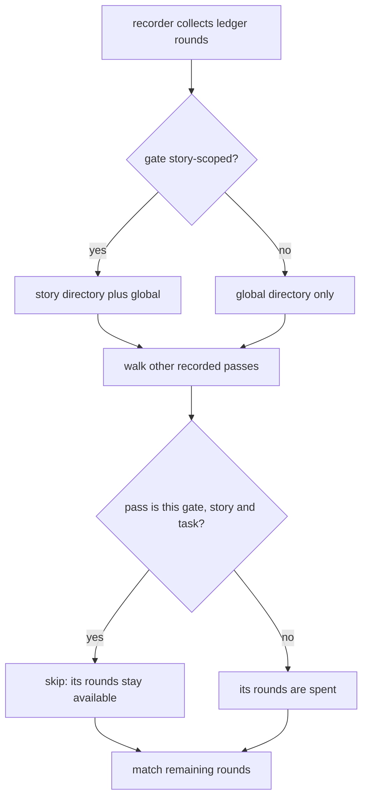

# GATES-1-T1 — A question round belongs to its gate and story

## Context

Decision 0067 (accepted, superseding 0051) says a question round belongs to the
gate and story it was asked for and may be reused when re-recording THAT gate for
THAT story, never across a different gate, story or task.

The recorder does not behave that way. `record_grill_from_json.py:70-100` walks
every recorded pass it can find, treats all of their rounds as spent, and matches
a ledger round by question, options and answer alone. The one exception is narrow
to the point of uselessness: a pass skips its own record only while its rounds are
byte-identical to the ones already stored. Change a single round and the pass
starts consuming its own history, so re-recording a gate after resolving findings
demands a brand new question. On one client task that produced roughly fifteen
owner questions, several of which existed only to satisfy the recorder.

Separately, ledger rounds are collected from the active story's directory AND the
global one for every gate, so a globally recorded gate can consume a round asked
during an entirely different story. 0051 permitted that by accident.

## What changes

1. **Provenance is location, and it is already recorded.** Three earlier drafts
   of this contract invented a carrier: a session context written by the grill,
   read by the hook, stamped onto the round. None of it is needed. The hook
   already writes a round into the ACTIVE STORY's `grill-rounds/` directory, and
   a recorded pass already lands at a path unique per gate, story and task, since
   `Gate.evidence_name` returns `grills/tasks/<id>.json` for a task gate and
   `grills/<gate>.json` otherwise, under the story directory when the gate is
   story-scoped. Both halves of the rule can be read off those two facts.

2. **A pass stops spending its own rounds.** The self-exclusion in the used-rounds
   walk drops its equality condition: a pass never treats the rounds of its own
   evidence path as spent, whatever they now contain. Because that path is unique
   per gate, story and task, this is exactly "reusable at THAT gate for THAT
   story" and nothing wider. Every other pass keeps consuming, which is what still
   refuses a round at a different gate, story or task.

3. **A global gate reads only global rounds.** Ledger collection for a gate whose
   `story_scoped` is false no longer includes the active story's directory, which
   closes 0051's hole. When no story is active both paths resolve to the same
   directory, so the pre-story flow is unchanged.

4. **Nothing else moves.** No session context, no ceremony-target routing, no
   hook change, no schema field, no legacy class and no migration, because no
   round changes at all. The earlier drafts' failure modes — a context outliving
   its reader, writer and reader resolving different directories, a legacy round
   colliding with a scoped one — cannot occur in a design that stores nothing.

5. **Verification can actually close the stage.** The suite is 93 red on main, so
   a bare full-suite command always exits non-zero and `stage done` rejects that,
   meaning the stage could never close. A new `factory/scripts/check_test_baseline.py`
   runs the suite and exits zero ONLY when the failing set matches the recorded
   baseline by identity, not merely by count.

   The baseline is DATA, not code: `factory/tests/baseline-failures.txt`, one
   pytest node id per line, generated once from a clean run on the merge base and
   committed. Identity means set equality, so the comparator exits non-zero on a
   new failure AND on a known failure that disappears; a disappearing failure is a
   fix that must update the baseline in the same commit, which is the point.

   The suite command is INJECTABLE (`--suite`, defaulting to the repo's own
   pytest invocation) for one reason: a test that exercises the comparator must
   not invoke the full suite that contains that very test. The comparator's own
   tests pass a tiny fake suite, so they cannot recurse.

6. **Decision 0055 is not this task's to own.** 0055 wants lint, format and type
   checks configured and enforced in CI. T1 records them as its own verify
   commands, which is what the approved plan promised, but wiring them into
   `verify.py` and CI touches the verify configuration and is out of a three-file
   scope. That gap is named here rather than left implied, and belongs with the
   T3 work that already changes the verify path.

7. **The floor is untouched.** Every gate still requires at least one real round,
   and a pass still cannot be recorded against a question nobody asked.

## Non-goals

The manifest, the freshness predicate, the ledger terminal states and the task
snapshot are T3, T2 and T4. No gate changes what it judges.

## Workflow

## Manual Verification

1. Record a gate pass, resolve a finding, and re-record the SAME gate with an
   edited round set: it succeeds with no new question.
2. Try to record a DIFFERENT gate against that same round: it is refused.
3. Answer a question while a story is active, then record a global gate against
   it: it is refused.
4. Record a task gate for task A, then try the same round for task B: refused.
5. Record a global gate with no story active: it behaves exactly as it does today.
6. Delete a line from the baseline file and run the comparator: it exits non-zero.

## Verify

`python3 factory/scripts/check_test_baseline.py`, which runs the suite and exits
zero only when the failing set matches the recorded baseline by identity; the new
round-reuse suite; `./forge doctor`; and per decision 0055, Ruff format, Ruff lint
and Pyright over the changed Python.
